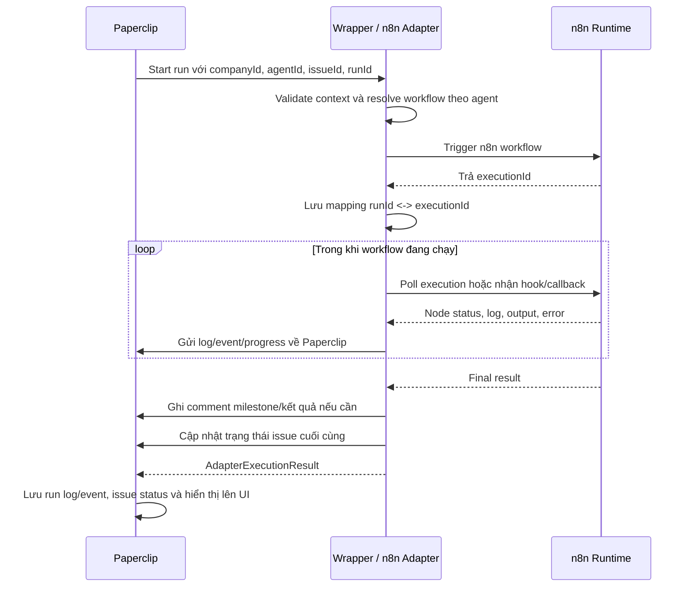
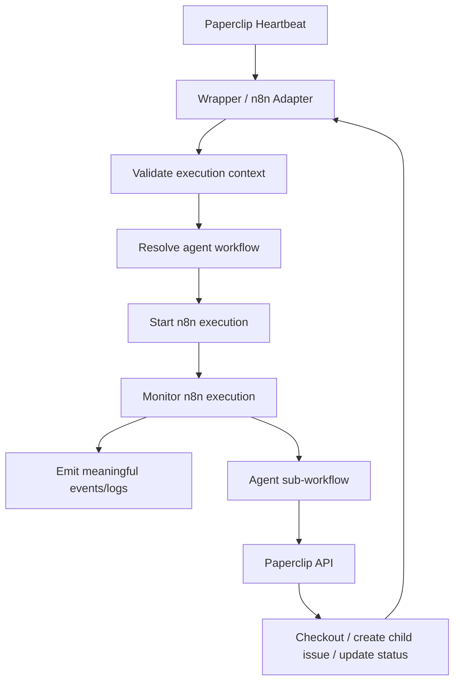
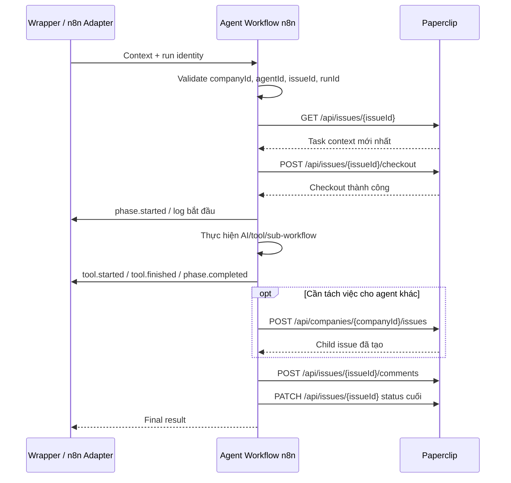

# Báo cáo đề xuất xây dựng wrapper tích hợp Paperclip và n8n

## 1. Mục tiêu

Báo cáo này tổng hợp đề xuất xây dựng một lớp wrapper mới giữa Paperclip và n8n để phục vụ việc thực thi task bằng workflow n8n, đồng thời đưa log, trace, event và trạng thái xử lý về Paperclip để người vận hành có thể theo dõi tiến độ ngay trên giao diện Paperclip.

Mục tiêu chính:

- Kết nối Paperclip với n8n theo đúng mô hình agent/task hiện có.
- Giữ Paperclip là nguồn dữ liệu chuẩn cho agent, issue, run, comment, activity và trạng thái task.
- Cho phép workflow n8n thực thi nghiệp vụ nhưng vẫn báo tiến độ, lỗi và kết quả về Paperclip.
- Hạn chế tình trạng task bị lặp, bị treo hoặc chuyển trạng thái sai do workflow trả HTTP `200` quá sớm.
- Tạo nền tảng để sau này nâng cấp lên realtime trace theo từng node của n8n.

## 2. Bối cảnh hiện tại

Hiện tại quá trình thử nghiệm đang sử dụng HTTP adapter của Paperclip để gọi webhook của n8n:

```text
Paperclip HTTP adapter -> n8n webhook -> n8n workflow -> Paperclip API
```

Cách này phù hợp để kiểm tra kết nối ban đầu, tạo agent, tạo task, cập nhật issue và ghi comment. Tuy nhiên, nếu chỉ dùng HTTP adapter đơn giản, Paperclip chỉ biết request HTTP thành công hay thất bại. Paperclip chưa tự biết workflow n8n đang chạy đến node nào, AI agent đang gọi tool gì, đã xử lý xong phần nào, hoặc vì sao task bị kẹt.

Trong quá trình thử nghiệm cũng phát hiện một số vấn đề:

- n8n có thể trả `200 OK` trước khi toàn bộ xử lý nghiệp vụ hoàn tất.
- Paperclip có thể hiểu run đã kết thúc trong khi issue vẫn chưa được chuyển sang trạng thái cuối.
- Nếu workflow tiếp tục ghi comment sau khi issue đã `done`, Paperclip có thể coi đó là tín hiệu mở lại công việc và chuyển issue từ `done` về `todo`.
- Khi lấy execution JSON từ n8n API, dữ liệu thường chỉ có sau khi node đã chạy xong hoặc khi n8n đã lưu execution progress; đây chưa phải realtime thật sự theo từng node.

Vì vậy cần một lớp tích hợp rõ ràng hơn giữa Paperclip và n8n.

## 3. Wrapper mới là gì?

Wrapper là lớp trung gian chịu trách nhiệm kết nối Paperclip với n8n, chuẩn hóa ngữ cảnh thực thi, theo dõi execution của n8n và chuyển log/event/result về Paperclip.

Có hai khái niệm cần phân biệt:

### 3.1. HTTP wrapper chạy ngoài Paperclip

Đây là một service HTTP độc lập nằm giữa Paperclip và n8n:

```text
Paperclip HTTP adapter -> HTTP wrapper -> n8n
```

HTTP wrapper có thể:

- Nhận request từ Paperclip.
- Validate `companyId`, `agentId`, `issueId`, `runId`.
- Chọn workflow n8n tương ứng với agent.
- Trigger n8n workflow.
- Lưu mapping giữa Paperclip run và n8n execution.
- Poll n8n execution API để lấy trạng thái.
- Gọi Paperclip API để cập nhật issue, comment hoặc cost event.

Nhưng HTTP wrapper bên ngoài Paperclip không thể gọi trực tiếp các callback nội bộ của Paperclip như `ctx.onLog`, `ctx.onEvent`, `ctx.onRuntimeProgress`, vì các callback này chỉ tồn tại trong tiến trình adapter của Paperclip.

Muốn HTTP wrapper đẩy event vào tab Run của Paperclip thì cần bổ sung một trong hai cơ chế:

- Một adapter bridge chạy trong Paperclip để nhận dữ liệu từ wrapper rồi gọi callback.
- Một endpoint ingest mới trong Paperclip để wrapper gửi event/log vào.

### 3.2. External adapter plugin chạy trong Paperclip

Đây là hướng tích hợp sâu hơn và phù hợp hơn về lâu dài:

```text
Paperclip -> external adapter n8n_runtime -> n8n
```

Adapter này chạy trong Paperclip nên có thể gọi trực tiếp:

```ts
ctx.onLog(stream, chunk);
ctx.onEvent(event);
ctx.onRuntimeProgress(update);
```

Nhờ đó, Paperclip có thể hiển thị log và event gần giống các adapter native khác. Đây là hướng nên dùng khi prototype đã ổn định.

## 4. Nguyên tắc kiến trúc

Nguyên tắc quan trọng nhất là không biến wrapper thành một hệ thống quản lý task thứ hai.

Paperclip phải tiếp tục là source of truth:

- Agent thuộc công ty nào.
- Issue/task đang ở trạng thái nào.
- Task đang được agent nào phụ trách.
- Run nào đang thực thi.
- Comment, activity, cost và lịch sử thay đổi được lưu ở đâu.
- Scheduler hoặc heartbeat nào sẽ đánh thức agent tiếp theo.

Wrapper chỉ nên là lớp thực thi và telemetry:

- Định tuyến workflow n8n.
- Theo dõi execution.
- Chuyển log/event về Paperclip.
- Chuẩn hóa kết quả cuối.
- Xử lý timeout, retry kỹ thuật và mapping run.

Wrapper không nên tự tạo các bảng hoặc mô hình riêng như:

```text
wrapper_tasks
wrapper_subtasks
wrapper_agent_status
wrapper_progress_percent
```

Nếu wrapper tự quản lý task riêng, hệ thống sẽ có hai control plane và rất dễ lệch trạng thái giữa Paperclip và wrapper.

## 5. Luồng tổng thể đề xuất

Luồng tích hợp đề xuất:



Trong sơ đồ này, `Paperclip` đại diện cho toàn bộ hệ thống Paperclip, bao gồm API, database, heartbeat/run store và UI. Nếu wrapper là external adapter chạy trong Paperclip, bước gửi log/event/progress tương ứng với `ctx.onLog`, `ctx.onEvent` và `ctx.onRuntimeProgress`. Nếu wrapper là HTTP service bên ngoài, bước này cần đi qua adapter bridge hoặc endpoint ingest riêng.

Sơ đồ dispatcher dạng flowchart:



Trong flowchart này, `Paperclip API` không phải một hệ thống tách rời khỏi Paperclip. Đây chỉ là bề mặt API mà agent sub-workflow hoặc wrapper dùng để cập nhật issue, ghi comment, tạo child issue và ghi cost event. Paperclip vẫn là source of truth duy nhất.

Thứ tự đúng trong dispatcher:

```text
Validate context
-> Resolve agent workflow
-> Start n8n execution
-> Monitor execution
-> Emit log/event
-> Map final result
-> Kết thúc Paperclip run
```

Điểm cần sửa so với sơ đồ ban đầu: không nên `Start / monitor n8n execution` trước khi `Resolve agent workflow`. Phải xác định workflow của agent trước, sau đó mới trigger execution.

## 6. Luồng agent sub-workflow

Mỗi agent workflow trong n8n nên tuân theo heartbeat protocol của Paperclip.

Luồng đề xuất:

```text
Nhận context từ Paperclip/wrapper
-> Validate companyId, agentId, issueId, runId
-> GET /api/issues/{issueId} nếu cần làm mới task context
-> POST /api/issues/{issueId}/checkout nếu cần claim task
-> Ghi comment bắt đầu nếu đây là milestone cần hiển thị
-> Thực hiện AI/tool/sub-workflow
-> Tạo child issue nếu cần
-> Ghi comment kết quả hoặc blocker
-> PATCH /api/issues/{issueId} sang done/blocked/cancelled
-> Trả final result cho wrapper/adapter
```

Sơ đồ agent sub-workflow:



Sơ đồ trên mô tả trách nhiệm của agent sub-workflow: nhận đúng task context, checkout đúng issue, chạy nghiệp vụ, phát log/event có ý nghĩa, tạo child issue nếu cần, ghi comment milestone và cập nhật trạng thái cuối. Wrapper/adapter chỉ điều phối và thu telemetry, còn Paperclip vẫn là nơi lưu trạng thái task chính thức.

Không nên để agent workflow gọi `GET assigned issues` rồi tự chọn task bất kỳ. Paperclip heartbeat đã truyền đúng `issueId/taskId`, nên workflow phải xử lý đúng issue trong context.

Khi gọi API thay đổi issue/comment/child issue trong một run, nên gửi thêm header:

```http
X-Paperclip-Run-Id: {paperclipRunId}
```

Header này giúp Paperclip liên kết hành động với đúng heartbeat run.

## 7. Phân biệt log, event, progress, comment và activity

Trong Paperclip, các khái niệm này có vai trò khác nhau:

| Loại dữ liệu | Mục đích | Nơi hiển thị/lưu |
|---|---|---|
| Log | Dòng output kỹ thuật, stdout/stderr, transcript thô | Run log, tab Run |
| Event | Sự kiện có cấu trúc như node started, tool finished, phase completed | `heartbeat_run_events`, tab Run |
| Runtime progress | Trạng thái live tạm thời của active run | Bộ nhớ Paperclip, live UI |
| Comment | Mốc nghiệp vụ quan trọng cho task | Thread/comment của issue |
| Activity | Audit hành động trong hệ thống | Activity feed |

Không nên biến mọi log hoặc event thành comment. Comment nên là báo cáo tổng quát hoặc milestone quan trọng, ví dụ:

- "Bắt đầu xử lý yêu cầu của khách hàng."
- "Đã đọc dữ liệu Google Sheets."
- "Không tìm thấy dữ liệu phù hợp, cần người dùng bổ sung thông tin."
- "Đã xử lý xong task."

Log/event nên dùng cho chi tiết kỹ thuật:

- Node nào bắt đầu.
- Node nào kết thúc.
- Tool nào được gọi.
- Duration bao lâu.
- Output summary là gì.
- Có lỗi ở node nào.

## 8. Cảnh báo quan trọng về comment và status

Trong Paperclip có logic xử lý comment trên issue đã đóng. Nếu issue đã ở trạng thái `done` hoặc `cancelled`, sau đó có comment mới được thêm vào, Paperclip có thể hiểu rằng task có tương tác mới và chuyển issue về `todo`.

Vì vậy không nên làm:

```text
PATCH status=done
-> POST comment "Đã xử lý xong task"
```

Thứ tự an toàn là:

```text
POST comment "Đã xử lý xong task"
-> PATCH status=done
-> Trả response cuối cho Paperclip
```

Sau khi đã PATCH `done`, không ghi thêm comment nữa, trừ khi chủ động muốn mở lại task.

Đây là một nguyên nhân có thể gây vòng lặp:

```text
in_progress -> done -> comment mới -> todo -> Paperclip đánh thức agent lại -> in_progress -> done
```

## 9. Các mức triển khai có thể chọn

### Cách 1: Giữ HTTP adapter hiện tại và sửa workflow n8n

Đây là cách đơn giản nhất, phù hợp giai đoạn thử nghiệm.

Cách làm:

- Paperclip gọi webhook n8n bằng HTTP adapter.
- n8n xử lý toàn bộ workflow.
- n8n ghi comment milestone.
- n8n PATCH issue sang `done` sau cùng.
- Webhook chỉ trả response khi toàn bộ xử lý đã hoàn tất.

Ưu điểm:

- Ít sửa code Paperclip.
- Dễ thử bằng Postman và n8n.
- Phù hợp để kiểm tra lifecycle task.

Nhược điểm:

- Chưa có node-level realtime.
- Paperclip chỉ nhìn thấy kết quả cuối hoặc log nếu n8n chủ động stream.
- Nếu workflow trả HTTP `200` sớm thì run có thể kết thúc sai thời điểm.

### Cách 2: HTTP response dạng SSE/chunked response

Workflow n8n hoặc wrapper có thể trả dữ liệu dạng chunk trong lúc chạy. HTTP adapter đọc từng chunk và ghi vào run log.

Ưu điểm:

- Có thể thấy log gần realtime.
- Không cần mở rộng quá nhiều kiến trúc.

Nhược điểm:

- Chủ yếu là log dạng text, chưa phải structured event.
- Không tự có input/output từng node.
- Chỉ hiệu quả nếu n8n thực sự giữ kết nối và stream dữ liệu.

### Cách 3: Polling n8n execution API

Wrapper hoặc adapter gọi định kỳ:

```http
GET /api/v1/executions/{executionId}?includeData=true
X-N8N-API-KEY: <api-key>
```

Cách này lấy execution JSON từ n8n, so sánh snapshot cũ và mới để phát hiện node đã chạy.

Ưu điểm:

- Không cần sửa từng workflow.
- Có thể lấy input/output node nếu n8n lưu execution data.
- Phù hợp để prototype trace.

Nhược điểm:

- Không realtime tuyệt đối.
- Có thể bỏ lỡ node chạy rất nhanh.
- Phụ thuộc cấu hình lưu execution progress của n8n.
- Cần chống event trùng và lọc dữ liệu nhạy cảm.

### Cách 4: External adapter `n8n_runtime`

Đây là hướng khuyến nghị sau khi prototype ổn.

Adapter chạy trong Paperclip, trigger n8n, monitor execution và gọi trực tiếp:

```ts
ctx.onLog("stdout", chunk);
ctx.onEvent({
  eventType: "n8n.node.finished",
  level: "info",
  message: "Đã xử lý xong node Google Sheets",
  payload: {
    executionId,
    nodeName,
    durationMs,
  },
});
```

Ưu điểm:

- Tích hợp đúng với kiến trúc Paperclip.
- Dữ liệu xuất hiện trong tab Run như các adapter native.
- Không cần public ingest endpoint.
- Có thể đóng gói thành plugin/adapter riêng.

Nhược điểm:

- Cần viết adapter riêng.
- Cần operational store để lưu mapping `paperclipRunId <-> n8nExecutionId`.
- Cần thiết kế retry, timeout, cancel, redaction.

### Cách 5: n8n internal lifecycle hooks

Đây là cách nâng cao nhất, dùng hook nội bộ của n8n như `nodeExecuteBefore`, `nodeExecuteAfter` để push event ngay khi node bắt đầu/kết thúc.

Ưu điểm:

- Gần realtime nhất.
- Có thể lấy node input/output chính xác hơn.
- Không cần thêm progress node vào từng workflow.

Nhược điểm:

- Phải patch/fork/extension n8n.
- API nội bộ có rủi ro thay đổi theo phiên bản.
- Nếu dùng queue mode, phải cài hook trên tất cả worker.
- Cần redaction mạnh vì input/output node có thể chứa token, cookie, dữ liệu khách hàng.

## 10. Phương án khuyến nghị

Nên triển khai theo từng phase, không nhảy ngay vào cách phức tạp nhất.

### Phase 1: Ổn định lifecycle bằng HTTP adapter hiện tại

Mục tiêu:

- Paperclip gọi được n8n.
- n8n xử lý đúng task.
- Task không bị vòng lặp `done -> todo`.
- Workflow không trả `200` quá sớm.
- Comment và status được ghi đúng thứ tự.

Việc cần làm:

- Đảm bảo node comment kết quả chạy trước node PATCH `done`.
- Không có node HTTP Request nào gọi GET issue rồi tạo tác dụng phụ sau khi done.
- Webhook response chỉ trả khi workflow xử lý xong.
- Test một task từ `todo -> in_progress -> done` và dừng hẳn.

Kết quả phase này chưa gọi là node-level realtime, nhưng là nền bắt buộc.

### Phase 2: Thêm polling prototype

Mục tiêu:

- Lấy được executionId của n8n.
- Gọi execution API để lấy `runData`.
- Phát hiện node nào đã chạy.
- Tạo event summary theo từng node.

Việc cần làm:

- Lưu mapping `paperclipRunId`, `issueId`, `agentId`, `n8nExecutionId`.
- Poll mỗi 2-5 giây.
- Dedupe event bằng khóa:

```text
executionId + nodeName + runIndex + startTime + status
```

- Chỉ gửi output summary, không gửi full payload lớn.
- Lọc header nhạy cảm như `Authorization`, cookie, API key.

### Phase 3: Xây external adapter `n8n_runtime`

Mục tiêu:

- Tích hợp n8n như một adapter chính thức của Paperclip.
- Event và log hiển thị trong tab Run.
- Paperclip run chỉ kết thúc khi n8n execution thật sự terminal.

Việc cần làm:

- Tạo adapter mới.
- Implement `execute(ctx)`.
- Trigger n8n workflow theo `adapterConfig`.
- Monitor execution đến `success`, `error`, `cancelled`, `timeout`.
- Gọi `ctx.onEvent` cho node/tool/phase.
- Gọi `ctx.onLog` cho output text.
- Trả `AdapterExecutionResult` chuẩn.

### Phase 4: Tích hợp lifecycle hook hoặc telemetry nâng cao

Mục tiêu:

- Node-level realtime chính xác.
- Có thể bắt node start/end/error ngay khi xảy ra.
- Có thể mở rộng sang OpenTelemetry, LangSmith, Sentry hoặc hệ tracing khác.

Chỉ nên làm phase này khi polling không đáp ứng được yêu cầu theo dõi.

## 11. Operational store tối thiểu

Wrapper/adapter chỉ cần lưu dữ liệu phục vụ theo dõi execution, không lưu task riêng.

Các trường đề xuất:

```text
paperclip_run_id
paperclip_issue_id
paperclip_agent_id
paperclip_company_id
n8n_execution_id
n8n_workflow_id
last_observed_node_key
last_event_seq_or_cursor
execution_status
started_at
updated_at
completed_at
```

Store này dùng để:

- Khôi phục theo dõi nếu wrapper restart.
- Tránh gửi event trùng.
- Biết execution nào thuộc Paperclip run nào.
- Dừng polling khi execution kết thúc.

Store này không dùng để:

- Quản lý trạng thái task thay Paperclip.
- Tính dashboard riêng.
- Tạo hệ thống phân công agent riêng.

## 12. Event schema đề xuất

Một event gửi về Paperclip nên có dạng:

```json
{
  "eventType": "n8n.node.finished",
  "stream": "system",
  "level": "info",
  "message": "Node Google Sheets đã hoàn tất",
  "payload": {
    "executionId": "151",
    "workflowId": "AXa9GvhJ7SkQ2brv",
    "nodeName": "Get row(s) in sheet",
    "nodeType": "n8n-nodes-base.googleSheets",
    "runIndex": 0,
    "durationMs": 1830,
    "status": "success",
    "outputSummary": "Tìm thấy 3 dòng dữ liệu phù hợp"
  }
}
```

Các event nên có:

- `n8n.execution.started`
- `n8n.execution.finished`
- `n8n.node.started`
- `n8n.node.finished`
- `n8n.node.failed`
- `agent.phase.started`
- `agent.phase.completed`
- `agent.tool.started`
- `agent.tool.finished`
- `paperclip.issue.checkout.completed`
- `paperclip.issue.child.created`
- `paperclip.issue.blocked`
- `paperclip.issue.done`

Không nên gửi mặc định:

- Toàn bộ binary data.
- Full body/request/response quá lớn.
- Authorization header, cookie, API key.
- Mọi biến trung gian.
- Mọi node kỹ thuật không có ý nghĩa vận hành như Set, IF, Merge, trừ khi cần debug.

## 13. API Paperclip liên quan

Các API đang liên quan đến hướng tích hợp:

```http
GET  /api/heartbeat-runs/{runId}/events
GET  /api/heartbeat-runs/{runId}/log
GET  /api/issues/{issueId}/activity
GET  /api/issues/{issueId}/runs
GET  /api/issues/{issueId}
POST /api/issues/{issueId}/checkout
POST /api/issues/{issueId}/comments
PATCH /api/issues/{issueId}
POST /api/companies/{companyId}/issues
POST /api/companies/{companyId}/cost-events
```

Lưu ý: hiện tại Paperclip có API đọc run events, nhưng chưa có public API chuẩn để POST event trực tiếp vào heartbeat run từ service bên ngoài. Vì vậy nếu chọn HTTP wrapper ngoài Paperclip mà muốn push event vào tab Run, cần mở rộng thêm endpoint ingest.

Endpoint ingest có thể thiết kế như sau:

```http
POST /api/integrations/n8n/runs/{runId}/events
Authorization: Bearer <integration-token>
Idempotency-Key: {executionId}:{nodeName}:{runIndex}:{status}
Content-Type: application/json
```

Endpoint này cần kiểm tra:

- Token có quyền ghi event cho company/run không.
- `runId` có tồn tại và thuộc đúng company không.
- `executionId` có khớp mapping đã lưu không.
- Idempotency key để tránh event trùng.
- Payload không vượt giới hạn kích thước.
- Không lưu dữ liệu nhạy cảm.
- Chính sách xử lý event đến muộn sau khi run đã terminal.

Tuy nhiên, nếu xây external adapter chạy trong Paperclip thì có thể không cần endpoint ingest này, vì adapter gọi trực tiếp được `ctx.onEvent`.

## 14. API n8n liên quan

API đã dùng để lấy execution:

```http
GET /api/v1/executions/{executionId}?includeData=true
X-N8N-API-KEY: <api-key>
```

Điều kiện để API này hữu ích:

- Phải biết `executionId`.
- n8n phải lưu execution data.
- Nếu muốn lấy gần realtime, n8n cần lưu progress khi execution đang chạy.
- Không xóa execution quá sớm.

Dữ liệu lấy về có thể gồm:

- `id`
- `status`
- `finished`
- `mode`
- `workflowId`
- `startedAt`
- `stoppedAt`
- `data.resultData.runData`
- input/output từng node đã lưu
- lỗi nếu node fail

Tuy nhiên, polling execution API không đảm bảo bắt được đúng thời điểm node bắt đầu. Nó phù hợp để lấy snapshot gần realtime hoặc hậu kiểm execution.

## 15. Xử lý child issue

Khi agent cần giao việc cho agent con, workflow không nên gọi thẳng webhook của agent con rồi coi đó là task Paperclip hoàn chỉnh.

Cách đúng là tạo child issue qua Paperclip API:

```http
POST /api/companies/{companyId}/issues
Authorization: Bearer <agent-token>
X-Paperclip-Run-Id: {parentRunId}
Content-Type: application/json
```

```json
{
  "title": "Kiểm tra dữ liệu đơn hàng",
  "description": "Đọc dữ liệu từ Google Sheets và lọc các đơn hàng phù hợp",
  "assigneeAgentId": "child-agent-id",
  "parentId": "parent-issue-id",
  "goalId": "goal-id",
  "status": "todo"
}
```

Sau đó Paperclip scheduler/heartbeat sẽ đánh thức agent con theo đúng lifecycle. Cách này giữ được:

- Quan hệ cha con giữa task.
- Lịch sử hoạt động.
- Quyền của agent.
- Trạng thái từng issue.
- Dashboard và cost tracking.

## 16. Rủi ro và cách kiểm soát

| Rủi ro | Nguyên nhân | Cách kiểm soát |
|---|---|---|
| Task bị chạy lặp | Comment sau khi `done`, webhook trả sớm, trạng thái chưa terminal | Comment trước, PATCH `done` sau cùng, giữ run đến khi n8n hoàn tất |
| Event bị trùng | Poll nhiều lần cùng một snapshot | Dùng idempotency key và cursor |
| Lộ dữ liệu nhạy cảm | Gửi full node input/output | Redaction, allowlist, truncation |
| Payload quá lớn | Node output lớn hoặc binary data | Chỉ gửi summary, lưu file ngoài nếu cần |
| Paperclip và n8n lệch trạng thái | Wrapper tự quản lý task riêng | Paperclip là source of truth, wrapper chỉ lưu operational mapping |
| Không realtime như kỳ vọng | Polling không bắt được node nhanh | Chấp nhận near realtime ở phase 2, nâng cấp hook ở phase 4 |
| Khó nâng cấp n8n | Patch internal lifecycle hook | Chỉ dùng hook nội bộ khi thật sự cần |
| Run kết thúc quá sớm | n8n webhook trả `200` trước khi workflow xong | Webhook chờ final result hoặc adapter monitor execution đến terminal |

## 17. Tiêu chí nghiệm thu

Một bản wrapper/adapter được coi là đạt yêu cầu khi:

- Một Paperclip heartbeat run tương ứng đúng một n8n execution chính.
- Paperclip run không kết thúc khi n8n vẫn đang xử lý nền.
- Issue đi đúng vòng đời `todo -> in_progress -> done/blocked/cancelled`.
- Không còn vòng lặp `done -> todo -> in_progress` ngoài ý muốn.
- Comment milestone hiển thị đúng ở task.
- Log/event hiển thị đúng ở tab Run.
- Node event không bị trùng khi polling nhiều lần.
- Output nhạy cảm được lọc trước khi gửi về Paperclip.
- Timeout/cancel được xử lý rõ.
- Nếu wrapper restart, có thể khôi phục mapping và tiếp tục monitor.
- Có test thực tế với ít nhất một workflow gồm webhook, AI agent, tool Google Sheets, update issue và comment.

## 18. Điểm chốt kiến trúc để báo cáo

Nếu wrapper là một HTTP service chạy bên ngoài Paperclip, wrapper có thể xử lý tốt các phần sau:

- Issue lifecycle.
- Sub-task/child issue.
- Assignment.
- Comment milestone.
- Dashboard thông qua dữ liệu Paperclip.
- Cost event nếu workflow cung cấp được dữ liệu.
- Final result.

Tuy nhiên, để đạt mức quan sát gần giống adapter native của Paperclip như `currentToolName`, `lastAssistantSnippet`, live run events và runtime status, wrapper nên được tích hợp thành custom Paperclip adapter hoặc phải có một bridge nội bộ gọi được các adapter callbacks. REST API công khai hiện tại không thay thế hoàn toàn được cơ chế callback nội bộ như `ctx.onLog`, `ctx.onEvent` và `ctx.onRuntimeProgress`.

Khuyến nghị kiến trúc cuối:

```text
Paperclip = source of truth + governance + dashboard
Wrapper / Adapter = adapter bridge + telemetry + n8n routing
n8n = agent execution runtime
```

Không cần thêm node log vào mọi n8n workflow. Cách phù hợp hơn là tạo một lớp tích hợp tập trung giữa Paperclip và n8n. Bản đầu có thể dùng external adapter + polling n8n execution API; khi cần node-level realtime chính xác hơn thì mới nâng cấp sang global n8n lifecycle extension hoặc telemetry bridge.

Bảng so sánh các phương án:

| Cơ chế | Có cần sửa từng workflow? | Mức theo dõi |
|---|---:|---|
| Paperclip adapter + polling n8n API | Không | Workflow queued/running/done/failed; có thể xác định node gần nhất |
| Adapter + global n8n lifecycle extension | Không | Node start/end/error gần realtime |
| Callback gateway + API ingest trong Paperclip | Không | Push event realtime nhưng phải mở rộng Paperclip core |
| Error Workflow của n8n | Không | Chỉ báo lỗi, không có tiến độ thành công |
| Node progress trong workflow | Có | Tiến độ nghiệp vụ chính xác nhất |

Ví dụ event có cấu trúc nên gửi về Paperclip:

```json
{
  "eventType": "tool.finished",
  "stream": "system",
  "level": "info",
  "message": "Database migration completed",
  "payload": {
    "tool": "postgres",
    "durationMs": 1830
  }
}
```

Các trường như `runId`, `issueId`, `agentId` và `seq` nên do Paperclip gắn khi event được ghi vào heartbeat run. Nếu dùng endpoint ingest từ bên ngoài thì endpoint mới phải tự validate và map các trường này với run thật.

Giới hạn quan trọng:

- Nếu không có node metadata hoặc progress event nghiệp vụ, hệ thống chỉ suy ra được workflow đang chạy, node nào đã chạy, node thành công/thất bại và execution đã kết thúc hay chưa.
- Hệ thống không thể tự biết chính xác các thông tin như "đã nghiên cứu được 60%" hoặc "đã xử lý 7/10 khách hàng" nếu workflow không chủ động cung cấp.
- Loại tiến độ nghiệp vụ này cần quy ước tên node, metadata workflow hoặc progress event do workflow phát ra.
- Không nên gửi mặc định các node kỹ thuật như `Set`, `IF`, `Merge`, biến trung gian, retry nội bộ hoặc các bước không có ý nghĩa với người vận hành.

Nguồn kiểm chứng nội bộ:

- Adapter callbacks: `onLog`, `onEvent`, `onRuntimeProgress`.
- External adapter plugins.
- HTTP adapter mặc định chỉ gọi request và kiểm tra HTTP status; nếu muốn realtime phải bổ sung streaming/polling/adapter riêng.
- Paperclip hiện có API đọc run events; chưa có public POST endpoint chuẩn để service ngoài ghi trực tiếp heartbeat run events.
- n8n external hooks như `workflow.preExecute/postExecute` chỉ bao phủ mức workflow, không phải node-level realtime.
- n8n internal lifecycle hooks có thể theo dõi node-level nhưng là hướng nâng cao và có rủi ro bảo trì.

## 19. Kết luận đề xuất

Trong giai đoạn hiện tại, nên tiếp tục dùng HTTP adapter để hoàn thiện lifecycle task trước. Mục tiêu gần nhất không phải là realtime node trace, mà là đảm bảo task chạy đúng một lần, cập nhật trạng thái đúng, ghi comment đúng thứ tự và không bị Paperclip đánh thức lại ngoài ý muốn.

Sau khi lifecycle ổn định, nên triển khai wrapper theo hướng external adapter `n8n_runtime` chạy trong Paperclip. Đây là hướng hợp lý nhất vì adapter có thể gọi trực tiếp `ctx.onLog`, `ctx.onEvent` và `ctx.onRuntimeProgress`, giúp dữ liệu hiển thị đúng trong tab Run mà không cần mở endpoint ingest công khai.

Polling n8n execution API nên dùng như bước trung gian để prototype trace theo node. Khi yêu cầu realtime cao hơn, có thể nâng cấp sang n8n internal lifecycle hook hoặc một hệ thống telemetry riêng như OpenTelemetry, nhưng đây nên là phase sau vì chi phí bảo trì cao hơn.

Tóm lại:

```text
Paperclip = source of truth, governance, issue lifecycle, dashboard
Wrapper/Adapter = bridge, routing, telemetry, mapping, timeout/retry
n8n = execution runtime, AI workflow, tool orchestration
```

Kiến trúc này giúp tận dụng được n8n để chạy workflow linh hoạt, đồng thời vẫn giữ Paperclip là hệ thống điều phối và theo dõi chính.

## 20. Nguồn tham chiếu nội bộ

Báo cáo này được tổng hợp từ:

- `C:\paperclip\User flow (1).pdf`
- `C:\paperclip\huong_dan_11_8.md`
- Kiểm tra source Paperclip liên quan đến adapter context, heartbeat run event, issue comment, activity và HTTP adapter.

Các file/source quan trọng trong repo:

- `packages/adapter-utils/src/types.ts`
- `packages/adapter-utils/src/runtime-progress.ts`
- `server/src/services/heartbeat.ts`
- `packages/db/src/schema/heartbeat_run_events.ts`
- `server/src/routes/agents.ts`
- `server/src/routes/issues.ts`
- `server/src/routes/activity.ts`
- `server/src/adapters/http/execute.ts`
- `docs/adapters/external-adapters.md`
