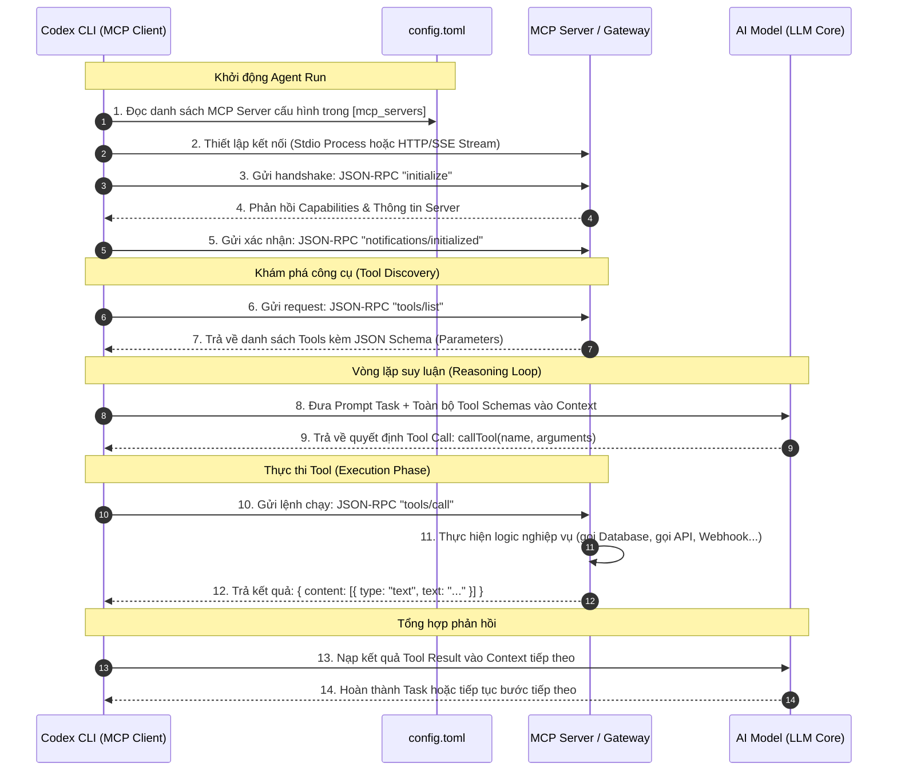

# Cơ Chế Hoạt Động Của MCP, Tích Hợp n8n Và So Sánh Khả Năng Thực Thi (MCP vs CLI) Với Codex Agent Trong Paperclip

Tài liệu này giải đáp toàn diện 5 vấn đề cốt lõi về mặt kiến trúc và thực hành khi vận hành AI Agent (Codex) trong Paperclip:
1. **Cơ chế gọi và thực thi MCP (Model Context Protocol) của Agent**.
2. **Khả năng kích hoạt (trigger) luồng n8n và biến luồng n8n thành công cụ (tool) MCP**.
3. **Phân tích hành vi Agent khi có đầy đủ MCP Tools/DB/Prompt: Có còn phải "mò mẫm" như CLI không và có giữ được sự tự do không?**
4. **Vấn đề hiển thị log chi tiết các node từ n8n sang Paperclip: Khi n8n thành MCP Tool thì có hiển thị được như n8n runtime adapter không và giải pháp khắc phục.**
5. **Hướng dẫn thực hành: Kích hoạt Paperclip MCP Server sẵn có cho Codex Agent và kịch bản kiểm thử thực tế.**

---

## PHẦN 1: Cơ Chế Agent Gọi MCP Để Thực Thi Hoạt Động Như Thế Nào?

Trong Paperclip và Codex CLI, giao thức **Model Context Protocol (MCP)** hoạt động theo mô hình Client - Server thông qua giao thức chuẩn **JSON-RPC 2.0**.

```
┌────────────────────────────────────────────────────────────────────────┐
│                              PAPERCLIP                                 │
│                                                                        │
│  ┌───────────────────────┐             ┌────────────────────────────┐  │
│  │  Codex CLI Process    │  JSON-RPC   │  Paperclip Tool Gateway /  │  │
│  │     (MCP Client)      │ <─────────> │     Custom MCP Server      │  │
│  └──────────┬────────────┘  (stdio/SSE)└─────────────┬──────────────┘  │
│             │                                        │                 │
│      Prompt │ Function Calls                         │ Thực thi        │
│             ▼                                        ▼                 │
│      ┌──────────────┐                     ┌─────────────────────┐      │
│      │   LLM Core   │                     │  DB / API / Scripts │      │
│      │  (OpenAI...) │                     │    (Ngoại vi)       │      │
│      └──────────────┘                     └─────────────────────┘      │
└────────────────────────────────────────────────────────────────────────┘
```

### 1. Sơ đồ tuần tự các bước (Sequence Diagram)



### 2. Chi tiết kỹ thuật từng bước

#### Bước 1: Khai báo cấu hình (Configuration Phase)
Codex CLI đọc thông tin kết nối từ file `config.toml` (nằm trong thư mục `$CODEX_HOME` của Agent):
- **Kiểu Stdio (Tiến trình cục bộ):** Codex tự khởi chạy một tiến trình con (Node.js/Python) và giao tiếp qua stdin/stdout.
  ```toml
  [mcp_servers.my_custom_tools]
  command = "node"
  args = ["C:/tools/my-mcp/dist/index.js"]
  env = { API_KEY = "xyz" }
  ```
- **Kiểu HTTP/SSE Stream (Remote Server / Gateway):**
  ```toml
  # Khối do Paperclip tự động inject qua Managed Tool Gateway:
  [mcp_servers.paperclip-gateway]
  url = "http://localhost:3100/api/tool-gateway/gateways/xxx/mcp"
  headers = { Authorization = "Bearer pgc_live_token_123" }
  ```

#### Bước 2: Bắt tay giao thức (Handshake)
Codex gửi JSON-RPC method `initialize`:
```json
{
  "jsonrpc": "2.0",
  "id": 1,
  "method": "initialize",
  "params": {
    "protocolVersion": "2024-11-05",
    "capabilities": { "tools": {} },
    "clientInfo": { "name": "codex-cli", "version": "0.122.0" }
  }
}
```

#### Bước 3: Lấy danh sách công cụ (`tools/list`)
MCP Server phản hồi danh sách các hàm mà Agent được phép gọi kèm **JSON Schema**:
```json
{
  "jsonrpc": "2.0",
  "id": 2,
  "result": {
    "tools": [
      {
        "name": "paperclipCreateIssue",
        "description": "Tạo một task/subtask mới trong hệ thống Paperclip",
        "inputSchema": {
          "type": "object",
          "properties": {
            "title": { "type": "string", "description": "Tiêu đề của task" },
            "parentIssueId": { "type": "string", "description": "ID task cha nếu là subtask" },
            "priority": { "type": "string", "enum": ["low", "medium", "high", "urgent"] }
          },
          "required": ["title"]
        }
      }
    ]
  }
}
```

#### Bước 4: Thực thi gọi Tool (`tools/call`)
Khi LLM xác định cần tạo task, nó xuất ra function call. Codex bắt lấy và chuyển tiếp thành bản tin JSON-RPC:
```json
{
  "jsonrpc": "2.0",
  "id": 3,
  "method": "tools/call",
  "params": {
    "name": "paperclipCreateIssue",
    "arguments": {
      "title": "Thiết kế giao diện dashboard",
      "parentIssueId": "9b1deb4d-3b7d-4bad-9bdd-2b0d7b3dcb6d",
      "priority": "high"
    }
  }
}
```
MCP Server thực thi logic tạo bản ghi vào CSDL hoặc gọi REST API của Paperclip, sau đó trả về:
```json
{
  "jsonrpc": "2.0",
  "id": 3,
  "result": {
    "content": [
      {
        "type": "text",
        "text": "{\"id\": \"issue-uuid-999\", \"status\": \"todo\", \"title\": \"Thiết kế giao diện dashboard\"}"
      }
    ],
    "isError": false
  }
}
```
Codex nạp lại kết quả này vào hội thoại để LLM biết task đã tạo thành công và tiếp tục công việc.

---

## PHẦN 2: Tích Hợp n8n Vào Codex Agent

> **Khẳng định:** Cấu hình tác nhân trong Paperclip là Codex **HOÀN TOÀN CÓ THỂ trigger và chạy các luồng trên n8n**. Việc **biến các luồng n8n thành các Tool MCP là giải pháp tối ưu và chuẩn mực nhất (Best Practice)**.

Mô hình kết hợp này tận dụng thế mạnh tuyệt đối của cả 2 hệ sinh thái:
- **Codex (Bộ não - Orchestrator):** Chuyên suy luận logic, phân tích mã nguồn, đọc hiểu ngữ cảnh nghiệp vụ, lập kế hoạch.
- **n8n (Cánh tay cơ bắp - Integration Engine):** Chuyên tự động hóa kết nối với hàng trăm hệ thống bên ngoài (Slack, Telegram, Gmail, Jira, Postgres, ERP, hệ thống Deploy CI/CD).

```
┌────────────────────────────────────────────────────────────────────────────────────────┐
│                                 MÔ HÌNH TÍCH HỢP TỔNG THỂ                              │
│                                                                                        │
│  ┌─────────────────────────┐                                ┌───────────────────────┐  │
│  │   Codex Agent           │  tools/call:                   │  n8n Automation       │  │
│  │   (Bộ não điều khiển)   │  "trigger_n8n_deploy"          │  (Thực thi kết nối)   │  │
│  │                         │                                │                       │  │
│  │  - Đọc task Paperclip   ├───────────────┐                │  - Build Docker       │  │
│  │  - Viết & sửa code      │  MCP Protocol │                │  - Bắn tin Telegram   │  │
│  │  - Gọi MCP Tool         │  (JSON-RPC)   │                │  - Đồng bộ Jira/CRM   │  │
│  └─────────────────────────┘               │                └───────────▲───────────┘  │
│                                            ▼                            │              │
│                             ┌──────────────────────────────┐            │              │
│                             │     n8n-mcp Server / Bridge  │  HTTP POST │              │
│                             │   (Wrapper bọc Webhook n8n)  ├────────────┘              │
│                             └──────────────────────────────┘  Webhook URL              │
└────────────────────────────────────────────────────────────────────────────────────────┘
```

### Hướng Dẫn Biến Luồng n8n Thành MCP Tool (Cách triển khai thực tế)

#### Bước 1: Tạo luồng Webhook trên n8n
1. Trong n8n, tạo workflow mới với node bắt đầu là **Webhook**:
   - HTTP Method: `POST`
   - Path: `/webhook/deploy-staging` (hoặc `/webhook/send-telegram`)
   - Respond: `Using 'Respond to Webhook' Node`
2. Kéo các node nghiệp vụ n8n (ví dụ: SSH vào server, gọi Git pull, build, gửi tin nhắn).
3. Đặt node cuối là **Respond to Webhook**, trả về JSON:
   ```json
   { "status": "success", "url": "https://staging.mycompany.com", "deployedAt": "2026-09-08T15:50:00Z" }
   ```

#### Bước 2: Tạo MCP Server bọc n8n (`n8n-mcp-server.mjs`)
Tạo một file JavaScript siêu nhẹ chạy bằng Node.js với thư viện `@modelcontextprotocol/sdk`:

```javascript
import { Server } from "@modelcontextprotocol/sdk/server/index.js";
import { StdioServerTransport } from "@modelcontextprotocol/sdk/server/stdio.js";
import { CallToolRequestSchema, ListToolsRequestSchema } from "@modelcontextprotocol/sdk/types.js";

const server = new Server(
  { name: "n8n-integration-tools", version: "1.0.0" },
  { capabilities: { tools: {} } }
);

// 1. Định nghĩa các luồng n8n thành các Tools với Schema chuẩn
server.setRequestHandler(ListToolsRequestSchema, async () => {
  return {
    tools: [
      {
        name: "n8n_deploy_staging",
        description: "Kích hoạt luồng n8n để deploy source code lên môi trường Staging",
        inputSchema: {
          type: "object",
          properties: {
            service_name: { type: "string", description: "Tên dịch vụ cần deploy (backend/frontend)" },
            git_branch: { type: "string", description: "Nhánh git cần lấy mã nguồn" }
          },
          required: ["service_name", "git_branch"]
        }
      },
      {
        name: "n8n_notify_channel",
        description: "Gửi thông báo tình trạng công việc tới nhóm qua luồng n8n",
        inputSchema: {
          type: "object",
          properties: {
            channel: { type: "string", enum: ["telegram", "slack", "discord"] },
            message: { type: "string", description: "Nội dung thông báo cần gửi" }
          },
          required: ["channel", "message"]
        }
      }
    ]
  };
});

// 2. Định tuyến cuộc gọi tools/call sang Webhook tương ứng trên n8n
server.setRequestHandler(CallToolRequestSchema, async (request) => {
  const { name, arguments: args } = request.params;

  if (name === "n8n_deploy_staging") {
    const res = await fetch("http://localhost:5678/webhook/deploy-staging", {
      method: "POST",
      headers: { "Content-Type": "application/json" },
      body: JSON.stringify(args)
    });
    const data = await res.text();
    return { content: [{ type: "text", text: data }] };
  }

  if (name === "n8n_notify_channel") {
    const res = await fetch("http://localhost:5678/webhook/notify-channel", {
      method: "POST",
      headers: { "Content-Type": "application/json" },
      body: JSON.stringify(args)
    });
    const data = await res.text();
    return { content: [{ type: "text", text: data }] };
  }

  throw new Error(`Tool ${name} không tồn tại`);
});

// Chạy dưới dạng Stdio transport
const transport = new StdioServerTransport();
await server.connect(transport);
```

#### Bước 3: Đăng ký MCP Server vào `config.toml` của Codex
Thêm vào file cấu hình của Codex:
```toml
[mcp_servers.n8n_tools]
command = "node"
args = ["C:/paperclip/tools/n8n-mcp-server.mjs"]
```

👉 **Kết quả:** Ngay khi Codex thực thi, nó thấy sẵn 2 công cụ `n8n_deploy_staging` và `n8n_notify_channel`. Khi cần deploy hay gửi tin, Codex gọi trực tiếp function call, không cần biết URL webhook là gì, không cần gõ lệnh curl.

---

## PHẦN 3: So Sánh MCP Server vs CLI: Có Còn Mò Mẫm Không? Có Tự Do Không?

### 1. Agent có cần "mò mẫm" như CLI không? 👉 **HOÀN TOÀN KHÔNG!**

#### Tại sao ở chế độ CLI thuần Agent lại phải mò mẫm?
Nhìn lại file log thực tế [`transcript.json`](file:///c:/paperclip/instructions/transcript.json):
- Agent muốn tạo Subtask nhưng **hoàn toàn mù** về API của Paperclip.
- Công cụ duy nhất nó có là Terminal (`execute_command`).
- Agent phải đoán mò URL: gọi `OPTIONS /api/issues`, thử `POST /api/issues`, nhận lỗi `403 ReadOnly`.
- Sau đó Agent phải chạy lệnh `rg` (ripgrep) quét toàn bộ hàng nghìn dòng code trong repo để tìm controller xem route nhận request là gì. Mất **5–7 lượt run (vòng lặp thử - sai)** mới tạo được 1 task!

#### Khi có MCP Server cung cấp đầy đủ Tools:
1. **Có sẵn Schema rõ ràng (Zero Hallucination):** Qua lệnh `tools/list`, Agent nhìn thấy ngay:
   - Tên hàm: `paperclipCreateIssue`
   - Mô tả tác dụng rõ ràng
   - Các trường dữ liệu bắt buộc và kiểu dữ liệu (string, enum, number).
2. **Loại bỏ hoàn toàn khâu dò đường:** Agent không cần đoán port, không cần quan tâm header `Authorization`, không cần mò endpoint REST.
3. **Thực thi 1 phát trúng đích (One-Shot Execution):** LLM sinh ngay 1 lệnh Function Calling chính xác, nhận về kết quả trong **dưới 1 giây**.

---

### 2. Agent có "tự do" tương tự như CLI không?

Để trả lời chính xác, cần phân định giữa **Tự do suy luận** và **Tự do hành động**:

#### A. Tự do về Tư duy & Lập kế hoạch (Orchestration Freedom) 👉 **VẪN HOÀN TOÀN TỰ DO!**
MCP không phải là kịch bản cứng (hardcode script). Agent vẫn là một thực thể AI tự chủ (autonomous agent):
- Agent **tự do quyết định**: Khi nào cần gọi tool? Gọi tool nào trước, tool nào sau?
- Agent **tự do xâu chuỗi dữ liệu (Chaining)**: Lấy output của Tool A (ví dụ đọc danh sách lỗi từ DB) -> LLM suy luận tìm nguyên nhân -> lấy kết quả đó làm tham số truyền vào Tool B (gửi thông báo qua n8n).
- Không có bất kỳ kịch bản cố định nào ép buộc Agent; toàn bộ hành động được điều khiển linh hoạt theo ngữ cảnh thực tế của task.

#### B. Tự do về Phạm vi Khả năng (Capability Scope) 👉 **BỊ GIỚI HẠN TRONG DANH SÁCH TOOL (An toàn & Có kiểm soát)**
- **CLI thuần (Tự do vô hạn nhưng rủi ro cao):** Agent có thể làm mọi thứ: gõ `rm -rf`, cài thư viện ngoài, tải file độc hại từ internet. Tự do này rất tốt khi debug code sâu, nhưng cực kỳ rủi ro và dễ chệch hướng khi làm việc nghiệp vụ.
- **MCP Server (Tự do trong khuôn khổ an toàn - Bounded Autonomy):** Agent chỉ được phép tương tác với những cổng kết nối đã được định nghĩa. Điều này giúp ngăn chặn hoàn toàn việc Agent tự ý làm những hành động phá hoại hệ thống.

---

### 3. Bảng Tổng Hợp So Sánh Trực Quan

| Tiêu chí | Dùng CLI thuần (Bash / Terminal) | Dùng MCP Server Chuyên Dụng |
| :--- | :--- | :--- |
| **Cơ chế gọi** | Gõ text lệnh terminal (`curl`, `node`, `psql`) | Gọi hàm cấu trúc JSON-RPC chuẩn (`tools/call`) |
| **Hiện tượng "Mò mẫm"** | **Rất nhiều** (phải đoán API, đọc file source tìm endpoint) | **Hoàn toàn không** (có sẵn JSON Schema định nghĩa) |
| **Tỷ lệ thành công** | Dễ lỗi cú pháp, sai URL, thiếu Token auth | Chuẩn xác 100% về mặt cấu trúc tham số |
| **Số lượt Run cần thiết** | 5 – 10 lượt (Thử - Sai - Sửa) | 1 lượt duy nhất (One-shot) |
| **Tiêu tốn Token & Chi phí**| Rất tốn do phải nạp lại stdout/stderr lỗi | Cực kỳ tiết kiệm ngữ cảnh (Token efficient) |
| **Tính Tự do của Agent** | Tự do vô hạn (Wild Freedom - dễ mất kiểm soát) | Tự do tư duy & xâu chuỗi trong phạm vi an toàn |
| **Khả năng Quản trị** | Khó audit, khó chặn các lệnh nguy hiểm | Có thể tích hợp Approval Gates, Logging, Rate-limit |

---

### 4. Kết luận kiến trúc: Mô hình Đa Năng Lai (Hybrid Model)

Hệ thống mạnh mẽ nhất là hệ thống **kết hợp cả hai loại công cụ cùng lúc** cho Codex:

```
                          ┌──────────────────────────────────────┐
                          │         CODEX AGENT CORE             │
                          └──────────────────┬───────────────────┘
                                             │
                   ┌─────────────────────────┴─────────────────────────┐
                   ▼                                                   ▼
     ┌───────────────────────────┐                       ┌───────────────────────────┐
     │      CÔNG CỤ CLI          │                       │      CÔNG CỤ MCP          │
     │  (Workspace Terminal)     │                       │  (Paperclip + n8n + DB)   │
     ├───────────────────────────┤                       ├───────────────────────────┤
     │ • Đọc & Sửa file mã nguồn │                       │ • Tạo Subtask Paperclip   │
     │ • Chạy unit test, build   │                       │ • Kích hoạt luồng n8n     │
     │ • Sáng tạo giải thuật     │                       │ • Truy vấn CSDL chính xác │
     └───────────────────────────┘                       └───────────────────────────┘
```

- **Khi cần lập trình, debug, sửa code:** Agent sử dụng **CLI** để phát huy tối đa sự tự do sáng tạo.
- **Khi cần tương tác với hệ thống quản trị (Paperclip), tự động hóa (n8n), CSDL:** Agent sử dụng **MCP Tools** để đạt tốc độ tức thì, không mò mẫm, an toàn tuyệt đối và tiết kiệm token tối đa.

---

## PHẦN 4: Vấn Đề Hiển Thị Log Chi Tiết Các Node n8n Sang Paperclip (Khi Chuyển Sang MCP Tool)

### 1. Phân tích băn khoăn kiến trúc: Tại sao có sự khác biệt về Log?

Khi nhìn vào giao diện **Runs** của Paperclip (màn hình `Agents > CEO > Runs`), bạn nhận thấy:
- **Khi cấu hình Agent là `n8n-runtime-adapter`:** Cột **Events** hiển thị đầy đủ và nhảy liên tục từng dòng log theo thời gian thực (Realtime):
  ```
  16:05:55 [system] [Nhận request từ Agent] success (0ms) - 1 items returned
  16:05:55 [system] [cmt đang xử lý] success (83ms) - 1 items returned
  16:05:56 [system] [Groq Chat Model] success (831ms) - finish_reason=tool_calls
  16:05:56 [system] [Get row(s) in sheet in Google Sheets1] finished (0ms) - Sheet node completed
  16:05:58 [system] [Comment thành công] success (34ms) - Đã xử lý xong task
  16:06:08 [system] [Respond to Webhook] success (0ms) - Webhook response sent
  ```
- **Khi cấu hình Agent là `codex-local` và n8n trở thành một MCP Tool:**
  - **Chủ thể điều khiển Run:** Là tiến trình Codex CLI (`codex exec`). Codex quản lý vòng đời Run và bắn log của nó vào Paperclip.
  - **Bản chất cuộc gọi MCP:** Codex chỉ coi n8n như một hàm ngoại vi (như `read_file` hay `fetch_api`). Codex gửi request JSON-RPC `tools/call` và đứng chờ (blocking RPC).
  - **Hiện tượng mặc định:** Trong suốt thời gian n8n đang xử lý (10–30 giây), cột Events của Paperclip sẽ "im lặng". Giao diện chỉ ghi nhận 1 dòng: `tool_call: n8n_tool` ➔ sau khi n8n chạy xong mới ghi nhận `tool_result: {...}`. **Log chi tiết từng node của n8n mặc định sẽ không xuất hiện trên cột Events!**

---

### 2. So sánh 2 cơ chế đẩy Log vào Paperclip

| Tiêu chí | Khi n8n là Runtime Adapter (`n8n-runtime-adapter`) | Khi n8n là MCP Tool (`n8n-mcp-server`) Mặc định |
| :--- | :--- | :--- |
| **Chủ thể nắm giữ `ctx`** | File `execute.ts` của adapter nắm trực tiếp `ctx.onLog()` | Không có `ctx` của adapter, chỉ có connection RPC với Codex |
| **Cơ chế bắt log n8n** | Polling ngầm `GET /api/v1/executions` theo `traceId` | Bắn Webhook HTTP POST rồi chờ Response |
| **Dòng log trên cột Events** | Đầy đủ từng node theo mili-giây | Chỉ có 1 dòng Tool Call và 1 dòng Tool Result |
| **Nơi hiển thị chi tiết** | Cột **Events** của Run | Bên trong **Tool Arguments/Result** (Transcript) |

---

### 3. Ba (03) Giải Pháp Để Vẫn Hiển Thị Log Chi Tiết n8n Sang Paperclip

---

#### 💡 GIẢI PHÁP 1: MCP Server Bắn Trực Tiếp Realtime Log Vào Database Paperclip (Khuyên Dùng ⭐⭐⭐⭐⭐)

Vì MCP Server (`n8n-mcp-server.mjs`) chạy trên cùng máy chủ/máy trạm với Paperclip, nó hoàn toàn có thể kết nối vào Database của Paperclip (PGlite hoặc PostgreSQL).

```
┌─────────────────┐  tools/call(runId) ┌───────────────────────────┐  HTTP POST  ┌──────────────┐
│  Codex CLI      │ ──────────────────> │  n8n-mcp-server           │ ──────────> │  n8n Server  │
│  (Đang chờ kết  │                     │  - Polling trạng thái node│             │  (Đang chạy) │
│   quả từ n8n)   │                     │  - Bắt được node hoàn tất │ <────────── │              │
└─────────────────┘                     └─────────────┬─────────────┘             └──────────────┘
                                                      │
                                                      │ Ghi realtime từng node
                                                      ▼
                                       ┌────────────────────────────┐
                                       │ Paperclip DB               │
                                       │ (heartbeat_run_events)     │
                                       └──────────────┬─────────────┘
                                                      │ Realtime Stream / SSE
                                                      ▼
                                       ┌────────────────────────────┐
                                       │ Giao diện Paperclip UI     │
                                       │ (Nhảy từng dòng như ảnh)   │
                                       └────────────────────────────┘
```

**Cách triển khai trong file `n8n-mcp-server.mjs`:**
1. Trong tham số của tool, Agent (hoặc hệ thống) truyền `paperclipRunId`, `companyId`, `agentId`.
2. Khi kích hoạt Webhook n8n, MCP Server khởi chạy một hàm background polling (tái sử dụng chính logic polling trong `n8n-runtime-adapter/src/server/execute.ts`):
   ```javascript
   // Mỗi khi polling thấy 1 node n8n hoàn thành:
   await db.insert(heartbeatRunEvents).values({
     companyId: companyId,
     runId: runId,
     agentId: agentId,
     seq: currentSeq++,
     eventType: "log",
     stream: "stdout",
     level: "info",
     message: `[n8n] [${node.name}] ${node.status} (${node.executionTime}ms) - ${node.summary || ""}`,
     createdAt: new Date()
   });
   ```
👉 **Hiệu quả:** Màn hình Paperclip vẫn hiển thị dòng xanh/xám nhảy realtime từng mili-giây y hệt như khi chạy `n8n-runtime-adapter`, trong khi Agent chính vẫn là **Codex**.

---

#### 💡 GIẢI PHÁP 2: Đóng Gói Toàn Bộ Node Trace Vào Nội Dung Tool Result (Dạng Accordion / Details)

Nếu không muốn can thiệp trực tiếp vào Database của Paperclip, bạn có thể cấu hình để sau khi luồng n8n chạy xong, MCP Server lấy toàn bộ lịch sử chạy các node và nhét vào trường `content` của Tool Response:

```javascript
server.setRequestHandler(CallToolRequestSchema, async (request) => {
  const { name, arguments: args } = request.params;
  
  // 1. Kích hoạt Webhook và chờ kết quả
  const { executionId, result } = await triggerAndTrackN8nWorkflow(args);
  
  // 2. Lấy chi tiết các node đã chạy từ n8n REST API
  const executionDetail = await getN8nExecutionDetail(executionId);
  const nodeLogs = executionDetail.data.resultData.runData;
  
  // 3. Format thành Markdown list
  const logSummary = Object.keys(nodeLogs).map(nodeName => {
    const data = nodeLogs[nodeName][0];
    return `- [${nodeName}] **${data.executionStatus}** (${data.executionTime}ms)`;
  }).join("\n");

  // 4. Trả về cho Codex kèm theo toàn bộ Trace
  return {
    content: [
      {
        type: "text",
        text: `${JSON.stringify(result)}\n\n### n8n Execution Trace:\n${logSummary}`
      }
    ]
  };
});
```

👉 **Hiệu quả:**
- Người dùng khi xem Run của Codex trên Paperclip, bấm vào phần **Transcript / Tool Calls** sẽ xem được toàn bộ danh sách các node n8n đã chạy mà không bị sót bất kỳ thông tin nào.
- **Hạn chế nhỏ:** Log không nhảy realtime từng giây mà hiện ra toàn bộ sau khi n8n hoàn tất.

---

#### 💡 GIẢI PHÁP 3: Phân Định Rõ Trách Nhiệm Của Agent (Kiến Trúc Multi-Agent)

Nếu việc giám sát chi tiết từng node của n8n là **yêu cầu bắt buộc hàng đầu** của dự án, bạn nên thiết kế theo mô hình **Phân vai Multi-Agent**:

1. **Agent Lập trình (Codex Agent):** Cấu hình adapter là `codex-local`.
   - Chuyên trách: Đọc code, sửa code, tạo subtask, review PR.
2. **Agent Tự động hóa (n8n Agent):** Cấu hình adapter là `n8n-runtime-adapter`.
   - Chuyên trách: Chạy các pipeline tích hợp, đồng bộ dữ liệu, cào dữ liệu Google Sheets / CRM.
   - Khi chạy, Agent này sẽ **bắn toàn bộ log chi tiết các node realtime lên giao diện Paperclip**.
3. **Cơ chế phối hợp:**
   - Codex Agent khi cần chạy luồng tự động hóa sẽ gọi tool `paperclipCreateIssue` để giao việc cho n8n Agent.
   - Ngay lập tức, Paperclip sẽ mở một **Run riêng cho n8n Agent**, và bạn có thể bấm vào Run đó để xem toàn bộ 21+ sự kiện của các node nhảy realtime y hệt bức ảnh bạn đã gửi!

---

### Tóm Tắt Khuyến Nghị

- Nếu bạn muốn **Codex vừa là Agent chính vừa thấy log n8n nhảy realtime trên cột Events**: Áp dụng **Giải pháp 1** (MCP Server polling n8n và insert vào `heartbeat_run_events`).
- Nếu bạn chỉ cần **xem lại đầy đủ lịch sử các node để kiểm tra/audit**: Áp dụng **Giải pháp 2** (Đóng gói trace vào Tool Result).
- Nếu luồng n8n là một **nghiệp vụ lớn, độc lập**: Áp dụng **Giải pháp 3** (Giao task sang một Agent chuyên biệt chạy `n8n-runtime-adapter`).

---

## PHẦN 5: Hướng Dẫn Thực Hành Bật Paperclip MCP Server Cho Codex Agent & Kịch Bản Kiểm Thử

Trong kho mã nguồn Paperclip hiện có sẵn gói MCP Server chính thức:
- **Đường dẫn mã nguồn:** [`packages/mcp-server`](file:///c:/paperclip/packages/mcp-server) (`@paperclipai/mcp-server`).
- **Danh sách công cụ có sẵn:** `paperclipListIssues`, `paperclipGetIssue`, `paperclipCreateIssue`, `paperclipUpdateIssue`, `paperclipCheckoutIssue`, `paperclipAddComment`, `paperclipListComments`, `paperclipUpsertDocument`, `paperclipCreateApproval`...

---

### 1. CÁCH 1: Cấu Hình Trực Tiếp Vào `config.toml` Của Codex (Khuyên Dùng ⭐⭐⭐⭐⭐)

Codex CLI tự động nạp bất kỳ MCP Server nào được khai báo trong file cấu hình `$CODEX_HOME/config.toml`.

#### Bước 1: Tạo Agent API Key trên giao diện Paperclip
1. Mở trình duyệt truy cập Paperclip: `http://localhost:3100`.
2. Vào **Settings** (Cài đặt công ty) ➔ **API Keys** ➔ Bấm **New Key**.
3. Đặt tên (ví dụ: `mcp-key`) và sao chép mã Key (dạng `pgc_live_xxxx...`).

#### Bước 2: Build gói `@paperclipai/mcp-server` trong repo
Mở Terminal ngoài máy của bạn (PowerShell hoặc CMD) và thực hiện lệnh:
```powershell
cd C:\paperclip
pnpm --filter @paperclipai/mcp-server build
```
*Lệnh này sẽ biên dịch mã nguồn TypeScript thành file thực thi tại: `C:\paperclip\packages\mcp-server\dist\stdio.js`.*

#### Bước 3: Thêm cấu hình vào file `config.toml` của Codex
Mở file cấu hình Codex tại máy của bạn:
- Đường dẫn mặc định: `C:\Users\<Tên_Người_Dùng>\.codex\config.toml`
*(Nếu chưa có file, hãy tạo mới).*

Thêm đoạn cấu hình sau vào cuối file:

```toml
[mcp_servers.paperclip]
command = "node"
args = ["C:/paperclip/packages/mcp-server/dist/stdio.js"]
env = { PAPERCLIP_API_URL = "http://localhost:3100", PAPERCLIP_API_KEY = "DÁN_API_KEY_CỦA_BẠN_VÀO_ĐÂY" }
```

> **Cách chạy không cần build (Qua npx):**
> Nếu không muốn build local từ thư mục repo, bạn có thể cho Codex chạy trực tiếp qua `npx`:
> ```toml
> [mcp_servers.paperclip]
> command = "npx"
> args = ["-y", "@paperclipai/mcp-server"]
> env = { PAPERCLIP_API_URL = "http://localhost:3100", PAPERCLIP_API_KEY = "DÁN_API_KEY_CỦA_BẠN_VÀO_ĐÂY" }
> ```

---

### 2. CÁCH 2: Kích Hoạt Qua Giao Diện Paperclip UI (Managed Tool Gateway)

Paperclip có kiến trúc quản trị MCP tập trung (Governed MCP Gateway) cho phép người quản trị kiểm soát công cụ của Agent:

1. Trên thanh điều hướng Paperclip UI, vào menu **Tools** (hoặc Company Settings ➔ Tools).
2. Chuyển sang tab **Paste Config** hoặc **Run Your Own**.
3. Dán đoạn JSON cấu hình:
   ```json
   {
     "mcpServers": {
       "paperclip-tools": {
         "command": "node",
         "args": ["C:/paperclip/packages/mcp-server/dist/stdio.js"],
         "env": {
           "PAPERCLIP_API_URL": "http://localhost:3100"
         }
       }
     }
   }
   ```
4. Gán quyền truy cập Tool này cho Agent Codex của bạn. Khi Agent bắt đầu một Run mới, Paperclip sẽ tự động inject cổng kết nối MCP Gateway vào môi trường của Agent.

---

### 3. Kịch Bản Thử Nghiệm Để Đánh Giá Hiệu Năng & Độ Linh Hoạt

Sau khi đã thêm cấu hình MCP Server, hãy thực hiện bài kiểm thử sau để so sánh trực quan:

#### Kịch bản kiểm thử:
1. Tạo một Task mới trên bảng Board của Paperclip.
2. Gửi một Comment với nội dung:
   > *"Hãy kiểm tra xem task hiện tại đã có những subtask nào chưa. Nếu chưa có, hãy tạo giúp tôi một subtask tên là 'Phân tích kiến trúc hệ thống' với độ ưu tiên là high, sau đó comment báo lại cho tôi."*

#### So sánh thực tế giữa 2 cơ chế:

```
┌──────────────────────────────────────────────────────────────────────────────────┐
│  KHI CHƯA CÓ MCP (CLI THUẦN)            │  KHI ĐÃ BẬT MCP SERVER                │
├─────────────────────────────────────────┼────────────────────────────────────────┤
│ 1. Codex chạy: `OPTIONS /api/issues`    │ 1. Codex phát hiện công cụ:            │
│ 2. Thử gọi: `curl -X POST /api/issues`  │    `paperclipListIssues`               │
│ 3. Bị lỗi: 403 ReadOnly                 │    `paperclipCreateIssue`              │
│ 4. Chạy `rg` quét source code tìm route │ 2. Codex gọi trực tiếp:                │
│ 5. Tốn 5 - 7 lượt Run và hàng chục ngàn │    `paperclipCreateIssue({             │
│    token ngữ cảnh chỉ để mò API!        │       title: "Phân tích kiến trúc...", │
│ 6. Dễ gặp lỗi parsing JSON stdout.      │       priority: "high"                 │
│                                         │    })`                                 │
│                                         │ 3. Hoàn thành ngay trong 1 Run duy     │
│                                         │    nhất (< 2 giây), chuẩn xác 100%!    │
└──────────────────────────────────────────────────────────────────────────────────┘
```

#### Đánh giá độ linh hoạt:
- **Agent không hề bị "cứng nhắc":** Codex vẫn đọc hiểu văn phong tự nhiên của người dùng, tự trích xuất tiêu đề `'Phân tích kiến trúc hệ thống'` và enum `'high'` để gán vào các tham số của tool.
- **Phối hợp thông minh:** Agent tự biết gọi `paperclipListIssues` trước để kiểm tra, sau khi tạo xong lại tự gọi `paperclipAddComment` để phản hồi cho người dùng, thể hiện khả năng xâu chuỗi (Chaining) hoàn hảo.


