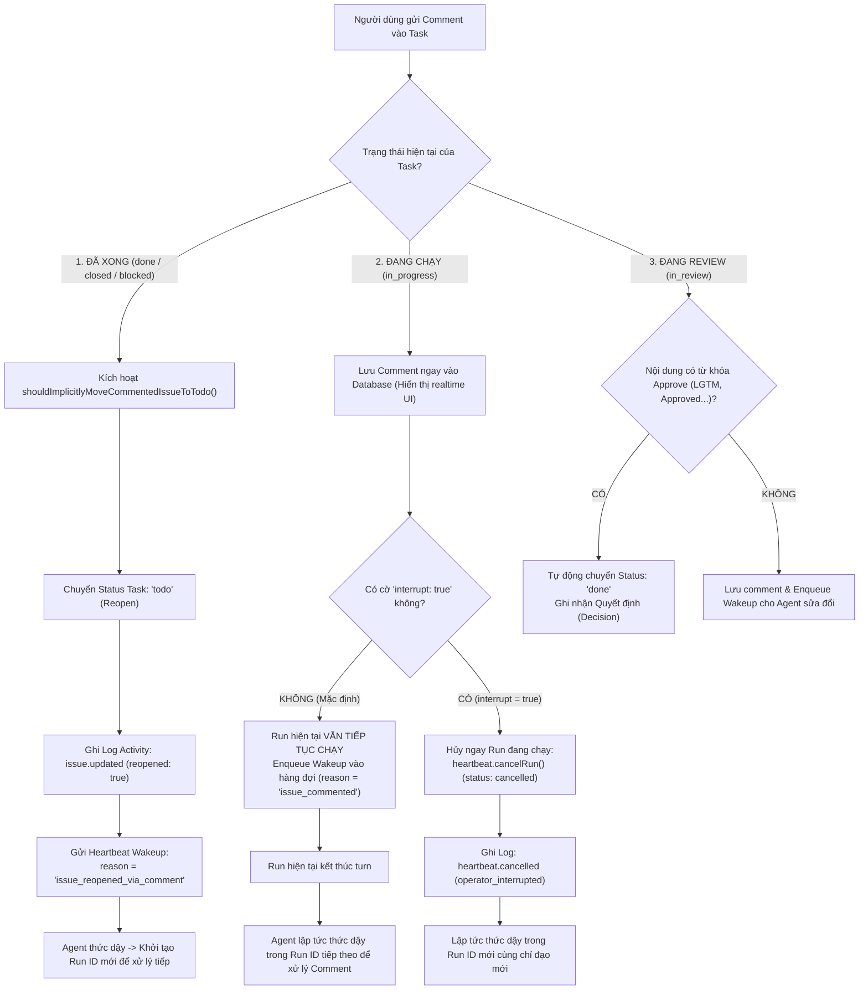
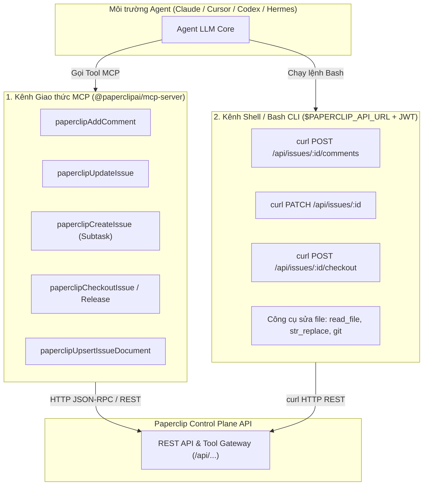
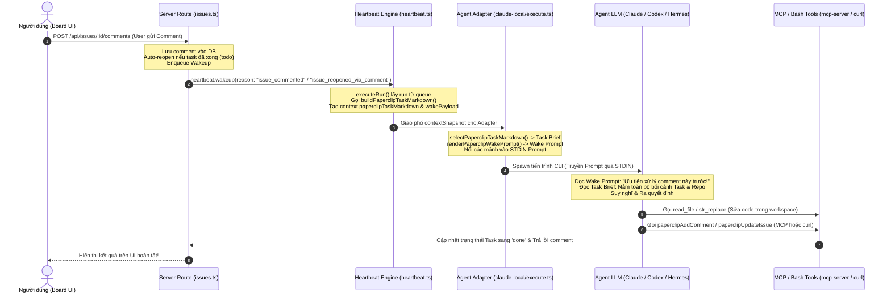

# Báo Cáo: Cơ Chế Xử Lý Logic Khi Người Dùng Bình Luận (Comment) Vào Task Trong Paperclip

## 1. Tổng quan vai trò của Comment trong Paperclip

Trong kiến trúc **Control Plane** của Paperclip, Bình luận (Comment) không chỉ đơn thuần là thông điệp hiển thị trên giao diện chat/thread, mà đóng vai trò là **Sự kiện kích hoạt (Event Trigger / Wakeup Source)** điều khiển vòng đời và trạng thái của Agent:

* **Human-in-the-loop (HIL):** Người dùng can thiệp, phản hồi, bổ sung thông tin hoặc chỉ đạo lại hướng đi của Agent.
* **Tự động mở lại Task (Auto-Reopen):** Tự động chuyển đổi trạng thái Task mà không cần người dùng phải bấm nút đổi trạng thái thủ công.
* **Xếp hàng hoặc Ngắt tiến trình (Queueing vs Interrupting):** Điều phối việc Agent xử lý ngay lập tức (hủy run cũ) hay xếp hàng chờ run hiện tại chạy xong.
* **Khởi tạo chuỗi Run ID (Run Lifecycle):** Mỗi lần can thiệp qua comment sẽ kích hoạt một lượt chạy mới (`heartbeat_run_id`).

---

## 2. Luồng xử lý chi tiết theo từng trạng thái của Task



---

## 3. Phân tích chi tiết từng trường hợp

### 3.1. Trường hợp 1: Task ĐÃ THỰC THI XONG (`done`, `closed` hoặc `blocked`)

Khi một Task đã hoàn thành hoặc đang bị chặn, nếu người dùng bình luận vào:

1. **Cơ chế Tự động mở lại (Implicit Auto-Reopen)**:
   - File xử lý: [`server/src/routes/issues.ts`](file:///c:/paperclip/server/src/routes/issues.ts) (hàm `shouldImplicitlyMoveCommentedIssueToTodo`).
   - Điều kiện kích hoạt:
     - `actor.actorType === "user"` (phải là người dùng thật bình luận, bình luận của chính Agent đó khi đóng task sẽ bị bỏ qua để tránh vòng lặp).
     - Task đang ở trạng thái đóng (`done`, `closed`, `cancelled`) hoặc `blocked`.
     - Task có `assigneeAgentId` (đã được giao cho một Agent).
   - Diễn biến: Task lập tức được chuyển trạng thái:
     $$\text{Status} \longrightarrow \mathbf{"todo"}$$
2. **Ghi nhận lịch sử (Activity Audit Log)**:
   - Hệ thống tạo bản ghi `issue.updated`:
     ```json
     {
       "action": "issue.updated",
       "details": {
         "status": "todo",
         "reopened": true,
         "reopenedFrom": "done",
         "source": "comment"
       }
     }
     ```
3. **Đánh thức Agent (`heartbeat.wakeup`)**:
   - Hệ thống gửi sự kiện đánh thức tới Agent phụ trách với:
     - `reason: "issue_reopened_via_comment"`
     - `payload: { issueId, commentId, reopenedFrom }`
     - `contextSnapshot`: Đính kèm toàn bộ ngữ cảnh nhiệm vụ và bình luận mới.
4. **Tạo Run ID mới**:
   - Agent khởi động một **Run ID hoàn toàn mới**, nạp Task (lúc này ở trạng thái `todo`) và đọc chỉ dẫn từ comment của người dùng để thực hiện tiếp.

---

### 3.2. Trường hợp 2: Task ĐANG CHẠY (`in_progress` / Có Active Run)

Khi Agent đang trong quá trình thực thi (gọi LLM, chạy tool, viết code...) mà người dùng gửi bình luận vào:

#### A. Chế độ Mặc định (Bình luận thông thường - Không ngắt):
1. **Tiến trình hiện tại KHÔNG bị gián đoạn**:
   - Agent vẫn hoàn thành nốt công việc của lượt chạy hiện tại (`Run ID` đang active).
2. **Lưu trữ tức thì**:
   - Comment được lưu ngay vào Database và hiển thị lên giao diện UI của Issue.
   - Các yêu cầu xác nhận cũ (`request_confirmation`) bị vô hiệu hóa vì đã có bình luận mới (`expireRequestConfirmationsSupersededByComment`).
3. **Xếp hàng đánh thức (Queued Wakeup)**:
   - Hệ thống gọi `heartbeat.wakeup` với `reason: "issue_commented"`. Lệnh này được xếp vào hàng đợi `agent_wakeups`.
4. **Nối tiếp Run ID**:
   - Ngay khi `Run ID` hiện tại hoàn tất, Agent sẽ **thức dậy ngay lập tức trong một `Run ID` mới** để đọc và phản hồi lại bình luận của người dùng.

#### B. Chế độ Ngắt (`interrupt: true` - Chọn "Interrupt & send comment"):
1. **Hủy ngay lập tức Run đang chạy**:
   - Hệ thống gọi `heartbeat.cancelRun(runToInterrupt.id, "Interrupted by board comment", ...)`.
   - Tiến trình Run cũ chuyển trạng thái `status: "cancelled"`.
   - Ghi log hoạt động: `heartbeat.cancelled` (loại `operator_interrupted`).
2. **Khởi chạy Run ID mới ngay lập tức**:
   - Agent không phải đợi tiến trình cũ kết thúc mà được đánh thức ngay trong một **Run ID mới** để tiếp nhận chỉ đạo can thiệp khẩn cấp của người dùng.

---

### 3.3. Trường hợp 3: Task Đang Chờ Duyệt (`in_review`)

Nếu Task đang ở trạng thái `in_review` và có chính sách kiểm duyệt (`executionPolicy`):
* Nếu bình luận của người dùng chứa các từ khóa đồng ý (như *"LGTM"*, *"Approved"*):
  - Hệ thống kích hoạt cơ chế `shouldAutoApproveReviewComment`.
  - Tự động chuyển trạng thái Task sang **`done`** và tạo bản ghi quyết định phê duyệt (`issueExecutionDecisions`).
* Nếu bình luận là góp ý/yêu cầu sửa:
  - Task được giữ nguyên hoặc chuyển trạng thái, đồng thời đánh thức Agent để sửa đổi theo phản hồi.

---

## 4. Bộ 3 Cờ Điều Khiển Vòng Đời Task (`reopen`, `resume`, `interrupt`)

Schema kiểm tra dữ liệu comment ([`packages/shared/src/validators/issue.ts:641-649`](file:///c:/paperclip/packages/shared/src/validators/issue.ts#L641-L649)) hỗ trợ 3 cờ điều khiển:

```typescript
export const addIssueCommentSchema = z.object({
  body: multilineTextSchema.pipe(z.string().min(1)),
  authorType: issueCommentAuthorTypeSchema.optional(),
  presentation: issueCommentPresentationSchema.nullable().optional(),
  metadata: issueCommentMetadataSchema.nullable().optional(),
  reopen: z.boolean().optional(),      // 👉 Mở lại task đã đóng
  resume: z.boolean().optional(),      // 👉 Tiếp tục task đang bị chặn/chờ
  interrupt: z.boolean().optional(),   // 👉 Ngắt khẩn cấp run đang chạy
});
```

### 4.1. Bảng so sánh 3 cờ điều khiển

| Cờ (Flag) | Mục đích chính | Dùng khi Task ở trạng thái | Hành vi của Server |
| :--- | :--- | :--- | :--- |
| **`reopen: true`** | **Mở lại việc đã đóng** | `done`, `closed`, `cancelled` | Chuyển task từ đã đóng $\rightarrow$ `todo` để Agent làm lại/làm thêm. |
| **`resume: true`** | **Tiếp tục việc đang bị chặn / tạm dừng** | `blocked`, `backlog`, `scheduled_retry` | Giải tỏa trạng thái chờ/chặn $\rightarrow$ `todo` để Agent làm tiếp ngay. |
| **`interrupt: true`** | **Ngắt khẩn cấp việc đang chạy** | `in_progress` (Live Run) | Hủy ngay run đang chạy (`cancelled`) $\rightarrow$ tạo Run mới với chỉ đạo mới. |

---

### 4.2. Chi tiết cờ `reopen: true`
* **Ý nghĩa:** Dành cho việc đã hoàn thành hoặc đã hủy nhưng phát sinh yêu cầu mới / phát hiện lỗi cần làm lại.
* **Cách dùng UI:** Khi comment vào task `done` hoặc `closed`, UI tự động gán `reopen: true` ([`IssueChatThread.tsx:3665`](file:///c:/paperclip/ui/src/components/IssueChatThread.tsx#L3665)).
* **API Payload:**
  ```json
  {
    "body": "Phát hiện lỗi ở bước 2, hãy mở lại task và sửa giúp tôi.",
    "reopen": true
  }
  ```

---

### 4.3. Chi tiết cờ `resume: true`
* **Ý nghĩa:** Dành cho task bị tạm dừng do thiếu thông tin, bị kẹt blocker, hoặc đang trong lịch hẹn thử lại tự động (`scheduled_retry`).
* **Sự hiện diện trên Giao diện UI:**
  1. **Các Nút bấm Resume chuyên dụng:**
     - **`[Resume work]` / `[Resume subtree]`**: Nút bấm trên thanh điều khiển Task ([`IssueDetail.tsx:263`](file:///c:/paperclip/ui/src/pages/IssueDetail.tsx#L263)) khi Task/Subtree bị tạm dừng (Pause Hold).
     - **`[Resume from backlog]`**: Nút xuất hiện khi Task nằm trong `backlog` ([`IssueDetail.tsx:1251`](file:///c:/paperclip/ui/src/pages/IssueDetail.tsx#L1251)).
     - **`[Resume parked blocker]`**: Xuất hiện trong `Blocked Inbox` để giải phóng các task bị kẹt.
     - **`[Resume agent]`**: Nút bấm mở lại Agent khi Agent bị dừng hoặc vượt giới hạn ngân sách.
  2. **Cơ chế Tự Động Kích Hoạt khi Human Comment:**
     - Khi một Task đang bị `blocked` hoặc đang hẹn giờ thử lại (`scheduled_retry`), người dùng chỉ cần **gõ bình luận và bấm Send**.
     - Server ([`routes/issues.ts:10018-10029`](file:///c:/paperclip/server/src/routes/issues.ts#L10018-L10029)) tự động kích hoạt `shouldHumanCommentResumeInProgressScheduledRetry`, nhận diện đây là hành động tháo gỡ của con người và **tự động xử lý như lệnh `resume: true`**.
* **Hành vi Server:** 
  1. Kiểm tra giải tỏa blockers (`getDependencyReadiness`).
  2. Hủy bỏ lịch retry tự động cũ (`cancelScheduledRetrySupersededByComment`).
  3. Chuyển task sang `todo`.
  4. Đánh thức Agent với metadata ngữ cảnh: `{ resumeIntent: true, followUpRequested: true }`.
* **API Payload (cho Script / Automation):**
  ```json
  {
    "body": "Đã cấp lại quyền truy cập database, hãy tiếp tục thực thi nhé!",
    "resume": true
  }
  ```

---

### 4.4. Chi tiết cờ `interrupt: true`
* **Ý nghĩa:** Can thiệp khẩn cấp vào tiến trình đang chạy của Agent mà không cần đợi Agent chạy hết vòng lặp.
* **Thao tác trên UI:**
  1. Gõ comment và bấm **Send**.
  2. Comment hiển thị trong khối màu cam **`Queued Comments`**.
  3. Bấm nút màu đỏ **`[ Interrupt ]`** ([`CommentThread.tsx:996`](file:///c:/paperclip/ui/src/components/CommentThread.tsx#L996)) để ngắt ngay run cũ và nạp comment vào run mới.
  4. Hoặc bấm nút **`[Pause work]`** / **`[Cancel run]`** trên banner Live Run.
* **API Payload:**
  ```json
  {
    "body": "Dừng phương án A lại ngay, chuyển sang làm theo phương án B!",
    "interrupt": true
  }
  ```

---

## 5. Bảng tổng hợp so sánh các trường hợp

| Trạng thái Task khi có Comment | Hành động với Task | Hành động với Agent / Run hiện tại | Số lượng Run ID sinh ra |
| :--- | :--- | :--- | :--- |
| **`done` / `closed` / `blocked`** | Tự động Reopen $\rightarrow$ chuyển sang **`todo`** | Đánh thức Agent (`issue_reopened_via_comment`) | Tạo thêm **1 Run ID mới** |
| **`in_progress` (Comment thường)** | Giữ nguyên **`in_progress`** | Run hiện tại chạy bình thường $\rightarrow$ Xếp hàng đánh thức (`issue_commented`) | Tạo thêm **1 Run ID nối tiếp** sau khi run cũ xong |
| **`in_progress` (Comment + Interrupt)** | Giữ nguyên **`in_progress`** | Hủy ngay Run hiện tại (`cancelled`) $\rightarrow$ Đánh thức lập tức | Hủy run cũ, tạo **1 Run ID mới ngay** |
| **`in_review` (Comment Approve)** | Tự động hoàn thành $\rightarrow$ **`done`** | Ghi nhận quyết định duyệt | Không cần tạo run mới |

---

## 6. Ngữ cảnh Toàn cục của Task (The Task Brief)

Khi một Run mới được kích hoạt do người dùng Comment, Agent cần hiểu rõ toàn bộ bối cảnh của Task gốc để không bị mất phương hướng (ví dụ: chỉ thấy mỗi câu comment "Sửa lại nút bấm đi" mà không biết nút bấm thuộc màn hình nào, repo nào). Hệ thống Paperclip giải quyết việc này bằng cơ chế **Task Brief (Task Markdown)**.

### 6.1. Logic chọn Brief (`selectPaperclipTaskMarkdown`)
Tại file [`packages/adapter-utils/src/server-utils.ts:1395-1409`](file:///c:/paperclip/packages/adapter-utils/src/server-utils.ts#L1395-L1409), hàm `selectPaperclipTaskMarkdown` quyết định mức độ chi tiết của tài liệu ngữ cảnh được nạp vào prompt:

```typescript
export function selectPaperclipTaskMarkdown(
  context: Record<string, unknown> | null | undefined,
  options: { resumedSession?: boolean } = {},
): string {
  const full = asString(context?.paperclipTaskMarkdown, "").trim();
  if (!full) return "";
  if (options.resumedSession !== true) return full;
  const wake = normalizePaperclipWakePayload(context?.paperclipWake);
  if (!wake) return full;
  if (isAssignmentShapedPaperclipWakeReason(wake.reason) || isPaperclipRecoveryWakePayload(context?.paperclipWake)) {
    return full;
  }
  const compact = asString(context?.paperclipTaskMarkdownCompact, "").trim();
  return compact || full;
}
```

* **Session mới (`resumedSession !== true`):** Nạp bản **Full Task Brief** hoàn chỉnh.
* **Session nối tiếp (`resumedSession === true`):** Nếu là session đã chạy trước đó, hệ thống chỉ nạp bản thu gọn (`compact` - lược bỏ `description` chi tiết để tiết kiệm token context window) trừ khi đây là wake dạng phân công mới (`isAssignmentShapedPaperclipWakeReason`) hoặc phục hồi sự cố (`isPaperclipRecoveryWakePayload`).

---

### 6.2. Cấu trúc sinh Task Brief trên Server (`buildPaperclipTaskMarkdown`)
Tại file [`server/src/services/heartbeat.ts:5015-5130`](file:///c:/paperclip/server/src/services/heartbeat.ts#L5015-L5130), hàm `buildPaperclipTaskMarkdown` tổng hợp dữ liệu từ Database thành khối Markdown chuẩn:

1. **Mã định danh và Tiêu đề Task ([dòng 5070-5072](file:///c:/paperclip/server/src/services/heartbeat.ts#L5070-L5072)):**
   - `- Issue: "PAP-123"`
   - `- Title: "Refactor Authentication Flow"`
2. **Chỉ thị Chế độ làm việc (Work Mode Directives - [dòng 5073-5107](file:///c:/paperclip/server/src/services/heartbeat.ts#L5073-L5107)):**
   - `ask`: Chỉ trả lời trực tiếp trong thread, không viết code thực thi hay lập plan.
   - `planning`: Chỉ lập hoặc cập nhật kế hoạch, không sửa code. Nếu có comment vào task planning, directive tự đổi thành: *"Update the plan only. Do not write code or perform implementation work."*
   - `acceptedPlanContinuation`: Chỉ tạo các child issues từ plan đã duyệt, không tự code trên planning issue.
   - `skill_test`: Chỉ kiểm thử kỹ năng, không lưu thay đổi ra ngoài issue.
3. **Mô tả chi tiết của Task ([dòng 5108-5111](file:///c:/paperclip/server/src/services/heartbeat.ts#L5108-L5111)):**
   - Nạp toàn bộ phần `issue.description` gốc của người giao việc (bọc trong markdown code fence).
4. **Cây gia phả Cha / Ông (Ancestors Context - [dòng 5113-5125](file:///c:/paperclip/server/src/services/heartbeat.ts#L5113-L5125)):**
   - Nạp thông tin tối đa 6 cấp cha/ông của task hiện tại:
     `- Parent: PAP-100 Build Auth Subsystem (in_progress) [high]`
     `- Ancestor 2: PAP-1 Master Architecture Roadmap (in_progress)`
5. **Đưa vào Context Run ([dòng 12204-12230](file:///c:/paperclip/server/src/services/heartbeat.ts#L12204-L12230)):**
   - Được nạp vào `context.paperclipTaskMarkdown` và `context.paperclipTaskMarkdownCompact`.

---

## 7. Chỉ Thị Hành Động Tức Thời (The Wake Prompt)

Ngay sau khi Agent nạp xong Task Brief, hệ thống sẽ chèn **Wake Prompt** để định hướng hành động ngay lập tức của Agent trong lượt chạy này.

Hàm thực hiện: [`packages/adapter-utils/src/server-utils.ts:1411-1917`](file:///c:/paperclip/packages/adapter-utils/src/server-utils.ts#L1411-L1917) (`renderPaperclipWakePrompt`).

### 7.1. Khẩu lệnh Ưu tiên Tối thượng (Steering Directives)
Tại các dòng [1528-1542](file:///c:/paperclip/packages/adapter-utils/src/server-utils.ts#L1528-L1542), hệ thống dùng các chỉ thị nghiêm ngặt để "bẻ lái" tư duy của Agent:

```text
## Paperclip Wake Payload

Treat this wake payload as the highest-priority change for the current heartbeat.
This heartbeat is scoped to the issue below. Do not switch to another issue until you have handled this wake.
Before generic repo exploration or boilerplate heartbeat updates, acknowledge the latest comment and explain how it changes your next action.
Use this inline wake data first before refetching the issue thread.
Only fetch the API thread when `fallbackFetchNeeded` is true or you need broader history than this batch.
```

> [!IMPORTANT]
> Khẩu lệnh này buộc Agent: **Trước khi đi scan lung tung khắp repository hay chạy các lệnh kiểm tra mặc định, việc đầu tiên phải làm là xác nhận đã đọc comment mới nhất và nêu rõ comment đó làm thay đổi hành động tiếp theo như thế nào**.

### 7.2. Định dạng Danh sách Comment theo Thứ tự Thời gian
Tại các dòng [1898-1915](file:///c:/paperclip/packages/adapter-utils/src/server-utils.ts#L1898-L1915), toàn bộ đợt comment mới kích hoạt lượt chạy này sẽ được trích xuất và hiển thị:

```typescript
if (normalized.comments.length > 0) {
  lines.push("New comments in order:");
}

for (const [index, comment] of normalized.comments.entries()) {
  const authorLabel = comment.authorId
    ? `${comment.authorType ?? "unknown"} ${comment.authorId}`
    : comment.authorType ?? "unknown";
  lines.push(
    `${index + 1}. comment ${comment.id ?? "unknown"} at ${comment.createdAt ?? "unknown"} by ${authorLabel}`,
    comment.body,
  );
  if (comment.bodyTruncated) {
    lines.push("[comment body truncated]");
  }
  lines.push("");
}
```

Nhờ đó, Agent nắm bắt chính xác: Ai đã nói gì, vào thời điểm nào, và nội dung chỉ đạo cụ thể ra sao.

---

## 8. Bộ Công Cụ Thực Thi (Tools Execution Model)

Để Agent không chỉ "nói suông" mà có thể tác động trở lại Control Plane (chuyển trạng thái task, trả lời comment, tạo subtask, cập nhật code), Paperclip cung cấp 2 phương thức giao tiếp công cụ:



---

### 8.1. Kênh 1: Bộ Công Cụ Chuẩn MCP Server (`@paperclipai/mcp-server`)
Định nghĩa mã nguồn tại file [`packages/mcp-server/src/tools.ts`](file:///c:/paperclip/packages/mcp-server/src/tools.ts). Paperclip cài đặt một MCP Server hoàn chỉnh cung cấp danh sách công cụ định kiểu (typed tools via Zod):

| Tên Tool MCP Chuẩn | Dòng Code Định Nghĩa | Chức Năng Cụ Thể |
| :--- | :--- | :--- |
| **`paperclipAddComment`** | [`tools.ts:490`](file:///c:/paperclip/packages/mcp-server/src/tools.ts#L490) | Bình luận phản hồi lại thread của issue (hỗ trợ cờ `resume: true`). |
| **`paperclipUpdateIssue`** | [`tools.ts:465`](file:///c:/paperclip/packages/mcp-server/src/tools.ts#L465) | Sửa trạng thái task (`status`: `in_progress`, `done`, `blocked`, `in_review`), cập nhật độ ưu tiên hoặc gán assignee. |
| **`paperclipCreateIssue`** | [`tools.ts:458`](file:///c:/paperclip/packages/mcp-server/src/tools.ts#L458) | Tạo task mới. Khi truyền `parentId: "<current-task-id>"`, đây chính là thao tác **tạo Subtask**. |
| **`paperclipCheckoutIssue`** | [`tools.ts:472`](file:///c:/paperclip/packages/mcp-server/src/tools.ts#L472) | Nhận quyền thực thi task (atomic checkout lock) ngăn các agent khác tranh chấp. |
| **`paperclipReleaseIssue`** | [`tools.ts:484`](file:///c:/paperclip/packages/mcp-server/src/tools.ts#L484) | Nhả task nếu không tiếp tục thực hiện. |
| **`paperclipUpsertIssueDocument`** | [`tools.ts:540`](file:///c:/paperclip/packages/mcp-server/src/tools.ts#L540) | Lưu hoặc cập nhật tài liệu gắn với task (`plan`, `spec`, `architecture`). |
| **`paperclipSuggestTasks`** | [`tools.ts:497`](file:///c:/paperclip/packages/mcp-server/src/tools.ts#L497) | Tạo tương tác đề xuất danh sách task con lên giao diện cho người dùng duyệt. |
| **`paperclipAskUserQuestions`** | [`tools.ts:509`](file:///c:/paperclip/packages/mcp-server/src/tools.ts#L509) | Đặt câu hỏi trắc nghiệm / lựa chọn cho người dùng ngay trên issue thread. |
| **`paperclipRequestConfirmation`** | [`tools.ts:521`](file:///c:/paperclip/packages/mcp-server/src/tools.ts#L521) | Tạo thẻ yêu cầu người dùng bấm Đồng ý / Từ chối một quyết định quan trọng. |

#### Cách các Local Adapters tích hợp MCP:
* **Claude Local Adapter:** File [`packages/adapters/claude-local/src/server/execute.ts:856`](file:///c:/paperclip/packages/adapters/claude-local/src/server/execute.ts#L856) nạp file cấu hình MCP vào tiến trình Claude Code qua tham số:
  ```bash
  claude --mcp-config <effectiveMcpConfigPath> --strict-mcp-config
  ```
* **Codex Local Adapter:** File [`packages/adapters/codex-local/src/server/codex-home.ts:257-295`](file:///c:/paperclip/packages/adapters/codex-local/src/server/codex-home.ts#L257-L295) tạo khối cấu hình TOML:
  ```toml
  [mcp_servers.paperclip]
  headers = { Authorization = "Bearer <run-token>" }
  ```

---

### 8.2. Kênh 2: Shell / Bash CLI Tools (Skill Paperclip)
Đối với các Agent tương tác bằng command line thông qua công cụ Terminal/Bash có sẵn (`bash`, `run_shell_command`, `exec`), Paperclip hướng dẫn và cấp quyền như sau:

#### A. Tự động Tiêm Biến Môi Trường (Environment Variables Injection):
Định nghĩa tại [`packages/adapter-utils/src/server-utils.ts:1975-1977`](file:///c:/paperclip/packages/adapter-utils/src/server-utils.ts#L1975-L1977) và hướng dẫn tại [`skills/paperclip/SKILL.md:18-22`](file:///c:/paperclip/skills/paperclip/SKILL.md#L18-L22):
- `PAPERCLIP_API_URL`: URL của máy chủ điều khiển (mặc định `http://localhost:3100`).
- `PAPERCLIP_API_KEY`: Token JWT có thời hạn ngắn (short-lived JWT), chỉ có hiệu lực trong khuôn khổ `Run ID` hiện tại.
- `PAPERCLIP_RUN_ID`: ID của lượt chạy hiện thời.
- `PAPERCLIP_TASK_ID`: ID của Task đang xử lý.
- `PAPERCLIP_WAKE_COMMENT_ID`: ID của bình luận vừa kích hoạt run này.
- `PAPERCLIP_WAKE_PAYLOAD_JSON`: Toàn bộ JSON payload của đợt đánh thức.

#### B. Thao tác REST API trực tiếp qua `curl`:
Được chuẩn hóa trong cẩm nang hướng dẫn Agent tại [`skills/paperclip/SKILL.md:513-526`](file:///c:/paperclip/skills/paperclip/SKILL.md#L513-L526):

```bash
# 1. Đăng bình luận báo cáo tiến độ:
curl -sS -X POST "$PAPERCLIP_API_URL/api/issues/$PAPERCLIP_TASK_ID/comments" \
  -H "Authorization: Bearer $PAPERCLIP_API_KEY" \
  -H "Content-Type: application/json" \
  -d '{"body": "Tôi đã đọc comment của bạn và đã sửa xong lỗi responsive 5px."}'

# 2. Hoàn thành Task và đổi trạng thái sang done:
curl -sS -X PATCH "$PAPERCLIP_API_URL/api/issues/$PAPERCLIP_TASK_ID" \
  -H "Authorization: Bearer $PAPERCLIP_API_KEY" \
  -H "Content-Type: application/json" \
  -d '{"status": "done", "comment": "Hoàn tất task sau khi xử lý comment."}'

# 3. Tạo Subtask phân quyền cho Agent khác:
curl -sS -X POST "$PAPERCLIP_API_URL/api/companies/$PAPERCLIP_COMPANY_ID/issues" \
  -H "Authorization: Bearer $PAPERCLIP_API_KEY" \
  -H "Content-Type: application/json" \
  -d '{
    "title": "Viết Unit Test cho Auth Component",
    "parentId": "'"$PAPERCLIP_TASK_ID"'",
    "assigneeAgentId": "<tester-agent-id>"
  }'
```

#### C. Công cụ Workspace nội tại:
Song song với việc gọi API Paperclip, Agent sử dụng các tool filesystem có sẵn trong môi trường của mình để thực thi công việc thực tế:
- `read_file` / `cat`: Đọc mã nguồn tại workspace.
- `edit_file` / `str_replace` / `sed`: Sửa chữa file theo yêu cầu trong comment.
- `git diff` / `git commit`: Tạo commit lưu trữ tiến độ trên branch của execution workspace.

---

---

## 9. Chu Trình Khép Kín Xử Lý 1 Comment (End-to-End Pipeline & Điểm Giao Thoa Mã Nguồn)

Để hiểu rõ toàn bộ cỗ máy này vận hành, dưới đây là luồng dữ liệu chi tiết từ khi người dùng bấm **Send Comment** trên UI cho đến khi Agent nhận diện ngữ cảnh, sửa code và cập nhật lại Paperclip Control Plane:



---

### 9.1. Điểm giao thoa 1: Server gọi `buildPaperclipTaskMarkdown` ở đâu và khi nào?

Hàm `buildPaperclipTaskMarkdown` được gọi **trực tiếp bên trong cỗ máy thực thi Heartbeat Runner**:
- **File:** [`server/src/services/heartbeat.ts`](file:///c:/paperclip/server/src/services/heartbeat.ts)
- **Hàm cha:** `executeRun(runId: string)` (bắt đầu từ [dòng 11870](file:///c:/paperclip/server/src/services/heartbeat.ts#L11870)).
- **Vị trí gọi chính xác:** [Dòng 12204 – 12231](file:///c:/paperclip/server/src/services/heartbeat.ts#L12204-L12231).

#### Diễn biến tại Server:
1. Khi một lượt chạy (`Run ID`) được lấy ra khỏi hàng đợi (`queued` $\rightarrow$ `running`), hàm `executeRun` chuẩn bị dữ liệu ngữ cảnh:
   - Lấy thông tin Issue (`issueRef` [L12106](file:///c:/paperclip/server/src/services/heartbeat.ts#L12106)).
   - Lấy danh sách task cha/ông: `issueAncestors = await issuesSvc.getAncestors(issueRef.id)` ([L12134](file:///c:/paperclip/server/src/services/heartbeat.ts#L12134)).
   - Lấy nội dung comment vừa kích hoạt: `safeWakeCommentContext` ([L12129](file:///c:/paperclip/server/src/services/heartbeat.ts#L12129)).
2. **Thực thi tạo Task Brief:**
   ```typescript
   // server/src/services/heartbeat.ts:12184-12231
   const taskMarkdownInput = {
     issue: issueRef ? {
       id: issueRef.id,
       identifier: issueRef.identifier,
       title: issueRef.title,
       workMode: issueRef.workMode,
       description: issueRef.description,
     } : null,
     ancestors: issueAncestors,
     wakeComment: safeWakeCommentContext,
     interaction: { ... },
     acceptedPlanContinuation: ...
   };

   // 👉 Gọi hàm sinh Markdown tại đây:
   const taskMarkdown = buildPaperclipTaskMarkdown(taskMarkdownInput);
   const taskMarkdownCompact = buildPaperclipTaskMarkdown({ ...taskMarkdownInput, includeDescription: false });

   // 👉 Đóng gói vào context snapshot của Run:
   if (taskMarkdown) {
     context.paperclipTaskMarkdown = taskMarkdown;
   }
   if (taskMarkdownCompact && taskMarkdownCompact !== taskMarkdown) {
     context.paperclipTaskMarkdownCompact = taskMarkdownCompact;
   }
   ```
3. Sau khi context được hoàn tất, Server dispatch context này sang cho **Adapter** của Agent tương ứng (như `claude_local`, `cursor_local`, `codex_local`, `hermes`).

---

### 9.2. Điểm giao thoa 2: Adapter nhận và ghép nối các mảnh Prompt như thế nào?

Minh họa tiêu biểu tại Adapter Claude Local: [`packages/adapters/claude-local/src/server/execute.ts`](file:///c:/paperclip/packages/adapters/claude-local/src/server/execute.ts).

Tại đây, Adapter import các helper từ `@paperclipai/adapter-utils/server-utils` ([dòng 43-45](file:///c:/paperclip/packages/adapters/claude-local/src/server/execute.ts#L43-L45)):
- `selectPaperclipTaskMarkdown`
- `renderPaperclipWakePrompt`
- `joinPromptSections`

Tại [dòng 802 – 820](file:///c:/paperclip/packages/adapters/claude-local/src/server/execute.ts#L802-L820), Adapter tiến hành **lắp ghép 2 mảnh ghép ngữ cảnh**:
```typescript
// 1. Trích xuất Task Brief (Ngữ cảnh toàn cục):
const taskContextNote = selectPaperclipTaskMarkdown(context, { resumedSession: Boolean(sessionId) });

// 2. Render Wake Prompt (Chỉ thị ưu tiên xử lý comment):
const wakePrompt = renderPaperclipWakePrompt(context.paperclipWake, {
  resumedSession: Boolean(sessionId),
  // Nếu Task Brief đã có description rồi thì wake prompt không lặp lại nữa
  suppressIssueDescription: taskContextNote.length > 0,
});

// 3. Ghép các mảnh lại theo thứ tự chiến lược:
const prompt = joinPromptSections([
  renderedBootstrapPrompt,
  wakePrompt,        // 👈 ĐẶT LÊN ĐẦU: Chỉ thị tối thượng bẻ lái AI xử lý comment
  sessionHandoffNote,
  taskContextNote,   // 👈 TIẾP THEO: Toàn bộ thông tin gốc của Task và cây cha/ông
  renderedPrompt,
]);
```

Cuối cùng, Adapter khởi chạy CLI Agent và **bơm trực tiếp chuỗi `prompt` đã ghép hoàn chỉnh vào luồng `stdin`** của tiến trình Agent ([dòng 918](file:///c:/paperclip/packages/adapters/claude-local/src/server/execute.ts#L918)):
```typescript
const proc = await runAdapterExecutionTargetProcess(runId, runtimeExecutionTarget, command, args, {
  cwd,
  env,
  stdin: prompt, // 👈 Bơm prompt vào tiến trình Agent
  ...
});
```

---

### 9.3. Điểm giao thoa 3: Agent đọc Prompt và gọi Công cụ Thực thi

Khi Agent nhận được nội dung qua `stdin`:
1. **Đọc phần đầu (`Wake Prompt`):** 
   - Bắt gặp khẩu lệnh: *"Treat this wake payload as the highest-priority change... Before generic repo exploration, acknowledge the latest comment..."*
   - Kèm theo nội dung comment mới nhất của người dùng.
   - $\rightarrow$ Agent hiểu ngay: *"Nhiệm vụ khẩn cấp nhất lúc này là phải giải quyết yêu cầu trong comment này trước!"*
2. **Đọc phần tiếp theo (`Task Brief`):**
   - Đọc tiêu đề, mô tả gốc, cây cha/ông của Task.
   - $\rightarrow$ Agent hiểu toàn cảnh: *"Comment này yêu cầu sửa lỗi 5px ở trang Login thuộc Task PAP-123 (Auth Subsystem), không bị ngơ ngác mất ngữ cảnh."*
3. **Thực thi và Tác động lại Control Plane qua Tools:**
   - **Sửa Code:** Dùng các tool workspace có sẵn (`read_file`, `str_replace`, git) để sửa file CSS/Code.
   - **Phản hồi lại Paperclip:**
     - *Kênh MCP:* Gọi tool `paperclipAddComment` ([L490](file:///c:/paperclip/packages/mcp-server/src/tools.ts#L490)) trả lời người dùng, rồi gọi `paperclipUpdateIssue` ([L465](file:///c:/paperclip/packages/mcp-server/src/tools.ts#L465)) chuyển trạng thái task sang `done`.
     - *Kênh Bash:* Chạy lệnh `curl -X POST "$PAPERCLIP_API_URL/api/issues/$PAPERCLIP_TASK_ID/comments"` từ terminal tool.
4. **Kết thúc:** Tiến trình con thoát, Server ghi nhận Run ID hoàn tất thành công và giao diện Paperclip cập nhật kết quả tức thì.

---

---

## 10. Cơ Chế Xử Lý Task Thông Thường (Normal Task Execution vs. Comment-Driven Task)

Một thắc mắc phổ biến là: *Liệu một Task thông thường (được giao mới hoặc chạy định kỳ) có dùng chung bộ khung đóng gói ngữ cảnh như trên không?*

Câu trả lời là: **Hoàn toàn CÙNG MỘT BỘ KHUNG (Unified Execution Pipeline)**. Bất kể Agent được đánh thức vì lý do gì, hàm `executeRun(runId)` ([`server/src/services/heartbeat.ts:11870`](file:///c:/paperclip/server/src/services/heartbeat.ts#L11870)) và Adapter vẫn chạy chung logic, nhưng nội dung các mảnh ghép sẽ được phân hóa thông minh:

### 10.1. Bảng So Sánh Chi Tiết

| Tiêu Chí | Task Thông Thường (Giao việc mới / Chạy theo lịch) | Task Kích Hoạt Bởi Comment (User can thiệp) |
| :--- | :--- | :--- |
| **Lý do kích hoạt (`wake.reason`)** | `"assignment"` (giao việc), `"manual_dispatch"` (bấm Run), `"routine_trigger"` | `"issue_commented"` hoặc `"issue_reopened_via_comment"` |
| **Dữ liệu `wakeComment`** | `null` (không có comment đánh thức) | Chứa object comment của người dùng (`id`, `body`, `author`) |
| **Hàm `buildPaperclipTaskMarkdown`** | **Có chạy**. Nạp Title, Mô tả gốc (`issue.description`), Cây cha/ông. Kết thúc bằng: *"Use this task context as the current assignment."* | **Có chạy**. Nạp đầy đủ như trên, **cộng thêm** phần: `Latest wake comment: ...` |
| **Nội dung `Wake Prompt`** | Chỉ chứa bullet ngắn gọn: `- reason: assignment`, `- issue: ...`. Không có batch comment. | Chứa khẩu lệnh bẻ lái: *"Trước khi generic exploration, acknowledge comment mới nhất và giải thích hướng xử lý!"* kèm danh sách comment. |
| **Mẫu Chỉ Dẫn Mặc Định (`renderedPrompt`)** | **ĐƯỢC NẠP ĐẦY ĐỦ** ([`DEFAULT_PAPERCLIP_AGENT_PROMPT_TEMPLATE`](file:///c:/paperclip/packages/adapter-utils/src/server-utils.ts#L152)): Cẩm nang hướng dẫn hành vi, tự giác nghiệm thu, không làm việc nửa vời. | **Được tinh giản** (nếu là session tiếp nối) để tránh lãng phí token lặp lại, nhường chỗ cho `Wake Prompt`. |
| **Tâm thế làm việc của Agent** | Tự do khảo sát repo, đọc file, lập kế hoạch, code từ đầu đến cuối để giải quyết `issue.description`. | Bỏ qua khảo sát rộng, tập trung giải quyết đúng yêu cầu/thắc mắc trong comment. |

---

### 10.2. Cấu trúc Prompt của một Task Thông Thường

Khi một task mới được giao cho Agent (chưa có comment), chuỗi Prompt bơm vào `stdin` của CLI Agent sẽ gồm 3 phần chủ đạo:
1. **Wake Summary ngắn gọn:** Báo ID và trạng thái task (`status: todo`).
2. **Task Brief (Toàn bộ đề bài):** Nạp đầy đủ tiêu đề, mô tả gốc người dùng đã viết khi tạo task, và nhánh git làm việc.
3. **Cẩm nang hành vi Paperclip (`DEFAULT_PROMPT_TEMPLATE`):**
   - *"Bắt tay vào làm việc ngay trong heartbeat này, không dừng lại ở plan suông."*
   - *"Để lại kết quả bền vững và chốt trạng thái hợp lệ (`done`, `in_review`, `blocked`) trước khi kết thúc."*
   - *"Ưu tiên kiểm thử nhỏ nhất đủ chứng minh code chạy đúng."*
   - *"Nếu việc quá lớn, hãy tách thành child issue giao cho agent khác thay vì tự làm hết."*

---

## 11. Cơ Chế Công Cụ: CLI / Bash vs. MCP (Song Song hay Tùy Chọn? Mặc Định Dùng Gì?)

### 11.1. Hoạt động SONG SONG trong cùng phiên chạy (Co-existence)
Trong môi trường thực thi của Agent (ví dụ Claude Code, Cursor, Codex):
- **CLI / Bash Tools** (`read_file`, `write_to_file`, `str_replace`, `bash` git, build tool) **luôn luôn hiện diện** để Agent thao tác trực tiếp với mã nguồn và filesystem của workspace.
- **MCP Tools** (`paperclipAddComment`, `paperclipUpdateIssue`...) khi được bật sẽ **xuất hiện đồng thời bên cạnh các tool CLI**.
- LLM hoàn toàn có thể gọi tool `bash` để chạy `git commit`, rồi ngay lập tức gọi tool MCP `paperclipAddComment` để bình luận báo cáo kết quả. Chúng bổ trợ cho nhau và **không hề triệt tiêu nhau**.

---

### 11.2. Là TÙY CHỌN THAY THẾ (Options & Fallback) đối với việc gọi Paperclip API
Đối với các thao tác quản lý Issue (comment, đổi status sang done, checkout task):
- **Option 1 (Kênh MCP):** Gọi trực tiếp Tool MCP (Giao thức JSON-RPC chuẩn hóa, type-safe qua Zod schema, không lo lỗi cú pháp shell escape).
- **Option 2 (Kênh CLI / Bash):** Gọi qua lệnh `curl` REST API dựa trên các biến môi trường được tiêm sẵn (`$PAPERCLIP_API_URL`, `$PAPERCLIP_API_KEY`).

---

### 11.3. BÌNH THƯỜNG MẶC ĐỊNH: Agent sử dụng CLI / Bash hay MCP?

> [!IMPORTANT]
> **Bình thường mặc định (Out-of-the-box), Agent sử dụng CLI / BASH (gọi REST API bằng `curl`) chứ KHÔNG bật MCP.**

#### Dẫn chứng mã nguồn:
1. **Điều kiện bật MCP tại Adapter:**
   Tại [`packages/adapters/claude-local/src/server/execute.ts:855-857`](file:///c:/paperclip/packages/adapters/claude-local/src/server/execute.ts#L855-L857):
   ```typescript
   if (runtimeMcpServers.length > 0) {
     args.push("--mcp-config", effectiveMcpConfigPath, "--strict-mcp-config");
   }
   ```
   $\rightarrow$ Cờ `--mcp-config` **chỉ được truyền vào lệnh chạy khi `runtimeMcpServers.length > 0`**.
2. **Mặc định `runtimeMcpServers` là mảng rỗng (`[]`):**
   Tại [`server/src/services/heartbeat.ts:2176-2219`](file:///c:/paperclip/server/src/services/heartbeat.ts#L2176-L2219) (`buildPaperclipRuntimeMcpServers`):
   ```typescript
   const effective = await toolAccessService(input.db).getEffectiveProfilesForAgent(...);
   if (uniqueConnections.length === 0) {
     return []; // 👉 Mặc định chưa cấu hình tool connection nào, trả về mảng rỗng!
   }
   ```
3. **Mặc định 100% tiêm biến môi trường REST API:**
   Mọi Agent khi chạy đều được tiêm sẵn `$PAPERCLIP_API_URL` và token `$PAPERCLIP_API_KEY` ([`server-utils.ts:1975`](file:///c:/paperclip/packages/adapter-utils/src/server-utils.ts#L1975)), và bản hướng dẫn [`skills/paperclip/SKILL.md`](file:///c:/paperclip/skills/paperclip/SKILL.md) hướng dẫn Agent dùng lệnh `curl` shell để quản lý task.

#### Lý do thiết kế mặc định dùng CLI / Bash:
- **Zero Configuration (Cắm là chạy):** Mọi công cụ CLI như Claude Code, Cursor CLI, Codex CLI khi cài đặt xong đều đã có sẵn terminal tool. Người dùng không cần cài đặt thêm daemon, không cần cấu hình port MCP phức tạp.
- **Tương thích cao:** `curl` qua HTTP nội bộ luôn hoạt động tin cậy trong mọi môi trường Docker, Sandbox hoặc Worktree cô lập.
- **Khi nào MCP mới kích hoạt?** Chỉ khi quản trị viên vào **Settings $\rightarrow$ Tool Connections / Tool Profiles** để chủ động cài đặt và gán quyền MCP Server cho Agent, khi đó `uniqueConnections > 0` và cờ `--mcp-config` mới được kích hoạt.

---

---

## 12. Bản Chất Cơ Chế Thực Thi: ReAct Loop Do Ai Quản Lý? (Outer Loop vs. Inner Loop)

Một câu hỏi mang tính then chốt về mặt kiến trúc: *Cơ chế Agent suy nghĩ (Reasoning), sinh lệnh code/bash, tự thực thi tool, nhận kết quả và lặp lại (vòng lặp ReAct) là do Paperclip tự viết hay do các Provider/Agent CLI đảm nhiệm?*

> [!IMPORTANT]
> **Vòng lặp ReAct (Reason + Act) hoàn toàn do CHÍNH TIẾN TRÌNH AGENT CLI (Provider / Harness) thực hiện, KHÔNG PHẢI do Paperclip.**
> 
> Kiến trúc của Paperclip được phân định rạch ròi theo mô hình **Hai Vòng Lặp: Outer Loop (Paperclip) và Inner Loop (Agent CLI)**.

```text
┌──────────────────────────────────────────────────────────────────────────────────┐
│                           OUTER LOOP: PAPERCLIP                                  │
│                      (Control Plane & Governance)                                │
│                                                                                  │
│  1. Tiếp nhận Task / Comment từ Người dùng.                                      │
│  2. Atomic Checkout (khóa task, chống 2 agent tranh nhau làm).                   │
│  3. Kiểm soát Ngân sách (Budget hard-stop, đo lường chi phí).                     │
│  4. Đóng gói Ngữ cảnh: Task Brief + Wake Prompt + Skill + Env Vars.              │
│  5. BẬT TIẾN TRÌNH CON: claude / codex / cursor / hermes (Spawn Process)         │
│                                                                                  │
│      ┌────────────────────────────────────────────────────────────────────┐      │
│      │               INNER LOOP: AGENT CLI (Provider / Harness)           │      │
│      │                     (Vòng lặp ReAct thuần túy)                     │      │
│      │                                                                    │      │
│      │   LLM Suy nghĩ (Reasoning / Chain-of-Thought)                      │      │
│      │        │                                                           │      │
│      │        ▼                                                           │      │
│      │   Quyết định hành động: Gen tool call (vd: Bash 'git diff')        │      │
│      │        │                                                           │      │
│      │        ▼                                                           │      │
│      │   Agent CLI (Claude/Codex) tự thực thi lệnh Bash trên máy          │      │
│      │        │                                                           │      │
│      │        ▼                                                           │      │
│      │   Nhận kết quả (Observation) -> Nạp lại vào LLM Context             │      │
│      │        │                                                           │      │
│      │        └───> (Lặp lại N turns cho đến khi hoàn tất công việc)      │      │
│      └────────────────────────────────────────────────────────────────────┘      │
│                                                                                  │
│  6. Lắng nghe stdout/stderr/events để hiển thị realtime lên UI.                  │
│  7. Bắt cổng phê duyệt (Human-in-the-loop / Approval Gate nếu cần).              │
│  8. Đóng Run ID, cập nhật trạng thái Task (done / in_review / blocked).          │
└──────────────────────────────────────────────�| **Tài liệu Skill Paperclip & CLI** | [`skills/paperclip/SKILL.md:18-22, 513-526`](file:///c:/paperclip/skills/paperclip/SKILL.md#L18-L22) | Bảng hướng dẫn biến môi trường và câu lệnh `curl` REST API |
| **Schema Validation 3 cờ** | [`packages/shared/src/validators/issue.ts:641-649`](file:///c:/paperclip/packages/shared/src/validators/issue.ts#L641-L649) | Validate `reopen`, `resume`, `interrupt` |
| **Route Xử lý Comment** | [`server/src/routes/issues.ts:9971-10480`](file:///c:/paperclip/server/src/routes/issues.ts#L9971-L10480) | Tiếp nhận POST comment, kiểm tra auto-reopen, interrupt, resume |
| **Tự động mở lại Task (`todo`)** | [`server/src/routes/issues.ts:1731-1759`](file:///c:/paperclip/server/src/routes/issues.ts#L1731-L1759) | `shouldImplicitlyMoveCommentedIssueToTodo` |
| **Hủy Run đang chạy (`interrupt`)** | [`server/src/routes/issues.ts:10117-10153`](file:///c:/paperclip/server/src/routes/issues.ts#L10117-L10153) | `heartbeat.cancelRun` |
| **Vòng lặp Heartbeat & Run ID** | [`server/src/services/heartbeat.ts:13600-13850`](file:///c:/paperclip/server/src/services/heartbeat.ts) | Khởi tạo, gán context và điều phối vòng đời của các lượt chạy (Run) |
| **Định nghĩa Work Modes UI** | [`ui/src/lib/work-mode-meta.ts`](file:///c:/paperclip/ui/src/lib/work-mode-meta.ts) | Định nghĩa metadata, nhãn, icon (Búa, Danh sách, Dấu hỏi) cho 3 mode |
| **Trình chọn Mode trong Comment** | [`ui/src/components/IssueChatThread.tsx:4050-4088`](file:///c:/paperclip/ui/src/components/IssueChatThread.tsx#L4050-L4088) | Menu chọn mode và phím tắt `Ctrl + .` trong khung soạn thảo |
| **Directives Ép Buộc Cho Work Modes** | [`server/src/services/heartbeat.ts:5073-5100`](file:///c:/paperclip/server/src/services/heartbeat.ts#L5073-L5100) | Bơm chỉ thị cấm code / cấm plan cho Ask mode và Plan mode |
| **Nạp Work Mode vào Wake Prompt** | [`packages/adapter-utils/src/server-utils.ts:1587-1605`](file:///c:/paperclip/packages/adapter-utils/src/server-utils.ts#L1587-L1605) | Bơm `planning directive` vào đầu Wake Prompt của Agent |

---

## 14. Cơ Chế 3 Chế Độ Làm Việc (Work Modes): Agent Mode, Plan Mode & Ask Mode

### 14.1. Đặt Vấn Đề & Vai Trò Của Work Modes

Khi người dùng bình luận vào một Task, không phải lúc nào mục đích cũng là yêu cầu Agent nhảy vào sửa code. Có những lúc người dùng chỉ muốn:
* **Hỏi han / Tham vấn:** *"Tại sao chỗ này lại dùng hàm này?", "Giải thích cho tôi logic đoạn code trên"*. Nếu Agent hiểu lầm và nhảy vào sửa file hay commit bừa bãi sẽ gây hỏng mã nguồn.
* **Thảo luận kế hoạch:** *"Hãy lên dàn ý các bước cần làm trước, chưa được code vội"*.

Để giải quyết vấn đề này, Paperclip thiết kế **3 Chế độ Làm việc (Issue Work Modes)** tích hợp ngay tại khung soạn thảo bình luận (Comment Composer):
1. **Agent mode** (Chế độ Thực thi / Builder)
2. **Plan mode** (Chế độ Lập kế hoạch / Architect)
3. **Ask mode** (Chế độ Hỏi đáp / Advisor)

```
       [ Khung Comment UI ] 
        (Phím tắt Ctrl + .)
                │
     ┌──────────┼──────────┐
     ▼          ▼          ▼
 🔨 Agent    📋 Plan    💬 Ask
   Mode       Mode       Mode
     │          │          │
     ▼          ▼          ▼
 [Toàn quyền [CẤM code,  [CẤM code,
  code & tool] CHỈ lập    CẤM plan,
               kế hoạch]  CHỈ trả lời]
```

---

### 14.2. Bảng So Sánh Chi Tiết 3 Chế Độ

| Tiêu Chí | 🔨 Agent Mode (`standard`) | 📋 Plan Mode (`planning`) | 💬 Ask Mode (`ask`) |
| :--- | :--- | :--- | :--- |
| **Biểu tượng UI** | Cái búa (Hammer) - Màu xám | Danh sách (ClipboardList) - Màu cam | Dấu hỏi (MessageCircleQuestion) - Màu xanh |
| **Định vị vai trò** | Lập trình viên / Kỹ sư thực thi | Kiến trúc sư / Tech Lead | Trợ lý tư vấn / Cố vấn kỹ thuật |
| **Quyền sửa code** | **CHO PHÉP** (Ghi file, sửa code, chạy shell) | **NGHIÊM CẤM** (Không được sửa file) | **NGHIÊM CẤM** (Không được sửa file) |
| **Quyền tạo Subtask** | **CHO PHÉP** | **CHO PHÉP** (Phân rã backlog) | **KHÔNG** |
| **Quyền đóng Task** | **CHO PHÉP** (Đổi status `done`) | **CHO PHÉP** (Đổi status `done` khi xong plan) | **KHÔNG** (Giữ nguyên trạng thái task) |
| **Chỉ thị ép buộc** | Thực hiện hành động cụ thể để tạo ra deliverable. | `"Make the plan only. Do not write code or perform implementation work."` | `"Answer the question directly in the issue thread. Do not write implementation code, and do not produce an implementation plan."` |

---

### 14.3. Kiến Trúc Xử Lý 3 Tầng Của Work Modes

Cơ chế này được Paperclip áp đặt chặt chẽ qua 3 tầng kiến trúc:

#### 1. Tầng Giao Diện (Frontend UI)
* **File:** [`ui/src/lib/work-mode-meta.ts`](file:///c:/paperclip/ui/src/lib/work-mode-meta.ts) & [`ui/src/components/IssueChatThread.tsx:4050-4088`](file:///c:/paperclip/ui/src/components/IssueChatThread.tsx#L4050-L4088).
* Người dùng có thể bấm vào menu hoặc dùng phím tắt **`Ctrl + .`** (hoặc `Cmd + .`) để chuyển đổi nhanh giữa các mode.
* Khi người dùng bấm **Send**, ngoài nội dung bình luận, UI sẽ gửi API `PATCH /api/issues/:id` để cập nhật trường `workMode` tương ứng vào database.

#### 2. Tầng Máy Chủ (Server Heartbeat Directives)
* **File:** [`server/src/services/heartbeat.ts:5073-5100`](file:///c:/paperclip/server/src/services/heartbeat.ts#L5073-L5100).
* Trước khi đánh thức Agent, hàm `buildPaperclipTaskMarkdown` sẽ kiểm tra trường `issue.workMode`:
  ```typescript
  if (issue.workMode === "ask") {
    lines.push(
      `- Work mode: "ask"`,
      "",
      "Ask mode directive:",
      "Answer the question directly in the issue thread. Do not write implementation code, and do not produce an implementation plan. Use tools only for investigation or temporary scratch work when needed; the deliverable is the answer."
    );
  } else if (issue.workMode === "planning") {
    let directive = "Make the plan only. Do not write code or perform implementation work.";
    if (wakeComment) {
      directive = "Update the plan only. Do not write code or perform implementation work.";
    }
    lines.push(
      `- Work mode: "planning"`,
      "",
      "Planning mode directive:",
      directive
    );
  }
  ```

#### 3. Tầng Adapter (Prompt Injection & Execution Constraints)
* **File:** [`packages/adapter-utils/src/server-utils.ts:1587-1605`](file:///c:/paperclip/packages/adapter-utils/src/server-utils.ts#L1587-L1605).
* Chỉ thị trên được bơm trực tiếp vào phần đầu của **Wake Prompt**.
* Khi mô hình AI (Codex, Claude, GPT) tiếp nhận ngữ cảnh, directive này đóng vai trò như "vòng kim cô" trong prompt hệ thống, khiến AI chủ động bỏ qua các tool ghi file (`write_file`, `patch`) và chỉ tập trung vào trả lời văn bản trong luồng comment.

---

### 14.4. Kinh Nghiệm Sử Dụng Thực Tế
* **Khi cần Code / Sửa lỗi / Tạo tài liệu Document:** Chọn **`Agent mode`** (Mặc định).
* **Khi cần yêu cầu Agent phân rã công việc hoặc lên checklist kiến trúc:** Chọn **`Plan mode`**.
* **Khi cần hỏi han kiến thức, giải thích code hoặc review tiến độ:** Chọn **`Ask mode`** để tiết kiệm chi phí token và đảm bảo an toàn tuyệt đối cho mã nguồn dự án.
 Đọc stream JSON stdout của tiến trình con để cập nhật tiến độ lên Web UI.
- **Bắt cổng phê duyệt (Human-in-the-loop):** Bắt Agent dừng lại chờ người dùng bấm "Duyệt Plan" hoặc "Xác nhận xóa database" trước khi được phép tiếp tục.

---

### 12.2. Dẫn Chứng Mã Nguồn

Hãy nhìn vào cách Paperclip gọi Claude Local tại [`packages/adapters/claude-local/src/server/execute.ts:834-918`](file:///c:/paperclip/packages/adapters/claude-local/src/server/execute.ts#L834-L918):

```typescript
// 1. Paperclip chỉ chuẩn bị tham số chạy:
const args = ["--print", "-", "--output-format", "stream-json", "--verbose"];
if (maxTurns > 0) args.push("--max-turns", String(maxTurns));

// 2. Paperclip spawn tiến trình con 'claude' (Binary của Anthropic):
const proc = await runAdapterExecutionTargetProcess(runId, runtimeExecutionTarget, command, args, {
  cwd,
  env,
  stdin: prompt,                           // 👈 Bơm đề bài vào tiến trình
  onRuntimeProgress: ctx.onRuntimeProgress, // 👈 Đứng ngoài nghe lén progress để vẽ UI
});
```

Tiến trình `claude` nhận chuỗi `prompt` qua `stdin` và **tự vận hành toàn bộ chu trình suy nghĩ - chạy code bên trong nó**. Khi hoàn thành, nó thoát tiến trình (`exit 0`), lúc đó Paperclip mới đóng Run ID.

---

### 12.3. Triết Lý Thiết Kế: Tại Sao Không Tự Viết ReAct Loop?

1. **Tận dụng đỉnh cao của các hãng AI:** Anthropic, OpenAI hay Cursor tối ưu hóa vòng lặp ReAct của họ cực kỳ tinh vi (tối ưu token, sửa code chính xác, tự sửa lỗi khi bash command thất bại). Paperclip không cần "phát minh lại cái bánh xe" này.
2. **Đúng định vị Control Plane:** 
   - Nếu Agent CLI là **"Lập trình viên"** (ngồi gõ phím, tự mở terminal, tự debug code),
   - Thì Paperclip chính là **"Hệ thống Quản Trị / Ban Điều Hành"** (giao việc, cấp tiền, duyệt kế hoạch, kiểm tra KPI, mở lại task khi có phản hồi của khách hàng).

---

## 13. Vị Trí Mã Nguồn Chi Tiết Trong Repository

| Thành Phần / Tính Năng | File & Dòng Code | Vai Trò |
| :--- | :--- | :--- |
| **Task Brief Selector** | [`packages/adapter-utils/src/server-utils.ts:1395`](file:///c:/paperclip/packages/adapter-utils/src/server-utils.ts#L1395) | `selectPaperclipTaskMarkdown` - chọn bản Brief Full hay Compact |
| **Task Brief Builder** | [`server/src/services/heartbeat.ts:5015`](file:///c:/paperclip/server/src/services/heartbeat.ts#L5015) | `buildPaperclipTaskMarkdown` - gom Title, Description, Directives, Ancestors |
| **Điểm gọi Task Brief trong Run** | [`server/src/services/heartbeat.ts:12204-12231`](file:///c:/paperclip/server/src/services/heartbeat.ts#L12204-L12231) | Gọi `buildPaperclipTaskMarkdown` và nạp vào `contextSnapshot` |
| **Wake Prompt Renderer** | [`packages/adapter-utils/src/server-utils.ts:1411`](file:///c:/paperclip/packages/adapter-utils/src/server-utils.ts#L1411) | `renderPaperclipWakePrompt` - tạo chỉ thị ưu tiên xử lý comment |
| **Điểm Ghép Nối Prompt & Bơm STDIN** | [`packages/adapters/claude-local/src/server/execute.ts:802-918`](file:///c:/paperclip/packages/adapters/claude-local/src/server/execute.ts#L802-L918) | Ghép Task Brief + Wake Prompt và bơm vào `stdin: prompt` |
| **Bật Tiến Trình Con (Spawn Process)** | [`packages/adapters/claude-local/src/server/execute.ts:915`](file:///c:/paperclip/packages/adapters/claude-local/src/server/execute.ts#L915) | `runAdapterExecutionTargetProcess` - ủy thác ReAct loop cho CLI của hãng |
| **Heartbeat Prompt Mặc Định** | [`packages/adapter-utils/src/server-utils.ts:152`](file:///c:/paperclip/packages/adapter-utils/src/server-utils.ts#L152) | `DEFAULT_PAPERCLIP_AGENT_PROMPT_TEMPLATE` - cẩm nang hành vi cho task thông thường |
| **Runtime MCP Builder** | [`server/src/services/heartbeat.ts:2171-2220`](file:///c:/paperclip/server/src/services/heartbeat.ts#L2171-L2220) | `buildPaperclipRuntimeMcpServers` - kiểm tra quyền MCP (mặc định trả về `[]`) |
| **MCP Tools Registry** | [`packages/mcp-server/src/tools.ts`](file:///c:/paperclip/packages/mcp-server/src/tools.ts) | Định nghĩa các công cụ MCP: `paperclipAddComment`, `paperclipUpdateIssue`, `paperclipCreateIssue`... |
| **MCP Server Entrypoint** | [`packages/mcp-server/src/index.ts`](file:///c:/paperclip/packages/mcp-server/src/index.ts) | Khởi tạo máy chủ MCP Server |
| **Claude Adapter MCP Wiring** | [`packages/adapters/claude-local/src/server/execute.ts:856`](file:///c:/paperclip/packages/adapters/claude-local/src/server/execute.ts#L856) | Nạp cờ `--mcp-config` vào lệnh chạy Claude |
| **Codex Adapter MCP Wiring** | [`packages/adapters/codex-local/src/server/codex-home.ts:257-295`](file:///c:/paperclip/packages/adapters/codex-local/src/server/codex-home.ts#L257-L295) | Inject cấu hình `[mcp_servers.paperclip]` cho Codex |
| **Tài liệu Skill Paperclip & CLI** | [`skills/paperclip/SKILL.md:18-22, 513-526`](file:///c:/paperclip/skills/paperclip/SKILL.md#L18-L22) | Bảng hướng dẫn biến môi trường và câu lệnh `curl` REST API |
| **Schema Validation 3 cờ** | [`packages/shared/src/validators/issue.ts:641-649`](file:///c:/paperclip/packages/shared/src/validators/issue.ts#L641-L649) | Validate `reopen`, `resume`, `interrupt` |
| **Route Xử lý Comment** | [`server/src/routes/issues.ts:9971-10480`](file:///c:/paperclip/server/src/routes/issues.ts#L9971-L10480) | Tiếp nhận POST comment, kiểm tra auto-reopen, interrupt, resume |
| **Tự động mở lại Task (`todo`)** | [`server/src/routes/issues.ts:1731-1759`](file:///c:/paperclip/server/src/routes/issues.ts#L1731-L1759) | `shouldImplicitlyMoveCommentedIssueToTodo` |
| **Hủy Run đang chạy (`interrupt`)** | [`server/src/routes/issues.ts:10117-10153`](file:///c:/paperclip/server/src/routes/issues.ts#L10117-L10153) | `heartbeat.cancelRun` |
| **Vòng lặp Heartbeat & Run ID** | [`server/src/services/heartbeat.ts:13600-13850`](file:///c:/paperclip/server/src/services/heartbeat.ts) | Khởi tạo, gán context và điều phối vòng đời của các lượt chạy (Run) |


