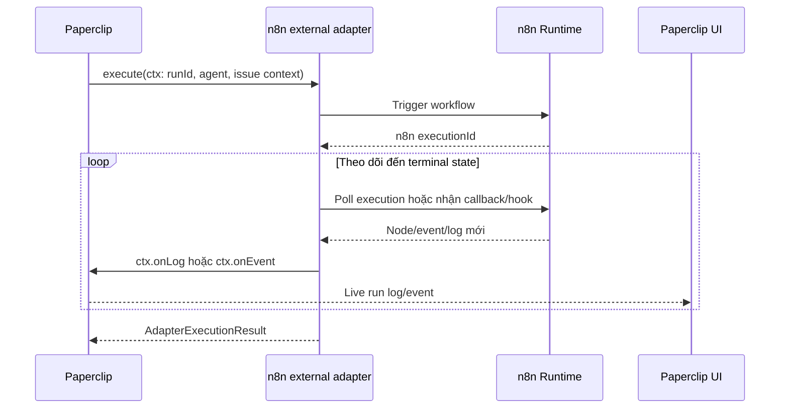
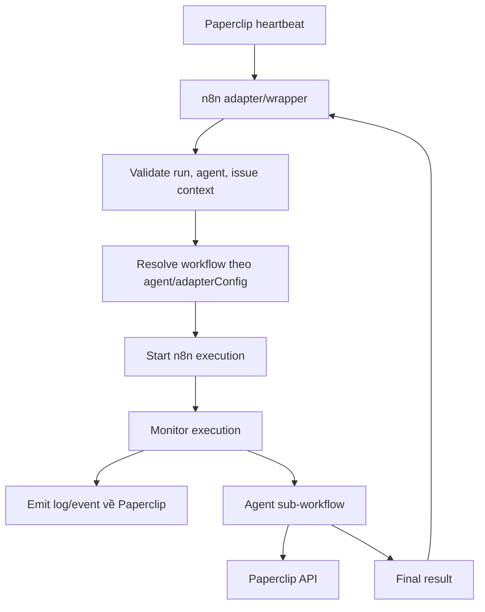

# Hướng dẫn tích hợp Paperclip với n8n và thiết kế wrapper
## 1. Kết luận kiến trúc

Paperclip là **control plane** và là nguồn dữ liệu chuẩn cho agent, issue, heartbeat run, comment, activity và chi phí. n8n là **execution runtime**. Wrapper chỉ là cầu nối giữa hai hệ thống, không được tạo thêm một hệ thống task hoặc trạng thái agent riêng.

Điểm cần sửa so với bản cũ:

- `Wrapper bên ngoài Paperclip` và `Paperclip external adapter plugin` không phải một khái niệm.
- Chỉ code chạy bên trong `adapter.execute(ctx)` mới gọi trực tiếp được `ctx.onLog`, `ctx.onEvent` và `ctx.onRuntimeProgress`.
- Một HTTP service bên ngoài không có các callback này. Nó phải đi qua một adapter bridge hoặc một endpoint ingest mới do Paperclip cung cấp.
- Polling n8n API chỉ cho ảnh chụp trạng thái gần realtime. Nó không bảo đảm bắt được chính xác thời điểm node bắt đầu và có thể bỏ qua các node chạy rất nhanh.
- n8n external hooks `workflow.preExecute/postExecute` chỉ theo dõi trước/sau **toàn workflow**, không cung cấp node-level realtime.
- `onEvent` là lịch sử event bền vững; `onRuntimeProgress` chỉ là trạng thái live tạm thời trong bộ nhớ.
- Comment là mốc nghiệp vụ trong task, không phải run log. Comment sau khi issue đã `done` có thể làm Paperclip mở lại issue thành `todo`.

Kiến trúc đích:



## 2. Phân biệt hai loại wrapper

### 2.1. HTTP wrapper chạy ngoài Paperclip

Đây là một service HTTP độc lập:

```text
Paperclip HTTP adapter -> HTTP wrapper -> n8n
```

Wrapper có thể định tuyến workflow, lưu mapping giữa run và execution, polling n8n, chuẩn hóa response và thực hiện retry kỹ thuật. Tuy nhiên, nó **không thể tự gọi** `ctx.onEvent` hay `ctx.onLog`, vì các callback chỉ tồn tại trong tiến trình Paperclip.

Muốn đẩy event từ service này vào tab Run cần một trong hai cách:

1. Có một external adapter plugin chạy trong Paperclip, nhận dữ liệu từ wrapper rồi gọi callback.
2. Mở rộng Paperclip bằng một API ingest có xác thực để nhận run event/log.

`POST /api/companies/:companyId/activity` không thay thế được run-event ingest: route này yêu cầu board auth, ghi vào activity feed và không ghi vào `heartbeat_run_events` của một run.

### 2.2. External adapter plugin chạy trong Paperclip

Đây là package adapter được Paperclip load khi khởi động:

```text
Paperclip -> n8n_runtime.execute(ctx) -> n8n
```

Adapter nhận trực tiếp:

```ts
ctx.onLog(stream, chunk);
ctx.onEvent(event);
ctx.onRuntimeProgress(update);
```

Vì vậy đây là hướng phù hợp nhất để đạt trải nghiệm gần native trong tab Run mà không phải tạo public ingest endpoint.

## 3. Trạng thái HTTP adapter trong repo hiện tại

HTTP adapter gốc chỉ gửi request, chờ response và dựa vào HTTP status để xác định thành công/thất bại. Trong working tree hiện tại đã có một **local patch chưa commit** tại `server/src/adapters/http/execute.ts`: patch đọc response body theo chunk và gọi `ctx.onLog("stdout", chunk)`.

Patch này hữu ích cho prototype nhưng cần hiểu đúng giới hạn:

- Nó chỉ stream những byte mà endpoint n8n thực sự trả về bằng chunked response/SSE.
- Nó không tự biết node nào bắt đầu, node nào kết thúc hoặc input/output của node.
- Nếu webhook n8n trả `200` ngay lập tức rồi tiếp tục chạy nền, HTTP adapter sẽ kết thúc run quá sớm.
- Nếu n8n giữ kết nối đến khi workflow hoàn tất, Paperclip run sẽ tiếp tục `running`, nhưng phải đặt timeout đủ lớn.
- Dữ liệu SSE hiện được đưa vào `onLog` dưới dạng text thô, chưa phải structured `onEvent`.

Tính năng SSE node/tool lifecycle được đề xuất ở n8n PR `#20499`, nhưng tại thời điểm rà soát 14/08/2026 PR vẫn đang mở. Không nên coi đây là tính năng ổn định đã có trong n8n đang triển khai.

## 4. Các kênh dữ liệu của Paperclip

| Kênh | Nơi lưu/hiển thị | Bền vững | Mục đích đúng |
|---|---|---:|---|
| `ctx.onLog` | Run log store, live event `heartbeat.run.log`, tab Run | Có | stdout/stderr, transcript kỹ thuật |
| `ctx.onEvent` | Bảng `heartbeat_run_events`, live event `heartbeat.run.event`, `GET /api/heartbeat-runs/:runId/events` | Có | Node/tool/phase event có cấu trúc |
| `ctx.onRuntimeProgress` | Bộ nhớ tiến trình Paperclip, live event `heartbeat.run.progress` | Không | Trạng thái hiện tại của active run |
| Issue comment | Bảng `issue_comments`, thread của task | Có | Mốc nghiệp vụ, kết quả, blocker, handoff |
| Activity | Bảng `activity_log`, company/issue activity feed | Có | Audit các hành động và thay đổi control-plane |

### Quy tắc quan trọng

- Không biến mọi log/event thành comment.
- Không dùng activity feed làm kho node trace.
- Không dùng `onRuntimeProgress` làm lịch sử vì dữ liệu này mất khi server restart, hết TTL hoặc run kết thúc.
- Dùng `onEvent` cho node/tool timeline và `onLog` cho nội dung chi tiết.
- Chỉ ghi comment ở các milestone có ý nghĩa đối với người theo dõi task.

Paperclip tự gán `runId`, `agentId` và `seq` khi adapter gọi `ctx.onEvent`. Adapter không cần tự đưa các trường đó vào event callback:

```ts
await ctx.onEvent?.({
  eventType: "n8n.node.finished",
  stream: "system",
  level: "info",
  message: "Đã đọc dữ liệu Google Sheets",
  payload: {
    executionId: "151",
    nodeName: "Get row(s) in sheet",
    runIndex: 0,
    durationMs: 1830,
  },
});
```

`onRuntimeProgress` có phase type dành chủ yếu cho runtime infrastructure (`git_sync`, `config_sync`, `adapter_startup`, `restore`, `export`, `finalize`). Với node/tool activity của n8n nên ưu tiên `onEvent`; Paperclip có thể suy ra `currentToolName` và `lastAssistantSnippet` từ event live.

## 5. Các phương án lấy dữ liệu từ n8n

| Phương án | Sửa workflow | Độ realtime | Có input/output | Nhận xét |
|---|---:|---:|---:|---|
| Chờ response cuối của webhook | Không | Không | Chỉ output cuối | Đơn giản nhất, phù hợp kiểm tra kết nối |
| HTTP response dạng SSE/chunk | Có thể | Gần realtime | Chỉ dữ liệu được chủ động stream | Phù hợp prototype; không mặc định có node lifecycle |
| Poll `GET /api/v1/executions/:id?includeData=true` | Không | Gần realtime | Có dữ liệu node đã được lưu | Có thể bỏ lỡ node nhanh; phụ thuộc cấu hình lưu execution progress |
| Thêm milestone/progress node | Có | Realtime | Do workflow chủ động chọn | Chính xác nhất về ý nghĩa nghiệp vụ |
| n8n external hooks | Không sửa từng workflow | Chỉ đầu/cuối workflow | Post hook có full run cuối | Không giải quyết node-level realtime |
| n8n internal lifecycle hooks | Không sửa từng workflow nhưng phải patch/fork n8n | Tốt nhất | `nodeExecuteAfter` có task data | API nội bộ, rủi ro khi nâng cấp; phải cài trên mọi worker ở queue mode |
| OpenTelemetry/LangSmith/Sentry | Tùy công cụ | Realtime | Thường là span/LLM trace, không mặc định có full node I/O | Cần collector/bridge để chuyển sang Paperclip |
| Error Workflow | Không | Khi lỗi | Dữ liệu lỗi | Không có tiến độ thành công |

### 5.1. Polling n8n API

Endpoint đã thử nghiệm thành công:

```http
GET /api/v1/executions/{executionId}?includeData=true
X-N8N-API-KEY: <api-key>
```

Polling chỉ hữu ích khi đáp ứng đủ các điều kiện:

- Lấy được `executionId` ngay sau khi kích hoạt workflow.
- n8n được cấu hình lưu execution và lưu tiến độ node trong lúc execution đang chạy.
- Không cấu hình xóa execution quá sớm.
- Wrapper so sánh snapshot mới với snapshot cũ và chỉ emit node/runIndex chưa gửi.

Khóa chống trùng gợi ý:

```text
executionId + nodeName + runIndex + startTime + terminalStatus
```

Không gửi toàn bộ `runData` ở mỗi lần poll. Chỉ lấy phần thay đổi, giới hạn kích thước và lọc dữ liệu nhạy cảm.

### 5.2. n8n external hooks

`EXTERNAL_HOOK_FILES` cung cấp các hook như:

- `workflow.preExecute`: trước khi workflow chạy.
- `workflow.postExecute`: sau khi workflow kết thúc và có full run data.

Hai hook này không phải `nodeExecuteBefore/nodeExecuteAfter`, nên không thể dùng riêng chúng để hiển thị từng node theo thời gian thực.

### 5.3. n8n internal lifecycle hooks

Execution engine nội bộ có:

- `nodeExecuteBefore`;
- `nodeExecuteAfter`;
- `workflowExecuteBefore`;
- `workflowExecuteAfter`;
- `sendChunk` ở các phiên bản mới.

Đây là vị trí có thể lấy chính xác node start/end và task data, nhưng là API nội bộ. Cách dùng thực tế là patch/fork n8n hoặc viết extension gắn vào execution lifecycle. Với queue mode phải triển khai hook trên tất cả worker, xử lý event trùng và không để việc gửi telemetry làm chậm workflow.

Input/output node có thể chứa access token, header, dữ liệu khách hàng hoặc payload rất lớn. Bridge phải có allowlist, redaction, truncation và không gửi binary data trực tiếp vào Paperclip.

## 6. Phân chia trách nhiệm

| Thành phần | Trách nhiệm |
|---|---|
| Paperclip | Source of truth, heartbeat run, issue lifecycle, scheduler/recovery, auth, activity, dashboard |
| External adapter | Gọi n8n, giữ run sống đến terminal state, mapping run/execution, telemetry, timeout, trả `AdapterExecutionResult` |
| Dispatcher workflow n8n | Validate context, chọn agent sub-workflow, truyền context/run identity |
| Agent sub-workflow | Thực hiện nghiệp vụ, gọi Paperclip API cho issue/comment/child issue, trả kết quả |
| Operational store | Chỉ lưu mapping và cursor phục vụ polling/retry; không làm task database thứ hai |

Operational store tối thiểu:

```text
paperclip_run_id
paperclip_issue_id
paperclip_agent_id
n8n_execution_id
n8n_workflow_id
last_observed_node_key
last_event_seq_or_cursor
execution_status
updated_at
```

Không tạo các bảng như `wrapper_tasks`, `wrapper_agent_status` hoặc `wrapper_progress_percent` làm nguồn dữ liệu riêng.

## 7. Luồng dispatcher đã sửa

Trong sơ đồ cũ, bước `Start / monitor n8n execution` đứng trước `Resolve agent workflow`. Thứ tự đúng phải là resolve workflow trước, sau đó mới start và monitor execution.



Dispatcher không nên chứa logic đọc Excel, gọi LLM hoặc xử lý nghiệp vụ riêng của từng agent.

## 8. Luồng agent sub-workflow đã sửa

Không nên mặc định `GET assigned issues` rồi tự chọn một issue khác. Heartbeat đã truyền `taskId/issueId`; workflow phải xử lý đúng issue trong context.

Luồng đề xuất:

```text
Nhận context và run identity
  -> validate companyId, agentId, issueId, runId
  -> GET /api/issues/{issueId} nếu cần làm mới context
  -> POST /api/issues/{issueId}/checkout nếu chưa được checkout
  -> comment "bắt đầu" nếu đây là milestone cần hiển thị
  -> thực hiện AI/tool/sub-workflow
  -> tạo child issue nếu cần
  -> comment kết quả/milestone cuối
  -> PATCH /api/issues/{issueId} { "status": "done" }
  -> trả final response cho adapter
```

Mọi request thay đổi issue/comment/child issue trong một heartbeat phải gửi:

```http
X-Paperclip-Run-Id: {paperclipRunId}
```

Nên dùng agent API key hoặc run-bound agent JWT khi có thể. Board token là quyền quá rộng và comment sẽ được ghi nhận như hành động của user; đây cũng là một nguyên nhân dễ làm issue terminal bị mở lại.

### Cảnh báo về comment và status

Không dùng thứ tự sau:

```text
PATCH status=done -> POST comment kết quả
```

Paperclip có logic coi comment mới trên issue terminal là tín hiệu cần tiếp tục và có thể chuyển `done -> todo`. Thứ tự an toàn là:

```text
POST comment kết quả -> PATCH status=done -> trả response cuối
```

Sau PATCH `done`, không ghi thêm comment trừ khi thật sự muốn mở lại công việc.

## 9. Tạo child issue

Agent workflow tạo sub-task bằng Paperclip API chuẩn:

```http
POST /api/companies/{companyId}/issues
Authorization: Bearer <agent-token>
X-Paperclip-Run-Id: {parentRunId}
Content-Type: application/json
```

```json
{
  "title": "Implement database migration",
  "assigneeAgentId": "child-agent-id",
  "parentId": "parent-issue-id",
  "goalId": "goal-id",
  "status": "todo"
}
```

Sau đó Paperclip scheduler chịu trách nhiệm đánh thức agent con. Agent cha không nên gọi thẳng sub-workflow của agent con rồi coi đó là một Paperclip task hoàn chỉnh.

## 10. Thiết kế event và progress

### Event bắt buộc

- execution started;
- checkout completed;
- phase started/completed;
- child issue created;
- blocked/waiting;
- final success/failure;
- usage/cost nếu n8n/provider trả được.

### Event nên có

- LLM call started/completed;
- tool call started/completed;
- API/database call;
- sub-workflow started/completed;
- node error đã phân loại;
- duration và runIndex;
- output summary đã lọc dữ liệu nhạy cảm.

### Không nên gửi mặc định

- mọi node Set/IF/Merge;
- toàn bộ biến trung gian;
- binary data;
- authorization header, cookie, API key;
- full input/output không giới hạn;
- mọi retry nội bộ không có ý nghĩa vận hành.

Usage, model và cost không tự xuất hiện chỉ vì wrapper biết `executionId`. Adapter chỉ điền được `usage`, `provider`, `model` và `costUsd` trong `AdapterExecutionResult` khi workflow, model provider hoặc tracing backend thực sự cung cấp các số liệu đó.

## 11. Lộ trình triển khai đề xuất

### Phase 1 - Prototype bằng HTTP adapter hiện tại

Mục tiêu là chứng minh lifecycle đúng trước khi theo đuổi node-level trace:

1. Paperclip gọi webhook n8n bằng HTTP adapter.
2. Webhook không trả `200` quá sớm; response cuối chỉ trả sau khi AI/tool và cập nhật issue hoàn tất.
3. n8n gửi comment bắt đầu/kết quả ở các milestone cần thiết.
4. n8n gửi comment kết quả trước, rồi mới PATCH issue thành `done`.
5. Kiểm tra Paperclip heartbeat run kết thúc một lần và issue vẫn `done`.

Kết quả Phase 1 chưa được gọi là node-level realtime.

### Phase 2 - Polling prototype

Thêm một bridge nhỏ giữ `paperclipRunId <-> n8nExecutionId`, poll execution API và phát hiện node mới. Có thể ghi kết quả ra console/SSE để kiểm tra trước, chưa cần sửa Paperclip core.

Tiêu chí đạt:

- Không emit trùng node khi poll nhiều lần.
- Phân biệt node start, success, error khi dữ liệu n8n cho phép.
- Không gửi full payload nhạy cảm.
- Poll dừng đúng khi success/error/cancelled/timeout.

### Phase 3 - External adapter `n8n_runtime`

Chuyển bridge thành Paperclip external adapter plugin:

1. `execute(ctx)` trigger n8n và nhận `executionId`.
2. Giữ promise của adapter đến khi execution terminal.
3. Chuyển node snapshot/hook thành `ctx.onEvent`.
4. Chuyển output text cần thiết thành `ctx.onLog`.
5. Trả usage/cost/model/result trong `AdapterExecutionResult` nếu có.
6. Thêm UI parser để render event n8n thành timeline dễ đọc.

#### 11.3.1. Hướng dẫn triển khai external adapter `n8n_runtime`

Phần này ghi lại cách tạo và cài đặt external adapter đã triển khai thử nghiệm trong repo local.

Adapter hiện được đặt tại:

```txt
C:\paperclip\n8n-runtime-adapter
```

Adapter type:

```txt
n8n_runtime
```

Ý nghĩa: thay vì Paperclip dùng HTTP adapter gọi một URL bridge như `http://localhost:3005/run`, Paperclip sẽ gọi trực tiếp `n8n_runtime.execute(ctx)`. Adapter này tự trigger webhook n8n, tự tìm execution, poll node output và đẩy log/event về Run tab của Paperclip.

Luồng chạy:

```txt
Paperclip heartbeat/run
-> n8n_runtime external adapter
-> gọi webhook workflow B của n8n
-> tìm executionId bằng workflowId + traceId
-> poll /api/v1/executions/{executionId}?includeData=true
-> emit ctx.onLog / ctx.onEvent
-> trả AdapterExecutionResult cho Paperclip
```

External adapter bản đầu vẫn dùng polling, chưa cần sửa Docker image của n8n và chưa cần lifecycle hook.

#### 11.3.2. Cấu trúc package adapter đã tạo

```txt
n8n-runtime-adapter/
  package.json
  tsconfig.json
  README.md
  scripts/
    copy-ui-parser.mjs
  src/
    index.ts
    metadata.ts
    types.ts
    ui-parser.cjs
    server/
      index.ts
      execute.ts
      parse.ts
      test.ts
```

Vai trò chính:

| File | Vai trò |
|---|---|
| `src/index.ts` | Entry point của package, export `createServerAdapter()` |
| `src/metadata.ts` | Khai báo `type`, `label`, `models`, `agentConfigurationDoc` |
| `src/server/index.ts` | Tạo `ServerAdapterModule`, khai báo `getConfigSchema()` |
| `src/server/execute.ts` | Logic chính: gọi n8n, tìm execution, poll node, emit log/event |
| `src/server/parse.ts` | Helper parse/summarize/redact node input-output |
| `src/server/test.ts` | Logic cho nút Test environment |
| `src/ui-parser.cjs` | Parser log JSONL để Run tab hiển thị dễ đọc hơn |
| `scripts/copy-ui-parser.mjs` | Copy UI parser sang `dist` sau khi build |

#### 11.3.3. Cài dependency và build adapter

Không tự tạo `node_modules` thủ công.

Nếu package chưa có dependency để build, chạy:

```powershell
cd C:\paperclip\n8n-runtime-adapter
pnpm install
```

Sau đó build:

```powershell
cd C:\paperclip\n8n-runtime-adapter
pnpm build
```

Kiểm tra type:

```powershell
cd C:\paperclip\n8n-runtime-adapter
pnpm typecheck
```

Khi build thành công, Paperclip sẽ load code từ folder `dist`.

Lưu ý:

- `node_modules` chỉ phục vụ quá trình build.
- `dist` mới là output chính để Paperclip dynamic import.
- Sau khi sửa code adapter, luôn chạy lại `pnpm build`.

#### 11.3.4. Cấu hình `N8N_API_KEY` cho Paperclip server

Adapter cần gọi n8n Execution API:

```txt
GET /api/v1/executions
GET /api/v1/executions/{executionId}?includeData=true
```

Vì vậy Paperclip server cần biết `N8N_API_KEY`.

Khuyến nghị đặt bằng environment variable khi chạy Paperclip:

```powershell
cd C:\paperclip
$env:N8N_API_KEY="your-n8n-api-key"
pnpm dev
```

Trong bản local này đã bổ sung logic để `pnpm dev` nạp thêm file:

```txt
C:\paperclip\.env
```

theo nguyên tắc không ghi đè biến đã set sẵn trong terminal. Vì vậy có thể đặt:

```txt
N8N_API_KEY=your-n8n-api-key
```

trong `C:\paperclip\.env`, sau đó restart Paperclip server.

Không nên hardcode API key trong `adapterConfig`, vì config có thể bị hiển thị hoặc log ra ở nhiều nơi.

Nếu dùng thêm env fallback:

```powershell
$env:N8N_BASE_URL="https://inexpert-aleida-rostrally.ngrok-free.dev"
$env:N8N_WORKFLOW_ID="<workflow-b-id>"
$env:N8N_API_KEY="your-n8n-api-key"
```

Nhưng với bản test hiện tại, nên khai báo `baseUrl` và `workflowId` trong `adapterConfig`, chỉ để `N8N_API_KEY` trong env.

#### 11.3.5. Cài external adapter vào Paperclip

Trước khi cài, cần đảm bảo Paperclip server đang chạy và API reachable:

```powershell
curl http://localhost:3100/api/health
```

Cài adapter:

```powershell
cd C:\paperclip
pnpm paperclipai adapter install --payload-json '{"packageName":"C:\paperclip\n8n-runtime-adapter","isLocalPath":true}'
```

Giải thích từng phần:

| Thành phần | Ý nghĩa |
|---|---|
| `pnpm` | Chạy command trong repo Paperclip |
| `paperclipai` | CLI quản trị của Paperclip |
| `adapter` | Nhóm lệnh liên quan external adapter |
| `install` | Đăng ký/cài adapter vào Paperclip |
| `--payload-json` | Truyền payload dạng JSON |
| `{"packageName":"C:\paperclip\n8n-runtime-adapter","isLocalPath":true}` | Cài adapter từ thư mục local |

Lệnh trên chỉ cần chạy một lần khi cài lần đầu.

Nếu lệnh báo:

```txt
Could not reach the Paperclip API
```

thì nguyên nhân thường là Paperclip server chưa chạy ở `http://localhost:3100` hoặc đang chạy ở port khác.

Nếu lệnh báo:

```txt
API error 500: npm install failed: spawn npm ENOENT
```

thì thường là do payload thiếu `isLocalPath: true`. Khi đó Paperclip hiểu `packageName` là tên npm package và cố chạy `npm install`. Với adapter local, phải truyền path qua `packageName` và bật `isLocalPath`:

```powershell
pnpm paperclipai adapter install --payload-json '{"packageName":"C:\paperclip\n8n-runtime-adapter","isLocalPath":true}'
```

#### 11.3.6. Kiểm tra adapter đã cài chưa

Xem danh sách adapter:

```powershell
cd C:\paperclip
pnpm paperclipai adapter list
```

Xem chi tiết adapter `n8n_runtime`:

```powershell
cd C:\paperclip
pnpm paperclipai adapter get n8n_runtime
```

Hai lệnh này không phải cài thêm. Chúng chỉ dùng để kiểm tra.

Ý nghĩa:

```txt
install = đăng ký adapter lần đầu
list    = xem adapter có trong danh sách chưa
get     = xem chi tiết adapter
reload  = nạp lại adapter sau khi sửa code
```

#### 11.3.7. Reload adapter sau khi sửa code

Khi sửa code trong `C:\paperclip\n8n-runtime-adapter`, không cần install lại.

Chạy:

```powershell
cd C:\paperclip\n8n-runtime-adapter
pnpm build

cd C:\paperclip
pnpm paperclipai adapter reload n8n_runtime
```

Nếu reload lỗi, có thể restart Paperclip server rồi kiểm tra lại:

```powershell
cd C:\paperclip
pnpm paperclipai adapter get n8n_runtime
```

#### 11.3.8. Cấu hình agent dùng adapter mới

Agent hiện tại đang dùng HTTP adapter kiểu:

```json
{
  "adapterType": "http",
  "adapterConfig": {
    "url": "http://localhost:3005/run",
    "method": "POST"
  }
}
```

Khi chuyển sang external adapter:

```json
{
  "adapterType": "n8n_runtime",
  "adapterConfig": {
    "webhookUrl": "https://inexpert-aleida-rostrally.ngrok-free.dev/webhook/<webhook-b>",
    "workflowId": "<workflow-b-id>",
    "baseUrl": "https://inexpert-aleida-rostrally.ngrok-free.dev",
    "method": "POST",
    "pollIntervalMs": 1000,
    "executionTimeoutMs": 300000,
    "matchTraceId": true,
    "logDetail": "compact"
  }
}
```

Adapter cũng hỗ trợ alias `url` để dễ migrate từ HTTP adapter cũ:

```json
{
  "adapterType": "n8n_runtime",
  "adapterConfig": {
    "url": "https://inexpert-aleida-rostrally.ngrok-free.dev/webhook/<webhook-b>",
    "workflowId": "<workflow-b-id>",
    "baseUrl": "https://inexpert-aleida-rostrally.ngrok-free.dev",
    "method": "POST"
  }
}
```

Tuy nhiên nên dùng `webhookUrl` cho rõ nghĩa.

Các field quan trọng:

| Field | Bắt buộc | Ý nghĩa |
|---|---:|---|
| `webhookUrl` | Có | Webhook workflow B của n8n |
| `baseUrl` | Có | Origin n8n để gọi Execution API |
| `workflowId` | Có | ID workflow B để tìm execution |
| `method` | Không | Mặc định `POST` |
| `pollIntervalMs` | Không | Chu kỳ poll, mặc định 1000ms |
| `executionTimeoutMs` | Không | Timeout execution, mặc định 300000ms |
| `matchTraceId` | Không | Nên bật để tránh match nhầm execution |
| `logDetail` | Không | `compact` hoặc `verbose` |

#### 11.3.9. Endpoint cập nhật agent

Nếu update bằng API/Postman:

```http
PATCH http://localhost:3100/api/companies/{companyId}/agents/{agentId}
Authorization: Bearer <token>
Content-Type: application/json
```

Body mẫu:

```json
{
  "adapterType": "n8n_runtime",
  "adapterConfig": {
    "webhookUrl": "https://inexpert-aleida-rostrally.ngrok-free.dev/webhook/<webhook-b>",
    "workflowId": "<workflow-b-id>",
    "baseUrl": "https://inexpert-aleida-rostrally.ngrok-free.dev",
    "method": "POST",
    "pollIntervalMs": 1000,
    "executionTimeoutMs": 300000,
    "matchTraceId": true,
    "logDetail": "compact"
  }
}
```

#### 11.3.10. Kiểm tra end-to-end sau khi cài

Checklist:

```txt
1. n8n Docker đang chạy.
2. n8n đã bật lưu execution data.
3. n8n API key gọi được Execution API.
4. Paperclip server đang chạy với N8N_API_KEY.
5. Adapter n8n_runtime đã install thành công.
6. Agent đã đổi adapterType sang n8n_runtime.
7. Agent config có webhookUrl, baseUrl, workflowId.
8. Tạo task mới để Paperclip wake agent.
9. Workflow B bên n8n được trigger.
10. Run tab Paperclip hiện log:
    - bridge.started
    - n8n.triggered
    - n8n.execution.found
    - n8n.node.finished
    - n8n.execution.finished
11. Issue status/comment được workflow B cập nhật đúng.
```

#### 11.3.11. Lưu ý với Docker và ngrok

Trường hợp hiện tại:

```txt
n8n chạy Docker
Paperclip chạy Windows host
```

Khi n8n container gọi Paperclip Windows:

```txt
http://host.docker.internal:3100
```

Khi Paperclip Windows gọi n8n:

```txt
https://inexpert-aleida-rostrally.ngrok-free.dev
```

hoặc nếu gọi trực tiếp được:

```txt
http://localhost:5678
```

Điểm dễ nhầm:

- `host.docker.internal` dùng từ container Docker gọi ra host.
- Paperclip đang chạy trên Windows host thì không nhất thiết dùng `host.docker.internal` để gọi n8n.
- `baseUrl` phải là URL mà Paperclip server gọi được.
- `webhookUrl` phải là URL webhook workflow B mà Paperclip gọi được.

#### 11.3.12. Kết quả đã kiểm tra ở bản local

Các lệnh đã chạy thành công trong package adapter:

```powershell
cd C:\paperclip\n8n-runtime-adapter
pnpm build
pnpm typecheck
```

Kết quả:

```txt
build pass
typecheck pass
```

Đã test import adapter từ output `dist`:

```json
{
  "type": "n8n_runtime",
  "hasExecute": "function",
  "hasTest": "function",
  "hasSchema": "function"
}
```

Lệnh install đã được thử, endpoint đúng là:

```txt
POST http://localhost:3100/api/adapters/install
```

Nhưng tại thời điểm thử, Paperclip server chưa chạy nên CLI báo không reach được API. Đây không phải lỗi code adapter.

### Phase 4 - Hook/telemetry nâng cao

Chỉ làm khi polling không đáp ứng độ chính xác:

- patch internal n8n lifecycle hooks để push node start/end;
- hoặc đưa span vào OpenTelemetry collector rồi bridge sang adapter;
- bổ sung cancel propagation, idempotency, backpressure và queue-worker deployment.

Không nên bắt đầu bằng phase này vì chi phí bảo trì theo phiên bản n8n cao.

## 12. API Paperclip liên quan

```http
GET  /api/heartbeat-runs/{runId}/events?afterSeq=0&limit=200
GET  /api/heartbeat-runs/{runId}/log?offset=0&limitBytes=256000
GET  /api/issues/{issueId}/activity
GET  /api/issues/{issueId}/runs
POST /api/issues/{issueId}/comments
POST /api/issues/{issueId}/checkout
PATCH /api/issues/{issueId}
POST /api/companies/{companyId}/issues
POST /api/companies/{companyId}/cost-events
```

Paperclip hiện chưa có public `POST /api/heartbeat-runs/{runId}/events`. Nếu chọn wrapper HTTP chạy ngoài Paperclip và muốn ingest trực tiếp vào run, cần bổ sung endpoint riêng có:

- board/integration authentication;
- company/run/agent scope validation;
- mapping `paperclipRunId <-> n8nExecutionId`;
- idempotency key;
- payload size limit và redaction;
- từ chối event đến muộn sau terminal state hoặc lưu chúng theo chính sách rõ ràng.

Ví dụ thiết kế, chưa phải endpoint hiện có:

```http
POST /api/integrations/n8n/runs/{runId}/events
Authorization: Bearer <integration-token>
Idempotency-Key: {executionId}:{nodeName}:{runIndex}:{status}
```

## 13. Tiêu chí nghiệm thu

- Một Paperclip heartbeat tương ứng đúng một n8n execution.
- HTTP `200` không được hiểu là hoàn tất nếu n8n vẫn còn chạy nền.
- Issue không bị lặp `done -> todo -> in_progress` ngoài ý muốn.
- Event node xuất hiện theo đúng thứ tự và không trùng.
- Log/event/comment/activity hiển thị đúng bề mặt của chúng.
- Không lộ API key, cookie, authorization header hoặc dữ liệu nhạy cảm trong log/event.
- Timeout/cancel dừng polling và, nếu có API hỗ trợ, hủy execution n8n.
- Adapter restart có thể khôi phục mapping từ operational store.
- Payload lớn được tóm tắt hoặc lưu ngoài, không nhét toàn bộ vào event.

## 14. Nguồn kiểm chứng

### Paperclip local source

- `packages/adapter-utils/src/types.ts`: `AdapterExecutionContext`, `AdapterRuntimeEvent`, `AdapterExecutionResult`.
- `packages/adapter-utils/src/runtime-progress.ts`: phase và kiểu của `onRuntimeProgress`.
- `server/src/services/heartbeat.ts`: lưu run event, run log và phát live event.
- `packages/db/src/schema/heartbeat_run_events.ts`: schema event bền vững.
- `server/src/routes/agents.ts`: `GET /heartbeat-runs/:runId/events`.
- `server/src/routes/activity.ts`: activity GET/POST; POST yêu cầu board auth.
- `server/src/routes/issues.ts`: logic comment có thể chuyển issue terminal về `todo`.
- `server/src/adapters/http/execute.ts`: HTTP adapter và local response-stream patch.
- `docs/adapters/external-adapters.md`: cách đóng gói external adapter plugin.

### n8n

- [n8n external hooks tại commit đã khảo sát](https://github.com/n8n-io/n8n/blob/9205eb3f1908b94904b6d5400c32dcf3c4baf1b7/packages/cli/src/external-hooks.ts#L149)
- [n8n internal execution lifecycle hooks](https://github.com/n8n-io/n8n/blob/9205eb3f1908b94904b6d5400c32dcf3c4baf1b7/packages/core/src/execution-engine/execution-lifecycle-hooks.ts#L16)
- [Đề xuất n8n SSE node/tool lifecycle PR #20499](https://github.com/n8n-io/n8n/pull/20499)
- [n8n execution data](https://docs.n8n.io/hosting/scaling/execution-data/)

## Kết luận cuối

Với hệ thống hiện tại, nên tiếp tục HTTP adapter để hoàn thiện lifecycle và chống vòng lặp task. Không nên tuyên bố đã có node-level realtime chỉ vì lấy được execution JSON hoặc đọc được SSE response.

Khi prototype ổn định, external adapter `n8n_runtime` là bước nâng cấp hợp lý nhất: adapter chạy trong Paperclip, giữ heartbeat run đến khi n8n kết thúc, chuyển telemetry thành `onLog/onEvent` và trả kết quả chuẩn. Internal lifecycle hook chỉ nên là bước cuối khi polling và milestone event không còn đáp ứng yêu cầu quan sát.
