# Hướng dẫn cấu hình workflow n8n tích hợp Paperclip

Tài liệu này hướng dẫn cấu hình workflow n8n để nhận task từ Paperclip, đọc file đính kèm, tạo báo cáo Markdown, cập nhật kết quả và đóng task.

## 1. Sơ đồ toàn luồng

Ảnh toàn bộ workflow:

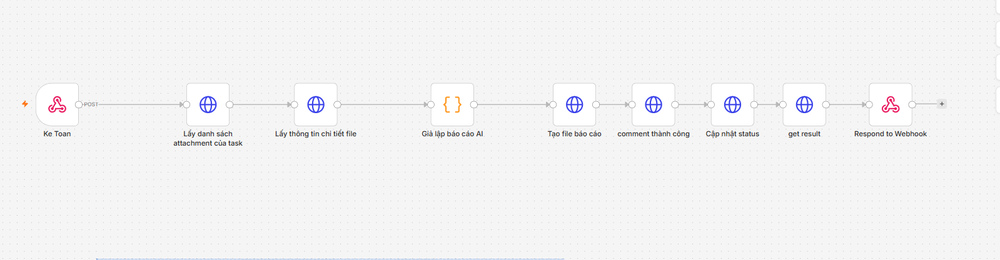

Ảnh được lưu tại `instructions/images/workflow.png`.

Luồng xử lý tổng quát:

```text
Webhook Ke Toan
    -> Lấy danh sách attachment của task
    -> Lấy thông tin chi tiết file
    -> Giả lập báo cáo AI / AI Agent
    -> Tạo file báo cáo Markdown
    -> Ghi comment thành công
    -> Cập nhật status task
    -> Lấy kết quả task
    -> Respond to Webhook
```

## 2. Mục tiêu workflow

- Nhận context task do Paperclip gửi qua HTTP adapter hoặc external adapter.
- Xác định đúng `issueId`, `runId`, `agentId` và `companyId`.
- Lấy file người dùng đã upload vào task.
- Đọc nội dung file để xử lý.
- Tạo báo cáo kết quả ở định dạng Markdown.
- Lưu báo cáo vào phần Documents của task để Paperclip hiển thị trực tiếp.
- Ghi comment milestone ngắn gọn.
- Cập nhật task sang trạng thái kết thúc phù hợp.
- Trả response cuối cho Paperclip.

## 3. Danh sách node

| STT | Tên node | Loại node | Vai trò |
|---:|---|---|---|
| 1 | `Ke Toan` | Webhook | Nhận request và context task từ Paperclip |
| 2 | `Lấy danh sách attachment của task` | HTTP Request | Lấy danh sách file gắn với task |
| 3 | `Lấy thông tin chi tiết file` | HTTP Request | Đọc metadata hoặc nội dung file |
| 4 | `Giả lập báo cáo AI` | Code | Tạo dữ liệu báo cáo mẫu khi chưa dùng AI thật |
| 5 | `Tạo file báo cáo` | HTTP Request | Tạo hoặc cập nhật Paperclip document dạng Markdown |
| 6 | `comment thành công` | HTTP Request | Ghi comment kết quả vào task |
| 7 | `Cập nhật status` | HTTP Request | Cập nhật trạng thái task, ví dụ `done` hoặc `blocked` |
| 8 | `get result` | HTTP Request | Kiểm tra lại trạng thái và kết quả task |
| 9 | `Respond to Webhook` | Respond to Webhook | Trả response cuối về cho Paperclip |

## 4. Nguyên tắc cấu hình chung

- URL Paperclip từ n8n Docker thường dùng `http://host.docker.internal:3100` khi Paperclip chạy trên máy host.
- Nếu Paperclip và n8n cùng chạy Docker network, ưu tiên dùng tên service/container, ví dụ `http://paperclip:3100`.
- Mọi request thay đổi dữ liệu Paperclip phải dùng Bearer token hợp lệ.
- Khi cập nhật issue hoặc ghi comment trong một run, nên gửi header:

```http
x-paperclip-run-id: {{$json.body.runId}}
```

- Không dùng cố định `issueId` trong URL. Lấy từ payload webhook hoặc node context.
- Đảm bảo Webhook node đang dùng Production URL khi Paperclip gọi workflow.
- Nếu adapter cần theo dõi execution n8n, phải truyền `traceId` xuyên suốt workflow.

## 5. Context mẫu từ Paperclip

Payload thường cần giữ lại các trường sau:

```json
{
  "runId": "paperclip-run-id",
  "paperclipRunId": "paperclip-run-id",
  "issueId": "paperclip-issue-id",
  "taskId": "paperclip-issue-id",
  "agentId": "agent-id",
  "companyId": "company-id",
  "traceId": "pc-run-paperclip-run-id",
  "context": {
    "source": "issue.assigned"
  }
}
```

## 6. Lưu ý xác thực cho các node HTTP Request

Các node HTTP Request gọi API Paperclip cần sử dụng API key của agent tương ứng để tạo Bearer token.

Quy trình:

1. Lấy API key của agent trong Paperclip.
2. Tạo credential loại **Bearer Auth** trong n8n.
3. Dán API key vào trường token của credential.
4. Chọn credential đó trong từng node HTTP Request gọi Paperclip.

Ảnh hướng dẫn:

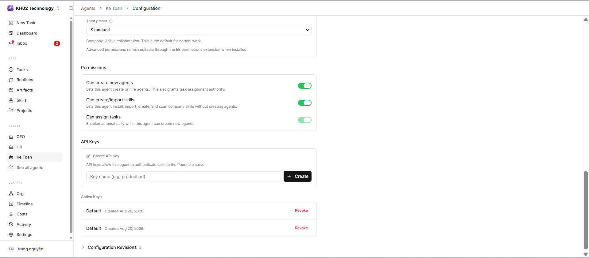

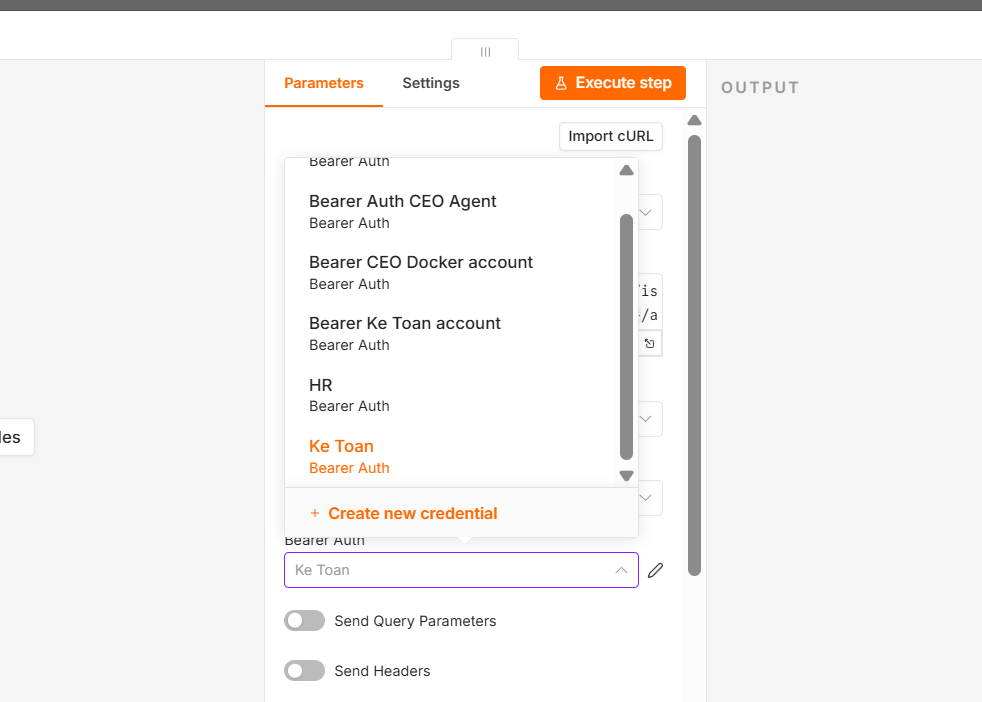

> Không ghi API key trực tiếp vào URL, body hoặc file workflow JSON khi chia sẻ. Nên lưu trong n8n Credentials và không đưa token thật lên GitHub.

## 7. Cấu hình chi tiết từng node

Các phần dưới đây sẽ được bổ sung lần lượt theo ảnh và thông số thực tế của từng node.

### 7.1 Webhook `Ke Toan`

Ảnh cấu hình:


Cấu hình cần thiết:

- Chọn **Respond: Using 'Respond to Webhook' Node**.
- Không cần cấu hình thêm tại node Webhook cho bước demo này.

Các thông tin cần kiểm tra:

- HTTP Method.
- Production URL.
- Authentication.
- Response mode.
- Vị trí lấy `issueId`, `runId`, `traceId`.

### 7.2 HTTP Request `Lấy danh sách attachment của task`

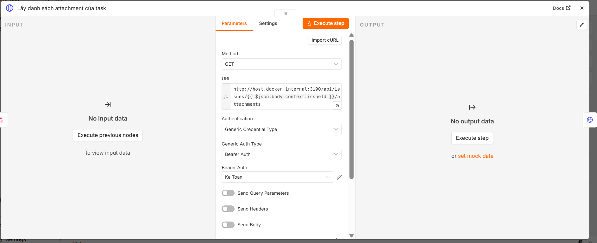

Cấu hình:

- **Method:** `GET`.
- **URL:**

```text
http://host.docker.internal:3100/api/issues/{{ $json.body.context.issueId }}/attachments
```

- **Authentication:** chọn **Bearer Auth** đã tạo ở phần xác thực.

Endpoint dự kiến:

```http
GET /api/issues/{issueId}/attachments
```

### 7.3 HTTP Request `Lấy thông tin chi tiết file`

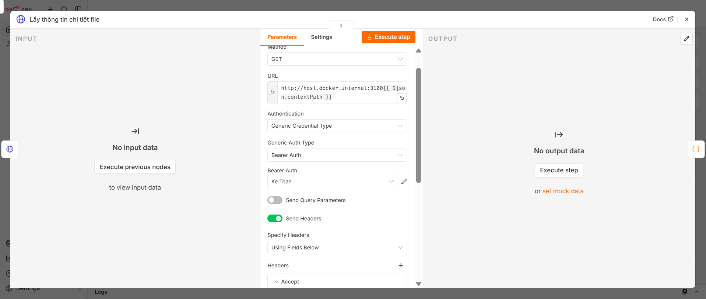

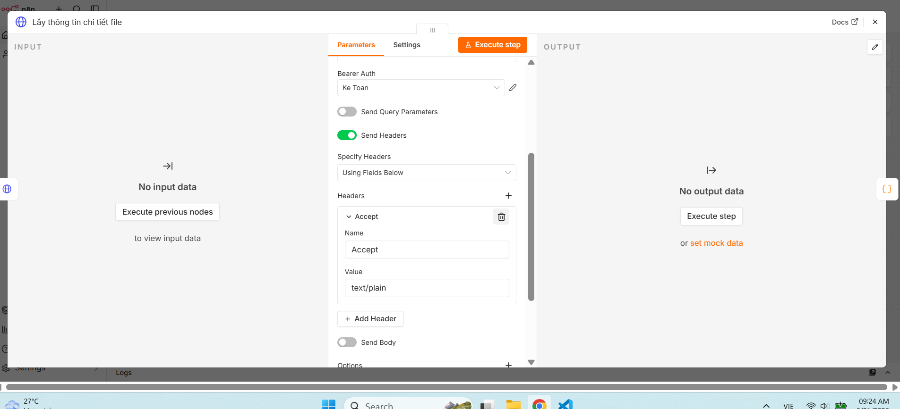

Cấu hình:

- **Method:** `GET`.
- **URL:**

```text
http://host.docker.internal:3100/api/attachments/{{ $('Lấy danh sách attachment của task').item.json[0].id }}/content
```

- **Authentication:** chọn **Bearer Auth**.
- Bật **Send Headers**.
- Thêm header `Accept` với giá trị phù hợp, ví dụ `text/plain, text/csv, application/octet-stream`.

Endpoint dự kiến:

```http
GET /api/attachments/{attachmentId}/content
```

### 7.4 Code `Giả lập báo cáo AI`

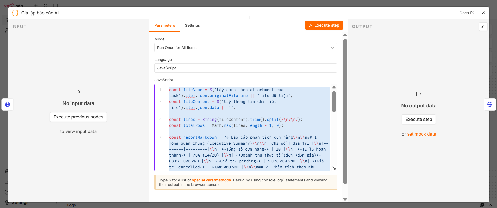

Cấu hình:

- **Loại node:** `Code`.
- **Ngôn ngữ:** `JavaScript`.
- Chọn chế độ chạy một lần cho toàn bộ dữ liệu nếu workflow đang xử lý một file.

Mã JavaScript:

```javascript
const fileName = $('Lấy danh sách attachment của task').item.json.originalFilename || 'file dữ liệu';
const fileContent = $('Lấy thông tin chi tiết file').item.json.data || '';
const lines = String(fileContent).trim().split(/\r?\n/);
const totalRows = Math.max(lines.length - 1, 0);

const reportMarkdown = `# Báo cáo phân tích đơn hàng

## 1. Tổng quan chung (Executive Summary)

| Chỉ số | Giá trị |
|--------|---------|
| **Tổng số đơn hàng** | 20 |
| **Tỉ lệ hoàn thành** | 70% (14/20) |
| **Doanh thu thực tế (đơn * đơn giá)** | 63 871 000 VNĐ |
| **Giá trị pending** | 5 078 000 VNĐ |
| **Giá trị cancelled** | 6 000 000 VNĐ |

## 2. Phân tích theo Khu vực

### 2.1 Doanh thu theo khu vực

| Khu vực | Doanh thu (VNĐ) |
|---------|-----------------|
| HCM | 34 200 000 |
| DN | 23 029 000 |
| HN | 3 092 000 |
| CT | 3 550 000 |

**Khu vực có doanh thu cao nhất:** **HCM**.

### 2.2 Số lượng đơn hàng theo khu vực

| Khu vực | Số đơn |
|---------|--------|
| HN | 6 |
| HCM | 5 |
| DN | 5 |
| CT | 4 |

**Khu vực có số lượng đơn nhiều nhất:** **HN**.

## 3. Phân tích theo Kênh bán

| Kênh | Số đơn | Doanh thu (VNĐ) |
|------|--------|-----------------|
| Lazada | 5 | 38 700 000 |
| Shopee | 6 | 18 187 000 |
| Tiki | 4 | 5 045 000 |
| Web | 5 | 1 939 000 |

**Kênh bán hiệu quả nhất theo doanh thu:** **Lazada**.

## 4. Phân tích sản phẩm

| Sản phẩm | Số lượng bán ra | Doanh thu (VNĐ) |
|----------|-----------------|-----------------|
| USB | 10 | - |
| Tai nghe | 6 | 2 840 000 |
| Chuot | 5 | 2 130 000 |
| Laptop | 2 | 36 000 000 |

## 5. Kết luận & Đề xuất

- Lazada đem lại doanh thu cao nhất.
- HCM là khu vực dẫn đầu về doanh thu.
- Nên tăng quảng cáo cho các sản phẩm có giá trị cao trên Lazada.
`;

return [
  {
    json: {
      reportMarkdown,
      summary: `Đã xử lý file ${fileName} với ${totalRows} dòng dữ liệu.`,
    },
  },
];
```

Node này tạo output trung gian có thể dùng làm báo cáo mẫu trước khi kết nối AI Agent thật.

Output nên có dạng:

```json
{
  "reportMarkdown": "# Báo cáo kết quả\n\nNội dung báo cáo...",
  "summary": "Tóm tắt kết quả xử lý"
}
```

### 7.5 HTTP Request `Tạo file báo cáo`

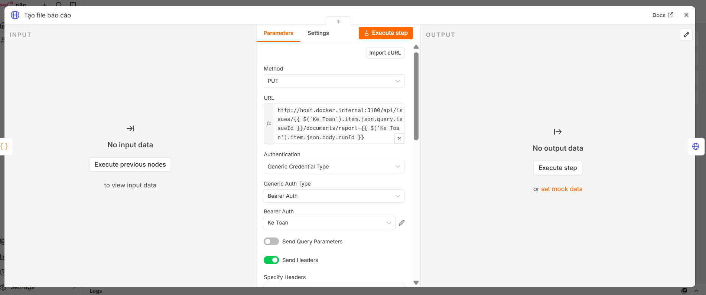

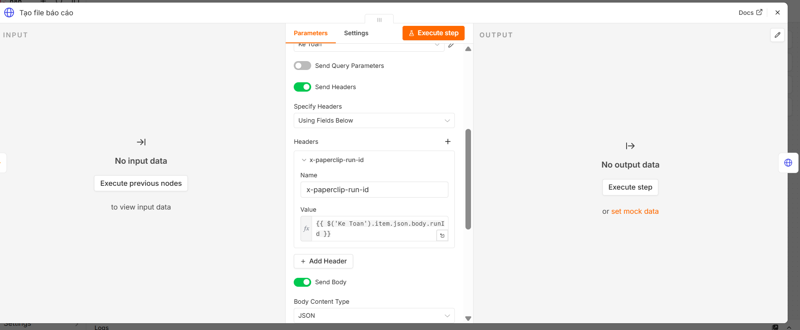

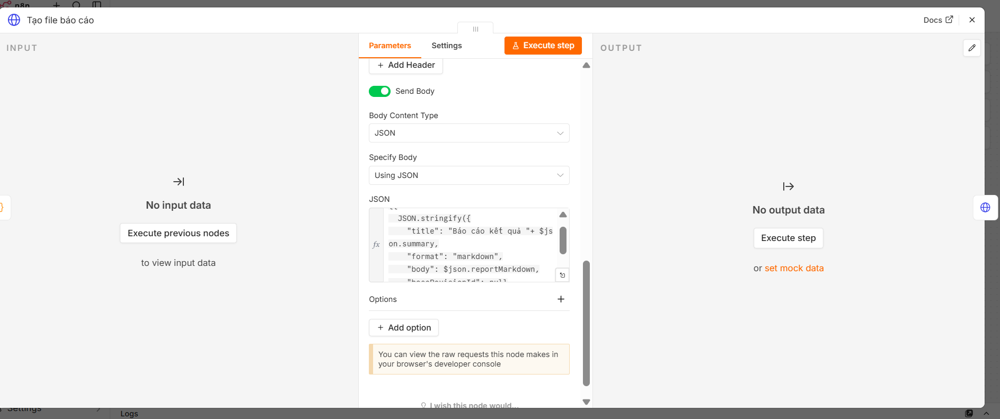

Cấu hình:

- **Method:** `PUT`.
- **URL:**

```text
http://host.docker.internal:3100/api/issues/{{ $('Ke Toan').item.json.query.issueId }}/documents/report-{{ $('Ke Toan').item.json.body.runId }}
```

- **Authentication:** chọn **Bearer Auth**.
- Bật **Send Headers** và thêm:

```text
Name: x-paperclip-run-id
Value: {{ $('Ke Toan').item.json.body.runId }}
```

- Bật **Send Body**.
- **Body Content Type:** `JSON`.
- **Specify Body:** `Using JSON`.
- JSON body:

```javascript
{{
  JSON.stringify({
    title: "Báo cáo kết quả " + $json.summary,
    format: "markdown",
    body: $json.reportMarkdown,
    baseRevisionId: null,
  })
}}
```

Endpoint dự kiến:

```http
PUT /api/issues/{issueId}/documents/{documentKey}
```

Body dự kiến:

```json
{
  "title": "Báo cáo kết quả",
  "format": "markdown",
  "body": "{{ $json.reportMarkdown }}",
  "baseRevisionId": null
}
```

`baseRevisionId` để `null` khi tạo document mới. Nếu cập nhật document đã tồn tại, phải gửi revision hiện tại.

### 7.6 HTTP Request `comment thành công`

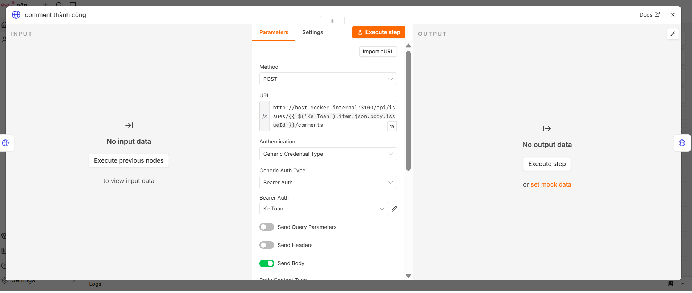

Cấu hình body:

```json
{
  "body": "Đã xử lý xong task"
}
```

URL:

```text
http://host.docker.internal:3100/api/issues/{{ $('Ke Toan').item.json.body.issueId }}/comments
```

Endpoint dự kiến:

```http
POST /api/issues/{issueId}/comments
```

Nội dung comment nên ngắn gọn, ví dụ:

```json
{
  "body": "Đã hoàn tất xử lý và tạo báo cáo kết quả."
}
```

### 7.7 HTTP Request `Cập nhật status`

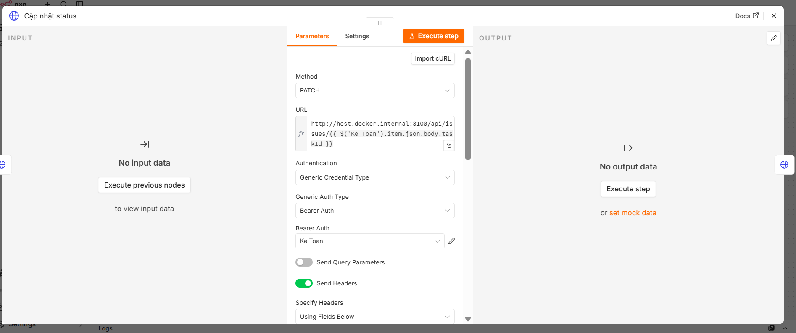

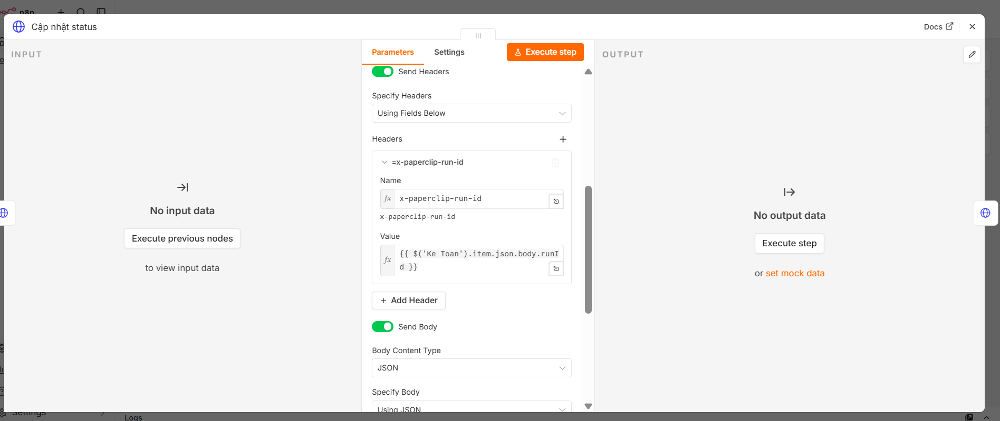

Cấu hình:

- **Method:** `PATCH`.
- **URL:**

```text
http://host.docker.internal:3100/api/issues/{{ $('Ke Toan').item.json.body.issueId }}
```

- **Authentication:** chọn **Bearer Auth**.
- Bật **Send Headers** và thêm:

```text
Name: x-paperclip-run-id
Value: {{ $('Ke Toan').item.json.body.runId }}
```

- Bật **Send Body**.
- **Body Content Type:** `JSON`.
- **Specify Body:** `Using JSON`.
- JSON body:

```json
{
  "status": "done"
}
```

Endpoint dự kiến:

```http
PATCH /api/issues/{issueId}
```

Body kết thúc thành công:

```json
{
  "status": "done"
}
```

### 7.8 HTTP Request `get result`

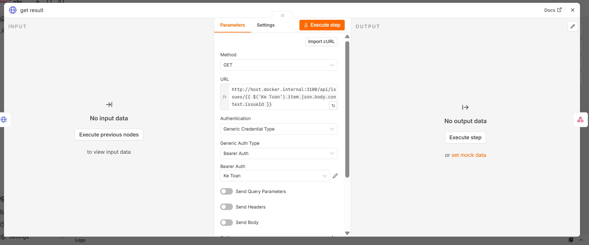

> **Tùy chọn:** Node này không bắt buộc, chỉ dùng để kiểm tra lại task sau khi đã cập nhật status.

Cấu hình cơ bản:

- **Method:** `GET`.
- **URL:**

```text
http://host.docker.internal:3100/api/issues/{{ $('Ke Toan').item.json.body.issueId }}
```

- **Authentication:** chọn **Bearer Auth**.

Endpoint dự kiến:

```http
GET /api/issues/{issueId}
```

Node này dùng để kiểm tra lại trạng thái cuối, không thay thế cho node cập nhật status.

### 7.9 `Respond to Webhook`

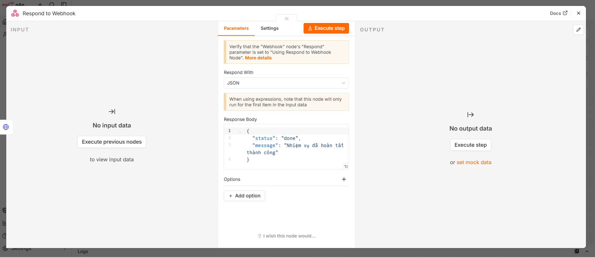

Cấu hình đơn giản:

- Chọn trả response dạng `JSON`.
- Cấu hình **Response Body** để gửi kết quả cuối về cho Paperclip.

Ví dụ response body:

```json
{
  "status": "done",
  "message": "Đã xử lý task thành công"
}
```

Node này trả response HTTP cuối cho Paperclip hoặc bridge. Response thành công không tự thay thế việc cập nhật issue status.

Response mẫu:

```json
{
  "status": "done",
  "message": "Đã xử lý task và tạo báo cáo",
  "issueId": "{{ $json.issueId }}"
}
```

## 7. Checklist kiểm thử

- [ ] Workflow đã được bật Published/Active.
- [ ] Paperclip gọi đúng Production Webhook URL.
- [ ] Webhook nhận đúng `issueId` và `runId`.
- [ ] Lấy được danh sách attachment.
- [ ] Đọc được nội dung file.
- [ ] Tạo được output `reportMarkdown`.
- [ ] Document Markdown hiển thị trong task.
- [ ] Comment được ghi vào task.
- [ ] Task chuyển sang `done` hoặc trạng thái mong muốn.
- [ ] Adapter tìm đúng execution bằng `workflowId` và `traceId`.
- [ ] Respond to Webhook trả HTTP 200.

## 8. Lịch sử cập nhật

| Ngày | Nội dung |
|---|---|
| 2026-08-21 | Tạo khung tài liệu và danh sách node ban đầu |
