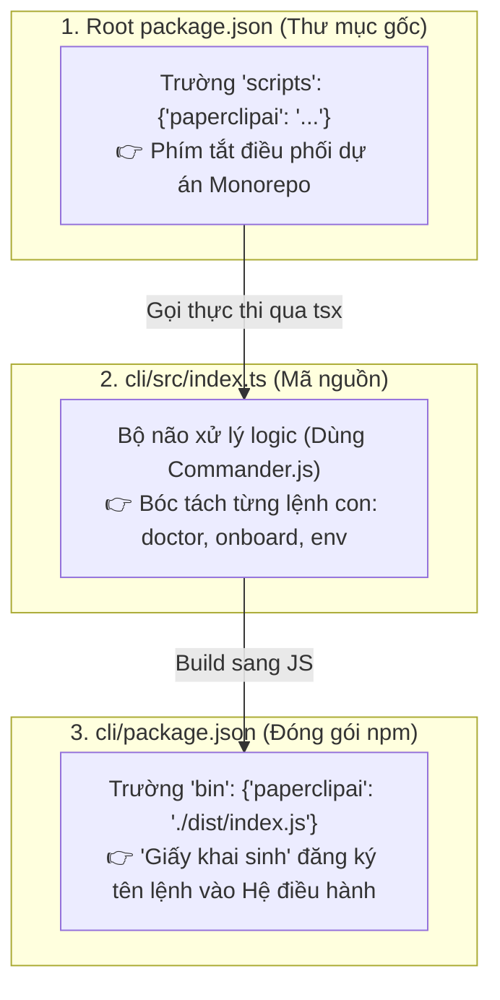
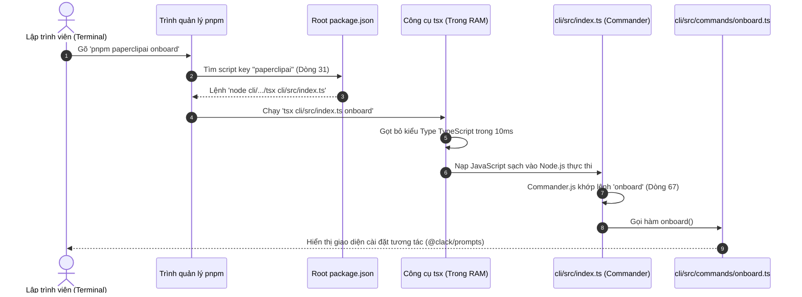

# CẨM NANG TOÀN DIỆN VỀ KIẾN TRÚC CLI, COMMANDS & SCRIPTS TRONG PAPERCLIP

---

> **Tài liệu Kỹ thuật & Sổ tay Lập trình viên**  
> **Vị trí Module:** `cli/` và `package.json` (Root)  
> **Mục đích:** Tổng hợp đầy đủ nguyên lý hoạt động, cơ chế thực thi của hệ điều hành, cách phân biệt `"bin"` vs `"scripts"`, công nghệ biên dịch tức thời `tsx`, và quy trình tự xây dựng một lệnh CLI mới trong dự án Paperclip.

---

## 1. BỨC TRANH TOÀN CẢNH: 3 THÀNH PHẦN CỐT LÕI

Rất nhiều lập trình viên mới tiếp cận dự án Monorepo thường bị rối giữa 3 file sau:



### Bảng phân biệt chi tiết:

| Thành phần | Đường dẫn file | Vai trò chính | Đối tượng sử dụng |
| :--- | :--- | :--- | :--- |
| **Mã nguồn Logic** | [`cli/src/index.ts`](file:///c:/paperclip/cli/src/index.ts) | Nơi **viết code** xử lý lệnh, bắt cờ tham số (`--repair`, `--config`), in màu terminal. | AI / Lập trình viên viết code |
| **Giấy khai sinh lệnh** | [`cli/package.json`](file:///c:/paperclip/cli/package.json) *(Trường `"bin"`)* | Báo cho `npm` biết: khi người ngoài cài đặt qua internet, hãy tạo lệnh mang tên **`paperclipai`**. | Quản lý gói npm / Hệ điều hành |
| **Phím tắt điều phối** | [`package.json`](file:///c:/paperclip/package.json) *(Trường `"scripts"`)* | Tạo **phím tắt `pnpm ...`** để dev chạy thử nhanh các thư mục con trong repo. | Lập trình viên đang làm việc trong repo |

---

## 2. TẠI SAO LÚC THÌ GỌI `paperclip`, LÚC LẠI LÀ `paperclipai`?

* **`paperclip`:** Là **Tên dự án / Tên sản phẩm** trong giao tiếp thông thường và viết tài liệu (ví dụ: *"Kiến trúc Paperclip"*, *"Tính năng của Paperclip"*).
* **`paperclipai`:** Là **Tên lệnh CLI chính thức (Command Name)** được đăng ký trên npm và hệ thống.  
  *(Lý do kỹ thuật: Trên kho thư viện npm toàn cầu, cái tên `paperclip` ngắn đã bị người khác đăng ký từ trước, do đó nhóm phát triển chọn tên gói và tên lệnh chính thức là **`paperclipai`**)*.

---

## 3. CƠ CHẾ HỆ ĐIỀU HÀNH (WINDOWS PATH) & TẠI SAO PHẢI CÓ `pnpm`

### 3.1. Tại sao gõ trực tiếp `paperclipai doctor` lại bị báo lỗi?
Khi bạn mở Terminal và gõ một chữ bất kỳ (như `git`, `node` hay `paperclipai`):
1. Hệ điều hành Windows sẽ tìm kiếm trong danh sách biến môi trường **`PATH`** xem có file `paperclipai.exe` hay `paperclipai.cmd` nào không.
2. Vì bạn chỉ mới tải mã nguồn về (`c:\paperclip`) chứ **chưa cài đặt nó vào hệ thống (chưa install global)**, Windows không tìm thấy và sẽ báo lỗi:  
   `paperclipai: The term 'paperclipai' is not recognized...`

### 3.2. Tại sao gõ `pnpm paperclipai doctor` lại chạy được?
* Chương trình `pnpm.exe` đã được cài sẵn vào biến môi trường `PATH`.
* Khi bạn gõ `pnpm paperclipai doctor`:
  1. Windows gọi chương trình `pnpm`.
  2. `pnpm` đọc file `package.json` trong thư mục hiện tại.
  3. Nó thấy phím tắt `"paperclipai"` trỏ tới file code `cli/src/index.ts`.
  4. `pnpm` tự động dùng Node.js chạy file code đó cho bạn!

### 3.3. Làm sao để gõ trực tiếp `paperclipai ...` mà KHÔNG CẦN chữ `pnpm`?
Bạn chỉ cần liên kết lệnh vào Windows **1 lần duy nhất**:
```powershell
# Cách dành cho Developer (chạy tại thư mục cli/):
cd c:\paperclip\cli
pnpm build
npm link
```
*(Sau khi `npm link`, Windows sẽ tạo một shortcut trong `PATH`, từ đó bạn có thể đứng ở bất kỳ thư mục nào gõ thẳng `paperclipai doctor`)*.

---

## 4. CƠ CHẾ BIÊN DỊCH TỨC THỜI CỦA `tsx` (TYPESCRIPT EXECUTE)

### 4.1. Tại sao bắt buộc phải biên dịch?
* **Node.js bản chất chỉ hiểu được JavaScript thuần (`.js`)**, nó **hoàn toàn không biết đọc TypeScript (`.ts`)**.
* File `cli/src/index.ts` chứa đầy đủ các cú pháp nâng cao của TypeScript như định nghĩa kiểu `: string`, `interface`, `type`, `generic <T>`... Nếu chạy thẳng bằng `node cli/src/index.ts`, Node.js sẽ báo lỗi cú pháp `SyntaxError: Unexpected token ':'`.

### 4.2. Vai trò của công cụ `tsx`
* **`tsx`** là một thư viện mã nguồn mở bên ngoài (tải từ npm, khai báo trong `devDependencies: { "tsx": "^4.23.1" }`).
* Thay vì phải chạy lệnh `tsc` để biên dịch chậm chạp ra file `.js` trên ổ cứng (mất vài giây), `tsx` sử dụng lõi `esbuild` viết bằng ngôn ngữ Go:
  * **"Gọt bỏ" toàn bộ các định nghĩa Type trong chớp mắt (chỉ mất ~10ms ngay trong RAM)**.
  * Nạp phần code JavaScript sạch còn lại thẳng vào Node.js để chạy ngay lập tức.
* 👉 Giúp lập trình viên sửa file `.ts` đến đâu là chạy thử được đến đó mà không cần bước build trung gian.

---

## 5. GIẢI MÃ CÁC CÂU LỆNH TRONG ROOT `package.json` (MONOREPO SCRIPTS)

Nhìn vào file [`package.json`](file:///c:/paperclip/package.json), ta thấy có 2 nhóm script:

### 🔹 Nhóm 1: CÓ chứa `pnpm` bên trong (Điều khiển Monorepo)
Dự án Paperclip gồm rất nhiều thư mục con (`server/`, `ui/`, `cli/`, `packages/db/`...). Ta dùng các cờ của `pnpm` để điều phối:
* **Cờ `--filter <tên_package>` (Nhảy vào 1 thư mục con duy nhất):**
  * `"dev:ui": "pnpm --filter @paperclipai/ui dev"` ➡️ Chỉ bật giao diện Web.
  * `"db:generate": "pnpm --filter @paperclipai/db generate"` ➡️ Nhảy vào thư mục `packages/db` để sinh schema migration.
* **Cờ `-r` (Recursive - Quét qua TẤT CẢ các thư mục con):**
  * `"build": "... && pnpm -r build"` ➡️ Tự động quét qua tất cả các package con và build lần lượt từng cái.
  * `"typecheck": "... && pnpm -r typecheck"` ➡️ Kiểm tra lỗi TypeScript trên toàn bộ repo.

### 🔹 Nhóm 2: KHÔNG chứa `pnpm` bên trong (Chạy trực tiếp 1 file script)
Chỉ đơn giản là gọi trình thông dịch chạy 1 file cụ thể:
* `"postinstall": "node scripts/link-plugin-dev-sdk.mjs"` ➡️ Chạy file `.mjs`.
* `"secrets:migrate-inline-env": "tsx scripts/migrate-inline-env-secrets.ts"` ➡️ Dùng `tsx` chạy file `.ts`.
* `"paperclipai": "node cli/node_modules/tsx/dist/cli.mjs cli/src/index.ts"` ➡️ Gọi `tsx` chạy file `index.ts`.

---

## 6. SƠ ĐỒ LUỒNG TOÀN DIỆN KHI GÕ `pnpm paperclipai onboard`



---

## 7. HƯỚNG DẪN TỰ TẠO 1 LỆNH CLI MỚI (3 BƯỚC THỰC HÀNH)

Nếu bạn muốn tạo thêm một lệnh mới (ví dụ: `paperclipai hello --name "Antigravity"`):

### Bước 1: Viết hàm xử lý logic
Tạo file mới: `cli/src/commands/hello.ts`
```typescript
import pc from "picocolors";

export async function helloCommand(options: { name?: string }) {
  const name = options.name || "Developer";
  console.log(pc.green(` Xin chào ${name}! Chúc bạn code vui vẻ với Paperclip.`));
}
```

### Bước 2: Đăng ký lệnh vào [`cli/src/index.ts`](file:///c:/paperclip/cli/src/index.ts)
Mở file `cli/src/index.ts` và thêm đoạn code:
```typescript
import { helloCommand } from "./commands/hello.js";

program
  .command("hello")
  .description("Lệnh chào hỏi thử nghiệm")
  .option("-n, --name <string>", "Tên người muốn chào")
  .action(helloCommand);
```

### Bước 3: Chạy thử nghiệm ngay trên Terminal
```powershell
pnpm paperclipai hello --name "Trung"
# Kết quả hiển thị:
#  Xin chào Trung! Chúc bạn code vui vẻ với Paperclip.
```


---

## 8. PHÂN BIỆT SCRIPTS THEO TỪNG THƯ MỤC & `dependencies` VS `devDependencies`

### 8.1. `scripts` trong từng file `package.json` hoạt động như thế nào?

Trong mô hình Monorepo của Paperclip, mỗi thư mục con (`cli/`, `packages/server/`, `packages/db/`...) đều có file `package.json` riêng:

* **Phạm vi thư mục làm việc (Working Directory - CWD):**
  * Khi bạn đứng tại thư mục `cli/` và chạy `pnpm dev` hoặc `pnpm build`, câu lệnh sẽ được thực thi với **thư mục hiện tại chính là `c:\paperclip\cli`**.
  * Các đường dẫn tương đối (như `src/index.ts`, `dist/index.js`, `./esbuild.config.mjs`) đều được tính bắt đầu từ thư mục `cli/`.
* **Khi gọi từ thư mục gốc Monorepo:**
  * Nếu đứng ở thư mục gốc `c:\paperclip` và chạy qua bộ lọc workspace:
    ```powershell
    pnpm --filter @paperclipai/cli run build
    ```
    thì `pnpm` sẽ tự động chuyển ngữ cảnh làm việc vào đúng thư mục `c:\paperclip\cli` để thực thi script của package đó.

---

### 8.2. Phân biệt `dependencies` và `devDependencies`

| Đặc điểm | `dependencies` (Runtime / Production) | `devDependencies` (Development / Build-time) |
| :--- | :--- | :--- |
| **Mục đích** | Các gói thư viện **bắt buộc phải có để chương trình chạy được** trong thực tế. | Các công cụ **chỉ dùng lúc lập trình, biên dịch mã nguồn, kiểm tra lỗi hoặc chạy test**. |
| **Môi trường sử dụng** | Cần cả khi dev trên máy lẫn khi triển khai Production trên server. | Chỉ cần trên máy lập trình viên (Developer) hoặc máy build (CI/CD). |
| **Khi triển khai Production** | Được cài đặt đầy đủ (`pnpm install --prod` hoặc `npm install --omit=dev`). | Bị **bỏ qua hoàn toàn** để giảm dung lượng và tối ưu tài nguyên server. |

#### 🔍 So sánh thực tế trong file [`cli/package.json`](file:///c:/paperclip/cli/package.json):

* **`dependencies` (Cần lúc chạy lệnh CLI):**
  * `commander`: Thư viện bóc tách cờ tham số CLI khi người dùng gõ lệnh.
  * `drizzle-orm`: ORM kết nối và truy vấn cơ sở dữ liệu.
  * `@clack/prompts`: Tạo giao diện menu tương tác console.
  * `@paperclipai/server`, `@paperclipai/shared`: Các package nội bộ cung cấp logic xử lý nghiệp vụ của hệ thống.
* **`devDependencies` (Chỉ cần lúc viết code & build):**
  * `typescript`: Trình biên dịch TypeScript sang JavaScript (`tsc --noEmit`). Khi đã build ra `dist/index.js`, Node.js chạy trực tiếp JS nên không cần TypeScript nữa.
  * `@types/node`: Các file định nghĩa kiểu (`.d.ts`) hỗ trợ IDE gợi ý code.
  * `tsx`: Công cụ nạp và chạy trực tiếp file TypeScript (`tsx src/index.ts`) khi đang dev mà không cần build trước.

---

### 8.3. Cơ chế cài đặt của `pnpm` trong quy trình làm việc

* **Khi chạy `pnpm install` trên máy cá nhân (Local Dev):**
  * `pnpm` sẽ **tự động cài đặt đầy đủ cả `dependencies` lẫn `devDependencies`** cho tất cả các package trong toàn bộ workspace.
* **Khi chạy `pnpm dev`:**
  * Hệ thống kết hợp công cụ từ `devDependencies` (như `tsx`) để chạy trực tiếp mã TypeScript mà không cần build, đồng thời nạp các thư viện logic từ `dependencies`.
* **Khi chạy `pnpm build`:**
  * Dùng trình đóng gói (`esbuild`, `typescript` từ `devDependencies`) để biên dịch toàn bộ mã nguồn sang JavaScript thuần trong thư mục `dist/`.
* **Khi triển khai Production (Server/Docker):**
  * Sau khi build xong mã nguồn, server chỉ cần chạy lệnh `pnpm install --prod` để loại bỏ toàn bộ `devDependencies`, giúp ứng dụng nhẹ nhất có thể.
