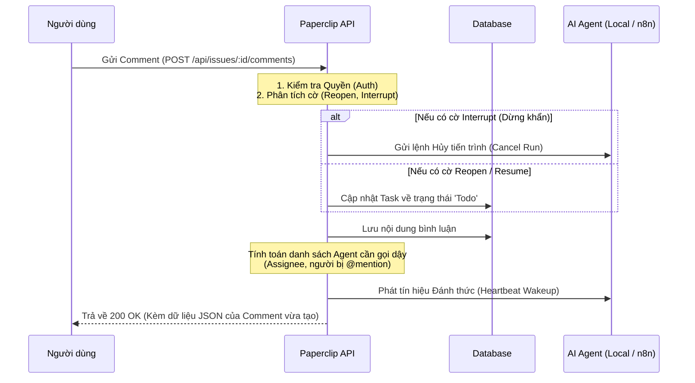

# KIẾN TRÚC VÀ CƠ CHẾ XỬ LÝ COMMENT, ĐÓNG GÓI FULL CONTEXT & ĐÁNH GIÁ N8N ADAPTER

Tài liệu này chi tiết hóa toàn bộ luồng nghiệp vụ từ khi User gửi nhận xét trên giao diện, cách hệ thống Paperclip phân tích, lưu trữ, đánh thức Agent, cách các Local Adapter (Claude, Gemini, Codex, Hermes...) đóng gói toàn bộ ngữ cảnh (Full Context) gửi sang cho LLM suy luận, và phân tích hiện trạng của `n8n-runtime-adapter`.

---

## 1. SƠ ĐỒ LUỒNG TỔNG QUAN (MERMAID FLOWCHART)

*(Ghi chú: Sơ đồ dưới đây là **Bản đồ kỹ thuật (Technical Blueprint)** dành cho Backend Developer. Nó mô phỏng chính xác từng ngã rẽ logic (If/Else) bên trong API `POST /api/issues/:id/comments` của máy chủ Paperclip, từ lúc nhận được Request của User cho đến lúc phản hồi 200 OK. Nếu bạn chỉ muốn hiểu luồng đi tổng quan, hãy bỏ qua sơ đồ này và đọc phần **Vòng đời của một bình luận** ở mục 2).*



---

## 2. VÒNG ĐỜI CỦA MỘT BÌNH LUẬN (NARRATIVE SUMMARY)

Để dễ hình dung trước khi đi sâu vào mã nguồn, hãy tưởng tượng luồng đi của một bình luận như sau:

1. **Tiếp nhận (Gõ phím):** Bạn (User) gõ một lời nhắn vào ô chat trên giao diện Paperclip và ấn Gửi (VD: *"Đổi nút này thành màu đỏ giúp tôi"*).
2. **Phân tích Ý đồ (Intent Parsing):** Máy chủ Paperclip nhận câu nói này, nó không vội báo ngay cho AI. Nó kiểm tra xem: Lời nhắn này có kèm lệnh (cờ) nào không? (VD: Cờ ép mở lại task đã đóng, cờ dừng khẩn cấp tiến trình AI đang đi sai hướng). Nếu có, nó tự động đổi trạng thái Task (từ `Done` về `Todo`) hoặc Kill tiến trình AI ngay lập tức.
3. **Lưu trữ & Đánh thức (Wakeup):** Sau khi lưu bình luận vào Database, máy chủ sẽ tìm xem AI nào đang phụ trách Task này. Nó gửi một tiếng chuông báo thức (Heartbeat Wakeup) tới thẳng nền tảng chạy AI (Local Adapter Terminal hoặc n8n Webhook).
4. **Gom nhặt Ký ức (Context Gathering):** Khi AI bị đánh thức, hệ thống Paperclip không bao giờ ném cho AI mỗi câu nói *"Đổi nút thành màu đỏ"* cụt lủn. Nó làm một việc rất tinh tế: Lật lại toàn bộ **Hồ sơ bệnh án** của Task đó. Nó lấy Mô tả yêu cầu ban đầu, Lịch sử chat trước đó, Tóm tắt những việc AI đã làm ở lần trước, và thông tin nhánh Code hiện tại.
5. **Nhồi Prompt & Ép buộc (Master Prompt):** Tất cả "Ký ức" trên được đóng gói chung vào một cục văn bản khổng lồ gọi là **Wake Prompt**, kèm theo một câu lệnh tâm lý (System Prompt) ép buộc: *"Ê, user vừa bình luận đấy, tạm dừng mấy việc khám phá linh tinh lại, đọc kỹ comment này và ưu tiên làm theo nó ngay lập tức!"*
6. **Thực thi:** Khối văn bản khổng lồ đó được gửi cho não bộ LLM (Claude/Gemini API). LLM đọc xong, hiểu ngay bối cảnh xuyên suốt từ đầu, và sinh ra lệnh Terminal (Bash) mới để sửa code theo đúng ý bạn.

Dưới đây là các minh chứng mã nguồn (Code) cho thấy hệ thống thực sự đã làm những việc trên.

---

## 3. CHI TIẾT ĐỐI CHIẾU MÃ NGUỒN XỬ LÝ COMMENT (SERVER ROUTE)

Toàn bộ logic tiếp nhận và xử lý bình luận nằm tại:
👉 **`server/src/routes/issues.ts`** (từ dòng **9971** đến **10600**).

### 📌 1. Cơ chế Reopen / Resume Task
* **Xác định cờ từ Request Body (Dòng 9988 - 9989):**
  ```typescript
  const reopenRequested = req.body.reopen === true;
  const resumeRequested = req.body.resume === true;
  ```
  *(Giải thích: Khi gọi API tạo comment, client có thể truyền thêm cờ `reopen: true` để yêu cầu mở lại task. Server sẽ đọc các cờ này để quyết định hành động tiếp theo.)*
* **Cập nhật Task về `todo` (Dòng 10081):**
  ```typescript
  const reopenedIssue = await svc.update(id, { status: "todo" });
  ```
  *(Giải thích: Nếu có cờ `reopen`, server sẽ tự động đổi trạng thái của issue từ Đã đóng (Done) về Cần làm (Todo) để Agent tiếp tục xử lý.)*
* **Cơ chế Tự động suy luận ngữ cảnh (Implicit Move - Dòng 1731 - 1759):**
  ```typescript
  function shouldImplicitlyMoveCommentedIssueToTodo(input: { ... }) {
    if (input.actorType !== "user") return false;
    if (!isClosedIssueStatus(input.issueStatus) && input.issueStatus !== "blocked") return false;
    if (typeof input.assigneeAgentId !== "string" || input.assigneeAgentId.length === 0) return false;
    return true; // Tự động mở lại task khi con người viết cmt trên task đã đóng/nghẽn
  }
  ```

---

### 📌 2. Cơ chế Ngắt chạy khẩn cấp khi Admin bình luận (Interrupt)
* **Code (Dòng 10117 - 10129):**
  ```typescript
  if (interruptRequested) {
    if (req.actor.type !== "board") {
      res.status(403).json({ error: "Only board users can interrupt active runs from issue comments" });
      return;
    }
    const runToInterrupt = await resolveActiveIssueRun(currentIssue);
    if (runToInterrupt) {
      const cancelled = await heartbeat.cancelRun(
        runToInterrupt.id,
        "Interrupted by board comment",
        operatorInterruptCancelOptions({ issueId: currentIssue.id, actor }),
      );
    }
  }
  ```
  *(Giải thích: Đây là tính năng "phanh gấp". Khi một người dùng cấp quản trị (board user) gửi comment kèm cờ `interrupt`, hệ thống sẽ lập tức tìm tiến trình AI đang chạy (active run) và ra lệnh hủy bỏ (cancelRun) ngay lập tức. Tính năng này chặn AI chạy tiếp nếu nó đang phá hoại hoặc đi sai hướng.)*

---

### 📌 3. Cơ chế Tự động phê duyệt (Auto-Approval khi Review)
* **Code nhận diện (Dòng 1566 - 1583 & Dòng 10157 - 10161):**
  ```typescript
  const shouldAutoApproveReviewComment =
    currentIssue.status === "in_review" &&
    currentExecutionState?.status === "pending" &&
    actorMatchesExecutionParticipant(actor, currentExecutionState.currentParticipant ?? null) &&
    isApprovalReviewComment(req.body.body);
  ```
  *(Giải thích: Đoạn code này kiểm tra xem Task có đang chờ duyệt (in_review) hay không, và người comment có đúng là người có quyền duyệt hay không. Hàm `isApprovalReviewComment` sẽ quét nội dung chữ của comment để tìm cụm từ khóa như `## Review: APPROVED`. Nếu thỏa mãn, task sẽ tự động chuyển sang trạng thái hoàn thành (Done) mà không cần click thêm nút nào.)*

---

### 📌 4. Cơ chế Đánh thức (Heartbeat Wakeup)
* **Đánh thức Assignee (Dòng 10437 - 10490):** Đánh thức với lý do `"issue_reopened_via_comment"` hoặc `"issue_commented"`.
* **Đánh thức Agent được nhắc tên (@-mentions - Dòng 10493 - 10518):** Đánh thức với lý do `"issue_comment_mentioned"`.
* **Đánh thức Task phụ thuộc & Task cha khi Done (Dòng 10520 - 10567):** Đánh thức với lý do `"issue_blockers_resolved"` và `"issue_children_completed"`.
* **Kích hoạt đồng loạt (Dòng 10569 - 10571):**
  ```typescript
  for (const { agentId, wakeup } of wakeups.values()) {
    heartbeat.wakeup(agentId, wakeup);
  }
  ```
  *(Giải thích: Sau khi đã thu thập đủ danh sách các Agent cần gọi dậy (người được giao task, người được @-mention, task phụ thuộc), vòng lặp này sẽ phát tín hiệu "Wakeup" đến từng Agent thông qua hệ thống Heartbeat. Tín hiệu này như tiếng chuông báo thức, ép Agent thức dậy đọc comment mới.)*

---

## 4. CƠ CHẾ ĐÓNG GÓI TOÀN BỘ NGỮ CẢNH (FULL CONTEXT) CHO LLM

Khi có bình luận của User, hệ thống **KHÔNG BAO GIỜ chỉ gửi mỗi nội dung câu comment cụt lủn**, mà đóng gói một **"hồ sơ bệnh án" hoàn chỉnh của Task** để LLM có đầy đủ trí nhớ (memory) khi suy luận lại.

### 📦 1. Kết quả & Trạng thái lần chạy trước (Continuation & Recovery)
* **Code:** [`packages/adapter-utils/src/server-utils.ts`](file:///c:/paperclip/packages/adapter-utils/src/server-utils.ts) (Dòng **1840 - 1871** & **1437 - 1452**):
  * **`continuationSummary`**: Bản tóm tắt những việc đã làm được ở Run trước.
  * **`livenessContinuation`**: Số lần thử lại (`attempt: 1/2`), mã Run trước (`sourceRunId`), trạng thái sống (`livenessState`).
  * **`recoveryInstruction`**: Hướng dẫn khôi phục cụ thể nếu lần trước bị mất tiến trình (`process_lost`), hết quota API, hay lỗi workspace.
  ```typescript
  if (normalized.continuationSummary) {
    lines.push("Issue continuation summary:", normalized.continuationSummary.body);
  }
  if (normalized.livenessContinuation) {
    lines.push(`- attempt: ${continuation.attempt}/${continuation.maxAttempts}`);
    lines.push(`- source run: ${continuation.sourceRunId}`);
    lines.push(`- instruction: ${continuation.instruction}`);
  }
  ```
  *(Giải thích: Để AI không bị "mất trí nhớ", đoạn code này chèn thêm bản tóm tắt của lần chạy trước (continuation summary) vào Prompt. Nếu AI từng bị sập mạng và phải chạy lại, nó sẽ in ra số lần thử lại (attempt) và lý do (instruction) để AI biết mình đang khắc phục lỗi thay vì làm lại từ đầu.)*

---

### 📦 2. Thông tin đầy đủ của Task (Task Context & Brief)
* **Code:** [`server/src/services/heartbeat.ts`](file:///c:/paperclip/server/src/services/heartbeat.ts) (Dòng **12184 - 12213**):
  * Tiêu đề task (`title`), Mã task (`identifier`: PAP-123).
  * Mô tả ban đầu (`description`).
  * Trạng thái hiện tại (`status`: todo, in_progress, blocked, in_review).
  * Chế độ làm việc (`workMode`: planning, implementation).
  * Thông tin Task cha (`ancestors`) và tóm tắt tiến độ các Task con (`childIssueSummaries`).

---

### 📦 3. Toàn bộ lịch sử trao đổi (Full Comments Thread)
* **Code:** [`packages/adapter-utils/src/server-utils.ts`](file:///c:/paperclip/packages/adapter-utils/src/server-utils.ts) (Dòng **1898 - 1910**):
  ```typescript
  lines.push("New comments in order:");
  for (const [index, comment] of normalized.comments.entries()) {
    lines.push(
      `${index + 1}. comment ${comment.id} at ${comment.createdAt} by ${authorLabel}`,
      comment.body
    );
  }
  ```
  *(Giải thích: Vòng lặp này duyệt qua toàn bộ các bình luận mới chưa được xử lý. Nó in ra số thứ tự, thời gian, tên người bình luận và nội dung chữ (comment.body). Điều này đảm bảo AI đọc được đầy đủ cuộc hội thoại giống như một con người đang kéo màn hình chat.)*

---

### 📦 4. Môi trường thực thi & Nhánh Git (Workspace & Git Branch)
* **Code:** [`packages/adapter-utils/src/server-utils.ts`](file:///c:/paperclip/packages/adapter-utils/src/server-utils.ts) (Dòng **1609 - 1613**):
  ```typescript
  lines.push(`- execution workspace branch: you are running in an execution workspace on branch ${normalized.executionWorkspace.branchName}`);
  ```
  *(Giải thích: Câu lệnh này bơm tên nhánh Git hiện tại vào Prompt. Nhờ vậy, AI sẽ nhận thức được nó đang đứng ở nhánh code nào để tránh tình trạng chạy sai lệnh commit hoặc tạo nhánh trùng lặp.)*

---

### 📦 5. Chỉ thị ưu tiên bắt buộc xử lý nhận xét (Wake Directive)
* **Code:** [`packages/adapter-utils/src/server-utils.ts`](file:///c:/paperclip/packages/adapter-utils/src/server-utils.ts) (Dòng **1528 - 1534**):
  ```typescript
  "## Paperclip Wake Payload",
  "",
  "Treat this wake payload as the highest-priority change for the current heartbeat.",
  "Before generic repo exploration or boilerplate heartbeat updates, acknowledge the latest comment and explain how it changes your next action."
  ```
  *(Giải thích: Đây là một câu lệnh tâm lý (System Prompt) rất mạnh áp đặt lên AI. Nó ép AI phải coi các Comment mới là ƯU TIÊN SỐ 1. Bắt buộc AI phải phân tích comment và giải thích xem comment đó làm thay đổi hướng hành động tiếp theo như thế nào, thay vì phớt lờ nó và làm việc cũ.)*

---

### 📦 6. Ghép nối thành Full Master Prompt
* **Code:** [`packages/adapter-utils/src/acpx-engine/execute.ts`](file:///c:/paperclip/packages/adapter-utils/src/acpx-engine/execute.ts) (Dòng **2116 - 2125**):
  ```typescript
  const prompt = joinPromptSections([
    promptInstructionsPrefix, // 1. System Prompt / Luật Agent (AGENTS.md / SKILL.md)
    renderedBootstrapPrompt,  // 2. Khởi tạo cơ bản
    wakePrompt,               // 3. WAKE PROMPT (Chứa Comment mới + Trạng thái + Recovery + Task tóm tắt)
    sessionHandoffNote,       // 4. Ghi chú bàn giao giữa các phiên
    taskContextNote,          // 5. Mô tả chi tiết Task gốc
    paperclipEnvNote,         // 6. Biến môi trường & Thư mục làm việc
    apiAccessNote,            // 7. Danh sách Tool / API nội bộ mà Agent được gọi
    renderedPrompt,           // 8. Template bổ sung
  ]);
  ```
  *(Giải thích: Hàm `joinPromptSections` là bước gom tất cả các mảng thông tin ở trên thành một khối văn bản khổng lồ (Full Master Prompt). Cấu trúc lớp lang này đảm bảo LLM nhận được một bức tranh toàn cảnh hoàn hảo về hệ thống, từ các luật lệ cơ bản cho đến nhiệm vụ hiện tại và lời dặn dò cuối cùng, giúp tỷ lệ suy luận chính xác đạt mức cao nhất.)*

---

## 5. ĐÁNH GIÁ HIỆN TRẠNG CỦA N8N-RUNTIME-ADAPTER (ĐÃ NÂNG CẤP)

### 🔍 1. Bước Đột Phá Mới Nhất
Trước đây, `n8n-runtime-adapter` chỉ truyền được các tín hiệu thô (`taskTitle`, `wakeCommentId`) khiến Node AI Agent trong n8n bị "mù dở" ngữ cảnh khi User comment.

Tuy nhiên, mã nguồn hiện tại của adapter này (`n8n-runtime-adapter/src/server/execute.ts`) **đã được nâng cấp toàn diện**! Nó đã áp dụng triệt để thư viện `@paperclipai/adapter-utils` (cụ thể là các hàm `normalizePaperclipWakePayload`, `renderPaperclipWakePrompt`, `joinPromptSections`) để đóng gói payload siêu chi tiết gửi sang Webhook của n8n.

* **Code minh chứng (Dòng 579 - 611):**
  ```typescript
  function buildN8nContextPayload(ctx: AdapterExecutionContext, opts: { includeFullPrompt: boolean }) {
    const wake = normalizePaperclipWakePayload(ctx.context.paperclipWake);
    // ... gọi renderPaperclipWakePrompt(wake) và joinPromptSections ...
    return {
      wakeReason: wake?.reason ?? null,
      latestComments: wake?.comments.map(c => ({ body: c.body })),
      continuationSummary: wake?.continuationSummary?.body ?? null,
      fullPrompt,
      // ...
    };
  }
  ```
  *(Giải thích thêm: Nhờ việc import và tái sử dụng trực tiếp các hàm core từ thư viện nội bộ `@paperclipai/adapter-utils`, `n8n-runtime-adapter` đã "thừa kế" toàn bộ chất xám và logic đóng gói ngữ cảnh vốn được thiết kế cho các Local Adapter (như Gemini/Claude Local) trong repo chính. Thay vì phải tự hard-code lại mọi thứ, nó chỉ việc tái sử dụng code gốc để đảm bảo chất lượng Data gửi sang n8n đạt độ chuẩn xác 100%.)*

### 📊 2. Bảng so sánh Local Adapters vs n8n-runtime-adapter (Phiên bản mới)

| Tiêu chí | Claude / Gemini / Codex Local | n8n Runtime Adapter (Đã nâng cấp) |
| :--- | :--- | :--- |
| **Nhận tín hiệu Wake khi có cmt** | Có (`heartbeat.wakeup`) | Có (`heartbeat.wakeup`) |
| **Trích xuất nội dung Comment** | Dùng `renderPaperclipWakePrompt` lấy đầy đủ text | **Đã có** (`latestComments`) |
| **Gửi tóm tắt lần chạy trước** | Có (`continuationSummary`, `recovery`) | **Đã có** (`continuationSummary`, `recovery`) |
| **Chỉ thị bắt buộc cho LLM** | Có (`acknowledge latest comment`) | **Đã có** (Nằm trong biến `fullPrompt`) |
| **Dữ liệu n8n LLM nhận được** | Toàn bộ lịch sử comment + bối cảnh task | **Đầy đủ y hệt Local Adapter** |

### 🚀 3. Sự Khác Biệt Giữa Local Adapter và n8n-runtime-adapter
Mặc dù chất lượng Dữ liệu ngữ cảnh (Context) gửi đi đã ngang hàng nhau 100%, sự khác biệt cốt lõi bây giờ chỉ nằm ở **Nơi thực thi (Execution Venue)**:

#### 3.1. Local Adapter (Vòng lặp khép kín)
* Khi nhận được Wakeup, Local Adapter (nhờ ACPX Engine) tự động gọi LLM và tự chạy các lệnh Bash/Terminal trực tiếp trên hệ thống của bạn để giải quyết Task. Nó là một "kỹ sư lập trình AI" đích thực.

#### 3.2. n8n-runtime-adapter (Vai trò cầu nối)
* Bản thân nó **KHÔNG** tự chạy LLM và cũng **KHÔNG** chạy lệnh Terminal.
* Nó đóng gói toàn bộ chất xám (`fullPrompt`, `latestComments`) thành file JSON và bắn Webhook sang n8n.
* **Quyền sinh sát thuộc về n8n:** Trong n8n, Node AI Agent sẽ đọc biến `{{ $json.body.fullPrompt }}` để suy luận, sau đó sử dụng các công cụ của n8n (gửi email, query DB, dùng Paperclip MCP) để giải quyết vấn đề thay vì chạy lệnh bash.

👉 **Kết luận:** Bản nâng cấp này đã xóa nhòa khoảng cách về mặt "nhận thức ngữ cảnh" giữa Local Adapter và n8n. n8n giờ đây đã đủ thông minh để xử lý các luồng công việc phức tạp, hiểu sâu ý định của user khi user thêm comment vào issue!

---

## 6. So Sánh `issue_commented` và `issue_reopened_via_comment`

Cả hai tín hiệu wakeup này đều được truyền khi có comment mới, tuy nhiên chúng có mức độ "chỉ đạo" khác nhau:

- **`issue_commented`:** Được bắn ra khi user comment vào một task *đang làm bình thường (Todo / In Progress)*.
- **`issue_reopened_via_comment`:** Được bắn ra khi user comment vào một task *đang ở trạng thái Đã đóng (Done) hoặc Bị khóa (Blocked)*. Hành động comment tự động ép task quay lại trạng thái `Todo`.

**Dưới góc độ Adapter/LLM, sự khác biệt nằm ở 2 điểm lớn:**
1. **Gửi Full Task Description:** Sự kiện `issue_reopened_via_comment` được hệ thống đánh giá là một dạng *Reassignment* (Giao lại việc). Do đó, hàm `selectPaperclipTaskMarkdown` sẽ gửi **toàn bộ Full Task Description** (thay vì chỉ bản tóm tắt ngắn ngọn Compact) để ép Agent đọc lại toàn bộ yêu cầu ban đầu của task từ đầu.
2. **Context thay đổi:** LLM nhận được text `reason: issue_reopened_via_comment`, giúp nó hiểu rằng: *"Mình đã từng làm xong task này rồi, nhưng user bắt làm lại. Mình cần đọc rất kỹ comment mới nhất xem lỗi ở đâu."*

Với các bản nâng cấp tận dụng thư viện `adapter-utils`, n8n-runtime-adapter sẽ tự động kế thừa toàn bộ logic xử lý thông minh này mà không cần hard-code các câu lệnh If/Else.
