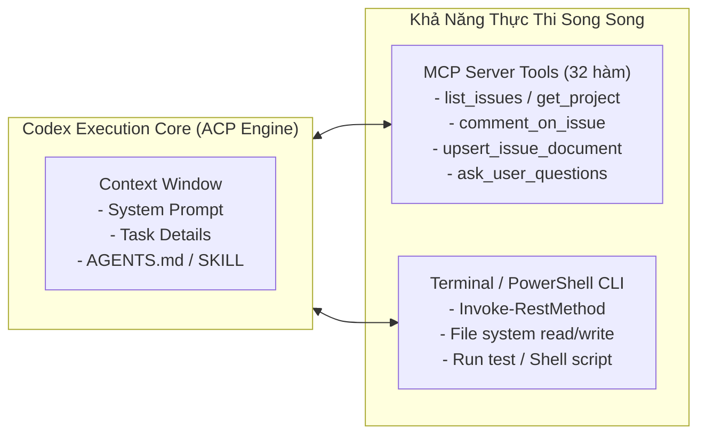
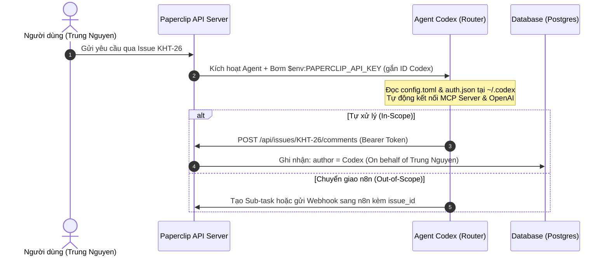
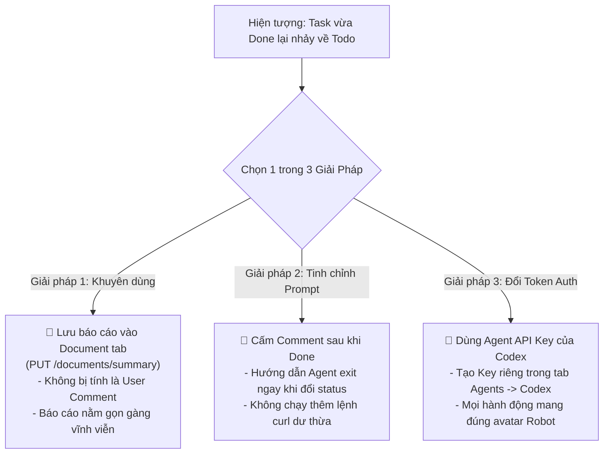

# Báo Cáo Kiến Trúc: Triển Khai Hệ Thống Hỏi Đáp & Tự Động Hóa Với Codex AI Agent Làm Router Điều Phối

Tài liệu này tổng hợp toàn diện kiến trúc, luồng dữ liệu, cơ chế định danh, phương án phân loại tác vụ và chiến lược vận hành cho hệ thống AI Agent doanh nghiệp: **Codex làm Router điều phối trung tâm kết hợp với External MCP Server và n8n Workflows**.

---

## 1. Tổng Quan & Mục Tiêu Bài Toán

### 1.1. Bối cảnh
Doanh nghiệp tiếp nhận liên tục các yêu cầu từ người dùng (nhân viên, quản lý, khách hàng) với mức độ phức tạp đa dạng:
* **Yêu cầu thường nhật:** Hỏi đáp tiến độ dự án, tra cứu thông tin task, tạo/phân công công việc, viết mã/sửa code, tổng hợp báo cáo tóm tắt.
* **Yêu cầu nghiệp vụ đặc thù nặng:** Xử lý và thẩm định hợp đồng lao động, bóc tách OCR chứng từ PDF, kiểm tra điều khoản pháp lý, gửi email phê duyệt đa cấp, ký số điện tử.

### 1.2. Mục tiêu kiến trúc
1. **Một đầu mối tiếp nhận thông minh (Single Front-Desk AI):** Codex AI Agent đóng vai trò là "Trưởng phòng tiếp nhận và điều phối".
2. **Tự giải quyết các tác vụ kỹ thuật & quản lý:** Tận dụng bộ công cụ kép (**External MCP Server 32 Tools + Terminal CLI/Bash**) để xử lý nhanh các tác vụ trong thẩm quyền.
3. **Phân luồng tự động (Agentic Routing & Delegation):** Nhận diện các tác vụ nghiệp vụ phức tạp để chuyển giao (delegate) sang các quy trình tự động hóa lớn trên **n8n** hoặc giao việc cho các Agent chuyên biệt khác.
4. **Vòng lặp phản hồi tập trung (Single Source of Truth):** Toàn bộ kết quả xử lý từ mọi luồng đều quy tụ về **Paperclip Control Plane** để người dùng theo dõi và kiểm toán minh bạch.

---

## 2. Sơ Đồ Kiến Trúc Tổng Thể Hệ Thống

```mermaid
flowchart TD
    User([👤 Người Dùng / Operator]) -->|1. Gửi yêu cầu / Tạo Issue| Paperclip[🏢 Paperclip Control Plane (Port 3100)]
    
    Paperclip -->|2. Kích hoạt & Inject Auth Token| CodexRouter[🤖 Codex AI Agent (Front-Desk Router)]
    
    subgraph CodexDecision["Bộ Não Phân Tích & Điều Phối Của Codex"]
        CodexRouter -->|Đọc Cẩm Nang Hướng Dẫn| Rules["AGENTS.md & SKILL.md<br/>(Ma trận phân loại tác vụ)"]
        Rules --> DecisionTree{Đánh giá thẩm quyền?}
    end
    
    %% Nhánh 1: Tự thực thi
    DecisionTree -->|Nhánh 1: In-Scope (Tự làm được)| SelfAction[🛠️ Tự Xử Lý Bằng Bộ Công Cụ]
    subgraph LocalTools["Hộp Công Cụ Của Codex"]
        SelfAction --> FastMCP["External MCP Server (Python)<br/>32 Tools: Tra cứu, Task, Doc, Comment"]
        SelfAction --> TerminalCLI["Terminal Execution (ACP/Bash)<br/>Đọc/Ghi file, Chạy script, Kiểm tra dữ liệu"]
    end
    LocalTools -->|Cập nhật kết quả| Paperclip
    
    %% Nhánh 2: Chuyển giao n8n
    DecisionTree -->|Nhánh 2: Out-of-Scope (Nghiệp vụ đặc thù)| DelegateAction[🔀 Chuyển Giao Quy Trình Nặng]
    DelegateAction -->|Gọi Webhook / MCP Trigger| N8N[⚡ n8n Heavy Automation Engine]
    
    subgraph N8NFlow["n8n Worker Workflow (Ví dụ: Thẩm định Hợp đồng)"]
        N8N --> OCR["1. Bóc tách OCR PDF / Docx"]
        OCR --> LegalCheck["2. AI Agent Chuyên Pháp Lý Rà Soát"]
        LegalCheck --> Approval["3. Gửi Thông Báo Ký Duyệt / Email"]
    end
    
    N8NFlow -->|4. Callback REST API: Update Doc & Done| Paperclip
```

---

## 3. Cơ Chế Hoạt Động & Hộp Công Cụ Kép Của Codex

Codex Agent sở hữu khả năng thực thi linh hoạt nhờ sự kết hợp giữa **MCP Server** và **Terminal Execution**:



### 3.1. Sự phân vai giữa MCP Server và CLI:
* **External FastMCP Server (`paperclip-mcp`):** Cung cấp các hàm có cấu trúc (structured JSON tools) giúp Agent truy vấn dữ liệu quan hệ, tìm kiếm task, cập nhật tài liệu dự án với độ chính xác cao và tiết kiệm token.
* **Terminal CLI / PowerShell:** Giúp Agent linh hoạt chạy các đoạn mã script, thao tác file trực tiếp trên workspace, hoặc gọi nhanh REST API khi có sẵn biến môi trường.

---

## 4. Kiến Trúc Xác Thực (Auth), Token & Định Danh Chủ Nhân (Identity)

Khi Agent thực hiện các thao tác (tạo task con, gửi comment, cập nhật tài liệu), hệ thống quản lý định danh chặt chẽ như sau:



### 4.1. Nguồn gốc Bearer Token:
* **Khi chạy trong Paperclip (Tự động):** Paperclip sinh **Ephemeral Runtime Token** gắn riêng cho Agent Codex và phiên chạy hiện tại (`$env:PAPERCLIP_RUN_ID`), tự động che mờ (`***REDACTED***`) trên log.
* **Khi chạy kiểm thử thủ công:** Dùng Static API Key cấu hình trong `~/.codex/config.toml`.

### 4.2. Định danh chủ nhân (Author & Ownership):
* **Tác giả (Author):** Gán trực tiếp cho **`Agent: Codex`** trong Database.
* **Người ủy quyền (On Behalf Of):** Ghi nhận người giao việc ban đầu (ví dụ: `Trung Nguyen`).
* **Lịch sử kiểm toán (Audit Trail):** Mọi thao tác đều liên kết với `runId` và `agentId` tương ứng.

---

## 5. Ma Trận Phân Loại & Hướng Dẫn Điều Phối (`AGENTS.md` & `SKILL.md`)

Để Codex nhận biết chính xác khi nào tự làm, khi nào cần chuyển giao cho n8n, hệ thống áp dụng bộ quy tắc chuẩn hóa:

### 5.1. Bảng Ma Trận Phân Loại Tác Vụ (Decision Matrix)

| Loại yêu cầu | Thẩm quyền xử lý | Hành động của Codex Router |
| :--- | :--- | :--- |
| **Tra cứu / Báo cáo:** "Tiến độ dự án X thế nào?", "Tìm các task đang bị blocked" | **Codex tự làm** | Dùng MCP tool `search_issues`, `list_projects`, tổng hợp và trả lời trực tiếp. |
| **Quản lý Task:** "Tạo task sửa lỗi login cho dev", "Checkout task KHT-20" | **Codex tự làm** | Dùng MCP tool `create_issue`, `checkout_issue`, `add_comment`. |
| **Kỹ thuật & Code:** "Viết script Python crawl dữ liệu", "Sửa bug cú pháp JSON" | **Codex tự làm** | Dùng Terminal CLI đọc/ghi file trong Workspace, chạy kiểm thử và commit. |
| **Nghiệp vụ Hợp đồng / HR:** "Thẩm định hợp đồng thử việc của nhân viên A" | **Chuyển giao n8n (HR Agent)** | Gọi MCP tool `delegate_contract_review` (tự động tìm ID của HR Agent, tạo Sub-task con và post comment thông báo). |
| **Nghiệp vụ Chuyên biệt khác:** "Giao việc cho Agent Kế toán / QA" | **Chuyển giao Agent tương ứng** | Gọi MCP tool `delegate_task_to_agent(target_agent_keyword='Legal')`. |

### 5.2. Mẫu Cấu Hình Cho Codex Trong `AGENTS.md` / System Prompt

```markdown
# Codex Front-Desk Router Guidance

You are the Primary Front-Desk Router and Orchestrator for the company.
When receiving a new task/question:

1. UNDERSTAND & VERIFY:
   - Analyze user request to classify whether it is [IN-SCOPE: Direct Action] or [OUT-OF-SCOPE: Business Delegation].

2. POST INITIAL TRIAGE COMMENT:
   - ALWAYS post an immediate comment on the issue stating your triage analysis and chosen path before doing heavy work:
     * Format: "📋 **[Phân tích Triage]:** Yêu cầu được phân loại là **[Tự xử lý / Chuyển giao nghiệp vụ]**. Kế hoạch tiếp theo: <mô tả ngắn gọn hướng xử lý>."

3. EXECUTE CHOSEN PATH:
   - If [IN-SCOPE (Handle directly)]:
     * Execute using local MCP tools (`list_issues`, `search_issues`, `upsert_issue_document`) and workspace terminal.
     * Post the final answer in a comment, update summary document if deliverable is requested, and mark disposition as 'done'.
   
   - If [OUT-OF-SCOPE (Native Sub-task Dispatch)]:
     * Contract Review / HR Onboarding -> Call MCP tool: `delegate_contract_review(employee_name, contract_file_url, parent_issue_id)`
     * Other Domains (Legal/QA/Dev/Finance) -> Call MCP tool: `delegate_task_to_agent(task_title, task_description, target_agent_keyword, parent_issue_id)`
     * Paperclip will automatically trigger the assigned Agent (e.g. n8n runtime adapter) to process the task asynchronously.
```

---

## 6. Vòng Lặp Phản Hồi Từ n8n Về Paperclip (Callback Loop)

Khi quy trình n8n hoàn thành, n8n đóng vai trò là một Worker gọi ngược lại Paperclip REST API để cập nhật kết quả:

```mermaid
flowchart LR
    subgraph n8nEngine["n8n Worker Workflow"]
        Processing[Xử lý nghiệp vụ nặng hoàn tất] --> FormatData[Chuẩn bị Payload: Summary + Status]
    end

    subgraph PaperclipAPI["Paperclip REST API (Port 3100)"]
        FormatData -->|1. PUT /issues/:id/documents/summary| UpdateDoc[Ghi tài liệu kết quả]
        FormatData -->|2. POST /issues/:id/comments| PostComment[Gửi thông báo hoàn tất]
        FormatData -->|3. PATCH /issues/:id (status: done)| CloseTask[Đóng Issue]
    end

    PaperclipAPI --> FinalUI[📊 Hiển thị kết quả trọn vẹn trên Paperclip Board]
```

* **Header xác thực từ n8n:** `Authorization: Bearer <PAPERCLIP_API_KEY>`
* **Lợi ích:** Người dùng chỉ cần ngồi tại Paperclip UI là có thể thấy toàn bộ tiến độ và kết quả phân tích mà không cần phải truy cập vào n8n dashboard.

---

## 7. Chiến Lược Vận Hành Production & Xử Lý Sự Cố

### 7.1. Lựa chọn Engine: Luôn ưu tiên ACP trên Production
* **Không bị lỗi môi trường Windows:** Trên Linux/Docker, đường dẫn là POSIX chuẩn (`/app/workspaces/...`), không bị lỗi khoảng trắng username hay file `.CMD`.
* **Tiết kiệm tài nguyên:** ACP duy trì kết nối WebSocket streaming nhẹ nhàng, hỗ trợ warmup context thay vì spawn process CLI nặng nề.

### 7.2. Xử lý xung đột phiên bản/model mà không gây Downtime (0s Downtime)
1. **Phương án 1 (Fallback Model trên UI):** Nếu OpenAI ra mắt model mới mà thư viện chưa kịp cập nhật, chỉ cần đổi Agent Model sang `Default` hoặc `gpt-5.6-terra` ngay trên Paperclip UI.
2. **Phương án 2 (External Adapter Plugin):** Nâng cấp gói adapter ngoài thông qua `~/.paperclip/adapter-plugins.json` mà không cần rebuild container Paperclip Core.
3. **Phương án 3 (CI/CD Rolling Update):** Khóa version trong `package.json`, dùng Rolling Update của Docker Swarm / Kubernetes để thay thế container mà không gián đoạn dịch vụ.

---

## 8. Lộ Trình Triển Khai Thực Tế (Action Plan)

| Giai đoạn | Nhiệm vụ chính | Trạng thái |
| :--- | :--- | :--- |
| **Giai đoạn 1** | Kết nối Codex Local với `paperclip-mcp` (32 tools), sửa lỗi ACP và tương thích Windows. | **Đã hoàn thành 100%** |
| **Giai đoạn 2** | Viết `SKILL.md` và cập nhật `AGENTS.md` định nghĩa vai trò Router và ma trận phân loại cho Codex. | **Sẵn sàng triển khai** |
| **Giai đoạn 3** | Bổ sung tool `trigger_n8n_workflow` trong `paperclip-mcp/server.py` để Codex gọi n8n khi cần. | **Sẵn sàng triển khai** |
| **Giai đoạn 4** | Xây dựng Workflow Worker trên n8n (ví dụ: bóc tách hợp đồng) có kèm node Callback REST API về Paperclip. | **Sẵn sàng triển khai** |
| **Giai đoạn 5** | Triển khai Docker hóa toàn bộ hệ thống lên VPS/Cloud Server với mô hình Container Decoupled. | **Sẵn sàng triển khai** |

---

## 9. Kịch Bản Kiểm Thử Thực Tế (Testing Playbook)

Phần này cung cấp 2 kịch bản mẫu (Test Cases) để bạn tạo thử trên Paperclip Board và kiểm chứng luồng phân nhánh của Codex Router:

### 🧪 TEST CASE 1: Nhánh Tự Xử Lý Trực Tiếp (In-Scope Direct Action)

* **Mục tiêu:** Kiểm tra khả năng tự nhận diện yêu cầu nội bộ, gọi tool `list_issues`, tổng hợp kết quả và tự đóng Task `done`.
* **Tiêu đề (Title):**
  ```text
  Kiểm tra và tổng hợp danh sách các Task hiện có trong dự án
  ```
* **Nội dung (Description):**
  ```text
  Chào bạn, hãy kiểm tra giúp tôi trong hệ thống Paperclip hiện tại có những Task (Issue) nào, liệt kê chi tiết tên từng task, trạng thái (status) và agent đang phụ trách. Sau đó đăng câu trả lời tổng hợp vào phần comment và đóng hoàn thành task này.
  ```

👉 **Tiêu chuẩn nghiệm thu (Expected Output):**
1. **Comment 1 (Triage):** Codex đăng comment xác nhận: *"📌 [Triage & Routing Decision]: Classification: Direct Execution..."*
2. **Tool Execution:** Codex gọi MCP tool `list_issues`.
3. **Comment 2 (Result):** Đăng bảng Markdown tổng hợp danh sách task.
4. **Final Disposition:** Task chuyển sang trạng thái **`Done`** (Hoàn thành) trong 1 lần Run duy nhất.

---

### 🧪 TEST CASE 2: Nhánh Chuyển Giao Nghiệp Vụ Hợp Đồng (`delegate_contract_review`)

* **Mục tiêu:** Kiểm tra khả năng phát hiện nghiệp vụ đặc thù, tự tìm Agent `HRR` / `HR`, tạo Sub-task con (status: `todo`, priority: `critical`), và khóa Task cha về `blocked` gắn `blockedByIssueIds`.
* **Tiêu đề (Title):**
  ```text
  Yêu cầu thẩm định Hợp đồng thử việc cho nhân sự mới: Nguyễn Văn An
  ```
* **Nội dung (Description):**
  ```text
  Phòng Nhân sự gửi tài liệu hợp đồng thử việc của nhân sự Nguyễn Văn An (vị trí Senior Developer).
  Đường dẫn tài liệu: https://storage.company.com/contracts/HDTV-NguyenVanAn-2026.pdf
  Yêu cầu: Kích hoạt quy trình thẩm định hợp đồng lao động, rà soát điều khoản bảo mật và chế độ thử việc 2 tháng.
  ```

👉 **Tiêu chuẩn nghiệm thu (Expected Output):**
1. **Comment 1 (Triage):** Codex đăng comment xác nhận: *"📌 [Triage & Routing Decision]: Classification: Business Delegation (Contract Review)..."*
2. **Tool Execution:** Codex gọi MCP tool `delegate_contract_review(parent_issue_id=...)`.
3. **Tạo Sub-task:** Sinh ra Task con mới gán cho Agent `HRR` với Payload:
   ```json
   {
     "title": "[HR-Contract] Thẩm định: Yêu cầu thẩm định Hợp đồng thử việc...",
     "status": "todo",
     "priority": "critical",
     "parentId": "<ID_TASK_CHA>",
     "assigneeAgentId": "<ID_HR_AGENT>"
   }
   ```
4. **Khóa Task cha:** Task cha tự động chuyển sang trạng thái **`Blocked`** kèm `blockedByIssueIds = ["<ID_TASK_CON>"]`.
5. **Kích hoạt n8n:** Paperclip tự động kích hoạt n8n runtime adapter để xử lý Sub-task con.

---

## 10. Cơ Chế Chống Vòng Lặp Mở Lại Task (Prevent Reopen Loop: Done -> Todo)

Trong quá trình vận hành, một tình huống thường gặp là: **Sau khi Task đã hoàn thành (`Done`), hệ thống lại tự động chuyển ngược về `Todo` và kích hoạt Agent chạy thêm một lượt vô ích.**

### 10.1. Nguyên nhân gốc rễ
* **Cơ chế phản hồi người dùng (User Comment Reactivity):** Paperclip được thiết kế để khi có **User (con người/Board Operator)** gửi bình luận vào Task, hệ thống hiểu rằng con người vừa đưa thêm yêu cầu hoặc phản hồi mới, nên sẽ tự động đổi Task sang `Todo` và đánh thức Agent dậy để xử lý.
* **Xung đột định danh (Identity Collision):** Nếu Agent sử dụng **Board API Key** (Key của User/Admin) để gửi comment hoặc gửi thêm comment sau khi đã đóng task, Paperclip Server sẽ coi đó là bình luận của con người và mở lại Task!

---

### 10.2. 3 Giải Pháp Khắc Phục Triệt Để



#### 🟢 Giải pháp 1: Ghi báo cáo vào tab Document thay vì đăng Comment (Tối ưu nhất)
* API cập nhật tài liệu (`PUT /api/issues/:id/documents/summary` qua tool `upsert_issue_document`) **hoàn toàn không kích hoạt cơ chế reopen task**.
* Toàn bộ bảng thống kê và kết quả được lưu trữ trang trọng, chuyên nghiệp tại tab **Documents** của Issue.

#### 🟢 Giải pháp 2: Chặn Agent đăng comment dư thừa sau khi đã `Done`
* Bổ sung quy tắc vào Prompt:
  ```text
  CRITICAL: Once the task status is set to 'done' (or when delegating to another agent), DO NOT execute any curl commands or post additional comments afterwards. Exit immediately.
  ```

#### 🟢 Giải pháp 3: Sử dụng Agent API Key của Codex (Định danh chuẩn)
1. Mở Paperclip UI -> Menu **Agents** -> Chọn **Codex** -> Tab **API Keys** -> Bấm **Create Key**.
2. Dán chuỗi Key mới (`pcp_...`) vào file `~/.codex/config.toml`.
3. Lúc này Server ghi nhận mọi hoạt động mang danh nghĩa **`Agent: Codex`**, ngăn chặn hoàn toàn việc Server hiểu nhầm là User đang bình luận.


