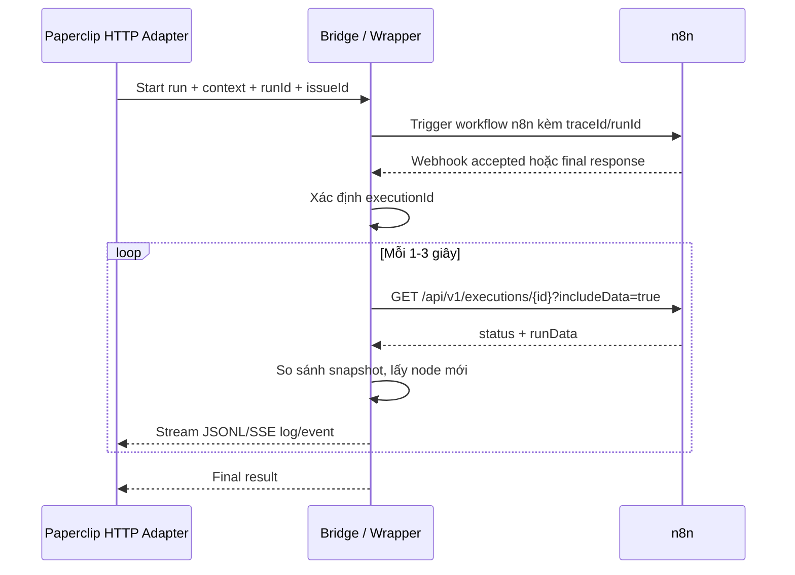

# Tổng hợp các cách hiển thị log/trace workflow n8n sang Paperclip khi vẫn dùng HTTP adapter

## 1. Mục tiêu

Mục tiêu là vẫn giữ luồng tích hợp hiện tại:

```text
Paperclip HTTP adapter -> n8n workflow
```

nhưng có thể hiển thị log/trace thực thi workflow n8n sang Paperclip để theo dõi:

- workflow đang chạy hay đã kết thúc;
- node nào đã chạy;
- node nào lỗi;
- thời gian chạy từng node;
- input/output hoặc summary input/output từng node;
- output của AI Agent/tool nếu n8n lưu được execution data.

Ràng buộc quan trọng:

- Không thêm thủ công HTTP Request node sau từng node trong các workflow có sẵn.
- Không biến n8n thành source of truth cho task.
- Paperclip vẫn là nơi quản lý agent, issue, run, comment, activity và status.
- HTTP adapter vẫn được dùng ở giai đoạn thử nghiệm.

## 2. Kết luận ngắn

Nếu vẫn dùng HTTP adapter và không sửa từng workflow, có 3 hướng đáng làm nhất:

| Hướng | Mức khuyến nghị | Realtime | Lấy input/output node | Có cần sửa workflow cũ? | Ghi chú |
|---|---:|---:|---:|---:|---|
| Bridge + polling n8n execution API | Cao nhất cho prototype | Gần realtime | Có, nếu n8n lưu execution data | Không | Dễ áp dụng nhất |
| Bridge + đọc trực tiếp n8n DB/execution storage | Trung bình | Gần realtime hơn API | Có | Không | Phụ thuộc DB/storage của n8n |
| n8n lifecycle hook/extension | Cao nhất về kỹ thuật | Gần realtime thật | Có thể có | Không sửa workflow, nhưng phải mở rộng n8n | Phức tạp hơn |
| Container log scraping | Thấp | Có | Không đầy đủ | Không | Chỉ dùng debug phụ |
| Workflow tự push log | Không phù hợp yêu cầu hiện tại | Realtime | Có | Có | Loại vì phải thêm node |

Hướng nên làm trước:

```text
HTTP adapter -> Bridge/wrapper -> n8n webhook
Bridge poll /api/v1/executions/{executionId}?includeData=true
Bridge stream JSONL/SSE log về Paperclip HTTP adapter
```

## 3. Bước 1: Cấu hình biến môi trường cho n8n Docker

Để lấy được dữ liệu từng node, n8n phải lưu execution data và progress trong lúc workflow đang chạy.

Các biến môi trường nên bật trong giai đoạn thử nghiệm:

```env
EXECUTIONS_DATA_SAVE_ON_PROGRESS=true
EXECUTIONS_DATA_SAVE_ON_SUCCESS=all
EXECUTIONS_DATA_SAVE_ON_ERROR=all
```

Ý nghĩa:

- `EXECUTIONS_DATA_SAVE_ON_PROGRESS=true`: n8n lưu tiến độ sau mỗi node execution.
- `EXECUTIONS_DATA_SAVE_ON_SUCCESS=all`: lưu execution thành công.
- `EXECUTIONS_DATA_SAVE_ON_ERROR=all`: lưu execution lỗi.

Nếu không bật lưu progress, API execution thường chỉ có dữ liệu đầy đủ sau khi workflow kết thúc. Khi đó Paperclip chỉ nhận được trace kiểu "xong rồi mới có cả cục", không đạt near realtime.

### 3.1. Trường hợp đang dùng Docker container và volume có sẵn

Nếu đang có container `n8n` và volume `n8n_data`, không thể thêm env trực tiếp vào container đã tạo. Cách an toàn là xóa container cũ, tạo lại container mới với cùng volume.

Container có thể xóa, nhưng **không xóa volume**. Volume `n8n_data` đang giữ workflow, credential và dữ liệu n8n.

Các bước:

```powershell
docker stop n8n
docker rm n8n
```

Tạo lại container với cùng volume và các biến env cần thiết:

```powershell
docker run -d --name n8n `
  -p 5678:5678 `
  -v n8n_data:/home/node/.n8n `
  -e EXECUTIONS_DATA_SAVE_ON_PROGRESS=true `
  -e EXECUTIONS_DATA_SAVE_ON_SUCCESS=all `
  -e EXECUTIONS_DATA_SAVE_ON_ERROR=all `
  -e N8N_API_KEY_ENABLED=true `
  n8nio/n8n
```

Lưu ý: nếu trước đó container n8n có thêm các biến như `WEBHOOK_URL`, `N8N_HOST`, `N8N_PROTOCOL`, timezone, ngrok domain hoặc cấu hình database riêng, cần thêm lại các biến đó khi tạo container mới.

### 3.2. Kiểm tra env đã vào container

Sau khi tạo lại container:

```powershell
docker ps
```

Kiểm tra các biến execution:

```powershell
docker exec -it n8n printenv | findstr EXECUTIONS
```

Kết quả mong muốn:

```text
EXECUTIONS_DATA_SAVE_ON_PROGRESS=true
EXECUTIONS_DATA_SAVE_ON_SUCCESS=all
EXECUTIONS_DATA_SAVE_ON_ERROR=all
```

### 3.3. Tạo hoặc lấy n8n API key

Vào n8n UI:

```text
Settings -> n8n API -> Create API Key
```

Cần có n8n API key để gọi:

```http
GET /api/v1/executions/{executionId}?includeData=true
X-N8N-API-KEY: <api-key>
```

Nguồn tham khảo:

- n8n execution data: https://github.com/n8n-io/n8n-docs/blob/main/docs/deploy/host-n8n/configure-n8n/scaling/manage-execution-data.md
- n8n executions API: https://www.mintlify.com/n8n-io/n8n/api/executions

## 4. Bước 2: Kiểm tra thủ công việc lấy execution data và executionId

Mục tiêu của bước này là chứng minh quy trình sau chạy được bằng tay trước khi viết bridge:

```text
1. Biết workflowId của workflow n8n
2. Trigger workflow
3. Gọi API list executions
4. Tìm execution mới nhất của workflow đó
5. Lấy executionId
6. Gọi /api/v1/executions/{executionId}?includeData=true
7. Đọc runData từng node
```

Khi làm được quy trình này thủ công, bridge chỉ cần tự động hóa lại đúng các bước đó.

### 4.1. Lấy workflowId và executionId từ URL n8n

Ví dụ URL:

```text
https://inexpert-aleida-rostrally.ngrok-free.dev/workflow/AXa9GvhJ7SkQ2brv/executions/151
```

Trong đó:

```text
workflowId = AXa9GvhJ7SkQ2brv
executionId = 151
```

`workflowId` là id của workflow cần monitor. `executionId` là id của một lần chạy cụ thể.

### 4.2. Kiểm tra lấy execution data theo executionId

Gọi bằng Postman:

```http
GET https://inexpert-aleida-rostrally.ngrok-free.dev/api/v1/executions/151?includeData=true
X-N8N-API-KEY: <api-key>
Accept: application/json
```

Hoặc nếu gọi local:

```http
GET http://localhost:5678/api/v1/executions/151?includeData=true
X-N8N-API-KEY: <api-key>
Accept: application/json
```

Kết quả cần có:

```text
data.resultData.runData
```

Bên trong `runData` phải thấy các node của workflow, ví dụ:

```text
Nhận request từ Agent
Groq Chat Model
Get row(s) in sheet in Google Sheets1
AI Agent1
HTTP Request
HTTP Request1
```

Mỗi node nên có các trường:

```text
startTime
executionTime
executionIndex
executionStatus
data
inputOverride
error nếu có lỗi
```

Nếu có các trường trên, dữ liệu đã đủ để bridge tạo log:

```json
{
  "type": "n8n.node.finished",
  "nodeName": "Groq Chat Model",
  "status": "success",
  "durationMs": 726,
  "outputSummary": "Model đã xử lý xong"
}
```

### 4.3. Kiểm tra list executions theo workflowId

Gọi API list executions:

```http
GET https://inexpert-aleida-rostrally.ngrok-free.dev/api/v1/executions?workflowId=AXa9GvhJ7SkQ2brv&limit=5&includeData=false
X-N8N-API-KEY: <api-key>
Accept: application/json
```

Kết quả mong muốn:

```json
{
  "data": [
    {
      "id": "151",
      "workflowId": "AXa9GvhJ7SkQ2brv",
      "finished": true,
      "startedAt": "2026-08-17T..."
    }
  ],
  "nextCursor": null
}
```

Nếu API này trả ra danh sách executions, bridge có thể tự tìm execution mới nhất của workflow.

### 4.4. Kiểm tra execution đang chạy

Khi workflow đang chạy, có thể thử:

```http
GET https://inexpert-aleida-rostrally.ngrok-free.dev/api/v1/executions?workflowId=AXa9GvhJ7SkQ2brv&status=running&limit=5&includeData=false
X-N8N-API-KEY: <api-key>
Accept: application/json
```

Nếu workflow chạy nhanh quá, có thể không kịp thấy trạng thái `running`. Trường hợp này bình thường. Bridge vẫn có thể chọn execution mới nhất theo `startedAt`.

### 4.5. Logic bridge sẽ dùng để tự tìm executionId

Logic đơn giản:

```text
T0 = thời điểm trước khi bridge trigger n8n
Bridge gọi webhook n8n
Bridge gọi GET /api/v1/executions?workflowId=...&limit=10
Bridge chọn execution mới nhất có startedAt >= T0
Bridge lấy execution.id
Bridge poll /api/v1/executions/{id}?includeData=true
```

Logic chắc hơn là truyền thêm `traceId` vào webhook body:

```json
{
  "traceId": "pc-run-123-issue-456",
  "paperclipRunId": "run-123",
  "issueId": "issue-456"
}
```

Sau đó bridge đọc Webhook node input trong `runData` để xác nhận execution đó có đúng `traceId`. Cách này tránh nhầm execution nếu nhiều workflow chạy gần nhau.

### 4.6. Kết quả cần đạt trước khi viết bridge

Cần xác nhận đủ 3 điều:

```text
1. GET /api/v1/executions/{executionId}?includeData=true có runData từng node
2. GET /api/v1/executions?workflowId=...&limit=5 trả về danh sách execution
3. Có thể chọn được executionId mới nhất của workflow
```

Khi 3 điều này đạt, có thể chuyển sang viết bridge polling.

## 5. Cách 1: Bridge + polling n8n execution API

Đây là hướng tối ưu nhất nếu muốn tiếp tục dùng HTTP adapter và chưa muốn viết external adapter mới.

### 4.1. Luồng tổng thể

```text
Paperclip HTTP adapter
-> Bridge/wrapper HTTP
-> n8n webhook/workflow
-> Bridge lấy executionId
-> Bridge poll n8n execution API
-> Bridge stream log/event về Paperclip qua HTTP response
-> Paperclip HTTP adapter ghi vào run log
```

Sơ đồ:



### 4.2. Bridge lấy `executionId` như thế nào?

Đây là phần quan trọng nhất.

Tùy cách trigger workflow, có một vài cách lấy hoặc suy ra `executionId`:

| Cách lấy executionId | Khả thi | Ghi chú |
|---|---:|---|
| n8n response trả luôn `executionId` | Tốt nhất nếu cấu hình/extension hỗ trợ | Không phải workflow nào cũng trả sẵn |
| Poll danh sách executions theo `workflowId` + thời gian bắt đầu | Khả thi | Cần match thêm `traceId/runId` trong input webhook |
| Truyền `traceId` vào webhook body rồi tìm execution có Webhook node input chứa `traceId` | Khả thi | Nên dùng cho prototype |
| Đọc trực tiếp n8n DB/active execution store | Khả thi nếu self-host | Phụ thuộc DB/storage |
| Dùng n8n internal hook để push executionId sang bridge | Tốt nhưng nâng cao | Cần mở rộng n8n |

Payload Paperclip gửi sang bridge nên có correlation id rõ ràng:

```json
{
  "paperclipRunId": "run-123",
  "issueId": "issue-456",
  "agentId": "agent-789",
  "companyId": "company-abc",
  "traceId": "pc-run-123-issue-456",
  "context": {
    "title": "Tìm đơn hàng áo polo",
    "description": "Đọc dữ liệu và trả lời khách hàng"
  }
}
```

Bridge trigger n8n webhook với payload này. Sau đó bridge tìm execution mới của workflow có input chứa `traceId`.

### 4.3. Polling lấy được dữ liệu gì?

Khi gọi:

```http
GET /api/v1/executions/{executionId}?includeData=true
```

Bridge có thể lấy:

- `id`;
- `workflowId`;
- `status`;
- `finished`;
- `startedAt`;
- `stoppedAt`;
- `data.resultData.runData`;
- danh sách node đã chạy;
- `startTime` của node nếu có;
- `executionTime` của node nếu có;
- `executionStatus`;
- output JSON từng node;
- error nếu node lỗi.

Từ đó bridge chuẩn hóa thành event:

```json
{
  "type": "n8n.node.finished",
  "nodeName": "Get row(s) in sheet",
  "status": "success",
  "startTime": 1785815332373,
  "durationMs": 64,
  "inputSummary": "Query: áo polo",
  "outputSummary": "Tìm thấy 3 dòng phù hợp"
}
```

### 4.4. Chống gửi trùng event

Vì polling đọc lại cùng một execution nhiều lần, bridge phải dedupe.

Khóa chống trùng gợi ý:

```text
executionId + nodeName + runIndex + startTime + executionStatus
```

Bridge lưu `lastObservedNodeKey` hoặc set các node event đã gửi:

```json
{
  "paperclipRunId": "run-123",
  "n8nExecutionId": "151",
  "emittedKeys": [
    "151:Get row(s) in sheet:0:1785815332373:success",
    "151:AI Agent1:0:1785815332437:success"
  ]
}
```

### 4.5. Stream về Paperclip như thế nào?

Nếu HTTP adapter của Paperclip đã đọc response body dạng stream/chunk và gọi `ctx.onLog`, bridge có thể giữ kết nối mở và trả JSON Lines:

```jsonl
{"type":"n8n.execution.started","executionId":"151","message":"Workflow n8n đã bắt đầu"}
{"type":"n8n.node.finished","nodeName":"Webhook","durationMs":0,"message":"Đã nhận request"}
{"type":"n8n.node.finished","nodeName":"AI Agent1","durationMs":4200,"message":"AI Agent đã xử lý xong"}
{"type":"n8n.node.finished","nodeName":"HTTP Request1","durationMs":310,"message":"Đã cập nhật issue"}
{"type":"n8n.execution.finished","status":"success","message":"Workflow hoàn tất"}
```

Mỗi dòng sẽ được Paperclip ghi vào run log. Đây là log dạng text/JSONL, chưa phải structured `heartbeat_run_events` native.

Nếu muốn thành event native trong tab Run, cần thêm một trong hai thứ:

- external adapter để gọi trực tiếp `ctx.onEvent`;
- hoặc endpoint ingest mới trong Paperclip.

### 4.6. Ưu điểm

- Không cần sửa từng workflow.
- Không cần thêm HTTP Request node sau từng node.
- Dùng được với n8n self-host hiện tại.
- Lấy được output từng node nếu n8n lưu execution data.
- Phù hợp nhất cho prototype nhanh.

### 4.7. Nhược điểm

- Chỉ gần realtime, không đảm bảo bắt đúng khoảnh khắc node bắt đầu.
- Node chạy rất nhanh có thể chỉ được thấy sau khi đã hoàn thành.
- Cần xử lý mapping `paperclipRunId <-> n8nExecutionId`.
- Cần redaction để tránh lộ token/header/input nhạy cảm.
- Có thể gây tải nếu poll quá dày hoặc output node lớn.

## 6. Cách 2: Bridge + đọc trực tiếp n8n database/execution storage

Nếu n8n self-host và bạn kiểm soát database/storage, bridge có thể đọc execution data trực tiếp thay vì qua public API.

Luồng:

```text
Paperclip HTTP adapter
-> Bridge trigger n8n
-> Bridge đọc n8n DB hoặc execution storage
-> Bridge phát hiện runData thay đổi
-> Bridge stream log/event về Paperclip
```

### 5.1. Khi nào nên dùng?

Nên cân nhắc nếu:

- n8n API không trả running execution đủ nhanh;
- cần giảm overhead public API;
- đã có quyền đọc DB n8n;
- hệ thống chạy self-host trong cùng network/docker compose.

### 5.2. Dữ liệu có thể lấy

Tùy cấu hình n8n, execution data có thể nằm ở:

- database;
- filesystem;
- S3/external storage với bản enterprise.

Bridge có thể đọc execution record theo `executionId`, `workflowId`, `startedAt`, hoặc correlation `traceId`.

### 5.3. Ưu điểm

- Không sửa workflow.
- Có thể nhanh hơn polling public API.
- Chủ động kiểm soát query và cursor.

### 5.4. Nhược điểm

- Phụ thuộc schema/storage nội bộ của n8n.
- Dễ vỡ khi nâng cấp n8n.
- Cần quyền DB nhạy cảm.
- Vẫn cần dedupe, redaction và limit payload.

Hướng này phù hợp nếu prototype bằng public API không đủ ổn, nhưng chưa muốn patch n8n lifecycle.

## 7. Cách 3: n8n lifecycle hook/extension

Đây là hướng mạnh nhất nếu vẫn không muốn thêm node vào workflow có sẵn.

Thay vì workflow tự gửi log, ta gắn hook ở runtime n8n:

```text
n8n runtime
-> nodeExecuteBefore
-> nodeExecuteAfter
-> workflowExecuteAfter
-> bridge/Paperclip
```

### 6.1. Phân biệt external hooks và internal lifecycle hooks

n8n có `EXTERNAL_HOOK_FILES`, nhưng external hooks chính thức thường ở mức workflow:

- `workflow.preExecute`;
- `workflow.postExecute`.

Các hook này hữu ích để biết workflow bắt đầu/kết thúc, nhưng không đủ cho node-level realtime.

Muốn bắt từng node, cần hook nội bộ hoặc extension dựa trên lifecycle:

- `nodeExecuteBefore`;
- `nodeExecuteAfter`;
- `workflowExecuteBefore`;
- `workflowExecuteAfter`;
- một số phiên bản/PR có thêm `sendChunk` cho streaming node/tool event.

Nguồn tham khảo:

- n8n workflow runner/lifecycle source: https://github.com/n8n-io/n8n/blob/master/packages/cli/src/workflow-runner.ts
- PR đề xuất stream node/tool qua SSE: https://github.com/n8n-io/n8n/pull/20499

### 6.2. Luồng đề xuất

```text
Paperclip HTTP adapter -> Bridge -> n8n webhook
n8n lifecycle extension -> POST event sang Bridge
Bridge -> stream/log về Paperclip HTTP adapter hoặc ingest API
```

Event từ n8n hook:

```json
{
  "traceId": "pc-run-123-issue-456",
  "executionId": "151",
  "workflowId": "AXa9GvhJ7SkQ2brv",
  "eventType": "nodeExecuteAfter",
  "nodeName": "AI Agent1",
  "nodeType": "@n8n/n8n-nodes-langchain.agent",
  "runIndex": 0,
  "status": "success",
  "startedAt": "2026-08-17T03:20:01.000Z",
  "durationMs": 4200,
  "inputSummary": "...",
  "outputSummary": "..."
}
```

### 6.3. Ưu điểm

- Không cần sửa từng workflow.
- Gần realtime thật hơn polling.
- Bắt được node start/end/error rõ ràng hơn.
- Có thể lấy input/output task data ngay lúc node hoàn thành.

### 6.4. Nhược điểm

- Phải patch/fork n8n hoặc viết extension nội bộ.
- API lifecycle nội bộ có thể thay đổi khi nâng cấp n8n.
- Nếu dùng queue mode, phải cài hook trên mọi worker.
- Cần đảm bảo hook không làm chậm workflow nếu Paperclip/bridge lỗi.
- Cần hàng đợi/retry/backpressure.

### 6.5. Khi nào nên dùng?

Chỉ nên dùng sau khi đã thử polling mà chưa đạt yêu cầu.

Ví dụ yêu cầu bắt buộc:

- phải thấy node started ngay khi node bắt đầu;
- phải debug input/output từng node gần realtime;
- workflow dài, node chạy lâu, cần trace chính xác;
- nhiều workflow dùng chung, không thể sửa từng workflow.

## 8. Cách 4: Container log scraping

Bridge hoặc agent phụ đọc log container n8n:

```text
docker logs n8n
-> parse "Start executing node"
-> parse "Running node finished"
-> gửi log sang Paperclip
```

### 7.1. Ưu điểm

- Không sửa workflow.
- Không cần gọi n8n API nhiều.
- Dễ làm để debug local.

### 7.2. Nhược điểm

- Không lấy được input/output node đầy đủ.
- Log format có thể thay đổi.
- Cần bật log level đủ chi tiết.
- Khó map chính xác với Paperclip run nếu thiếu traceId/executionId.
- Không phù hợp làm giải pháp chính thức.

Chỉ nên dùng như công cụ hỗ trợ debug, không nên dùng làm trace chính cho Paperclip.

## 9. Cách 5: Error Workflow của n8n

n8n có Error Workflow để xử lý khi workflow lỗi.

Luồng:

```text
n8n workflow lỗi
-> Error Workflow chạy
-> gửi thông tin lỗi về bridge/Paperclip
```

### 8.1. Ưu điểm

- Không cần thêm node vào từng workflow chính nếu cấu hình error workflow chung.
- Hữu ích để báo lỗi tập trung.

### 8.2. Nhược điểm

- Chỉ chạy khi lỗi.
- Không có tiến độ node thành công.
- Không đáp ứng yêu cầu realtime trace đầy đủ.

Nên dùng bổ sung cho các hướng khác, không dùng riêng.

## 10. Cách không phù hợp với yêu cầu hiện tại

### 9.1. Thêm HTTP Request node sau từng node

Cách này cho realtime tốt, nhưng bị loại vì vi phạm yêu cầu:

```text
Không thêm thủ công HTTP Request node vào workflow có sẵn
```

### 9.2. Sub-workflow logger gọi sau từng bước

Về bản chất vẫn phải thêm `Execute Workflow` node vào workflow chính sau từng bước quan trọng. Vì vậy cũng không phù hợp nếu mục tiêu là không động vào workflow cũ.

### 9.3. Chỉ dùng Respond to Webhook ở cuối

Cách này dễ làm nhưng không realtime:

```text
Workflow chạy xong -> trả một cục output cuối
```

Nó không giúp theo dõi từng node trong lúc đang chạy.

## 11. Thiết kế bridge khuyến nghị cho prototype

### 10.1. Trách nhiệm của bridge

Bridge nên làm các việc sau:

- Nhận request từ Paperclip HTTP adapter.
- Gắn `traceId` vào payload gửi sang n8n.
- Trigger đúng webhook/workflow n8n.
- Tìm hoặc nhận `executionId`.
- Lưu mapping `paperclipRunId <-> n8nExecutionId`.
- Poll execution API.
- Chuẩn hóa node data thành log/event.
- Redact dữ liệu nhạy cảm.
- Stream JSONL/SSE về HTTP adapter.
- Kết thúc response khi n8n execution terminal.

Bridge không nên làm:

- tự quản lý task;
- tự đổi status issue nếu không cần;
- tự tạo dashboard riêng;
- thay thế Paperclip heartbeat;
- lưu full input/output không giới hạn.

### 11.2. Operational store tối thiểu

```text
paperclip_run_id
paperclip_issue_id
paperclip_agent_id
paperclip_company_id
n8n_execution_id
n8n_workflow_id
trace_id
last_emitted_node_key
execution_status
started_at
updated_at
completed_at
```

### 11.3. Event JSONL stream về Paperclip

Vì HTTP adapter nhận stream text, JSON Lines là format dễ debug:

```jsonl
{"ts":"2026-08-17T03:20:00.100Z","type":"n8n.execution.started","executionId":"151","message":"Workflow n8n bắt đầu"}
{"ts":"2026-08-17T03:20:00.300Z","type":"n8n.node.finished","nodeName":"Webhook","durationMs":0,"message":"Đã nhận request"}
{"ts":"2026-08-17T03:20:04.500Z","type":"n8n.node.finished","nodeName":"AI Agent1","durationMs":4200,"message":"AI Agent xử lý xong","outputSummary":"Đã tìm thấy thông tin đơn hàng"}
{"ts":"2026-08-17T03:20:05.000Z","type":"n8n.execution.finished","status":"success","message":"Workflow hoàn tất"}
```

### 11.4. Redaction bắt buộc

Không gửi nguyên các trường sau vào Paperclip log:

- `Authorization`;
- `Cookie`;
- API key;
- credential data;
- token;
- binary data;
- full request body quá lớn;
- dữ liệu khách hàng nhạy cảm nếu không cần.

Nên gửi summary:

```json
{
  "inputSummary": "Query khách hàng: áo polo",
  "outputSummary": "Tìm thấy 3 dòng phù hợp",
  "outputBytes": 18240,
  "truncated": true
}
```

## 12. Tạo và sử dụng bridge prototype

Bridge prototype đã được đặt tại:

```text
C:\paperclip\n8n-bridge
```

Các file chính:

```text
C:\paperclip\n8n-bridge\bridge.js
C:\paperclip\n8n-bridge\.env.example
C:\paperclip\n8n-bridge\README.md
C:\paperclip\n8n-bridge\package.json
```

### 12.1. Mục tiêu của bridge

Bridge nằm giữa Paperclip HTTP adapter và n8n Webhook B:

```text
Paperclip HTTP adapter -> Bridge -> n8n Webhook B
```

Bridge làm các việc:

```text
1. Nhận request từ Paperclip hoặc Postman
2. Sinh traceId
3. Gọi Webhook B của n8n kèm traceId
4. Tìm executionId tương ứng
5. Poll execution data của n8n
6. Parse runData từng node
7. Stream log JSONL về client/Paperclip
```

### 12.2. Tạo file cấu hình `.env`

Mở terminal:

```powershell
cd C:\paperclip\n8n-bridge
Copy-Item .env.example .env
```

Điền các biến sau trong `.env`:

```env
PORT=3005
N8N_BASE_URL=https://inexpert-aleida-rostrally.ngrok-free.dev
N8N_API_KEY=<api-key-n8n>
N8N_WEBHOOK_URL=https://inexpert-aleida-rostrally.ngrok-free.dev/webhook/<webhook-B-id>
N8N_WORKFLOW_ID=<workflowId-cua-workflow-B>
POLL_INTERVAL_MS=1000
FIND_EXECUTION_TIMEOUT_MS=30000
EXECUTION_TIMEOUT_MS=300000
MATCH_TRACE_ID=true
INCLUDE_INPUT_SUMMARY=false
LOG_DETAIL=compact
```

Ý nghĩa các biến quan trọng:

| Biến | Ý nghĩa |
|---|---|
| `N8N_BASE_URL` | Base URL của n8n API |
| `N8N_API_KEY` | API key dùng để gọi `/api/v1/executions` |
| `N8N_WEBHOOK_URL` | Webhook B, tức workflow agent xử lý task |
| `N8N_WORKFLOW_ID` | Workflow id của Webhook B |
| `MATCH_TRACE_ID` | Bật kiểm tra traceId để tránh nhầm execution |
| `LOG_DETAIL=compact` | Chỉ hiển thị log gọn, tránh output JSON quá dài |

`N8N_WORKFLOW_ID` lấy từ URL n8n:

```text
/workflow/<workflowId>/executions/<executionId>
```

### 12.3. Kiểm tra cú pháp bridge

```powershell
cd C:\paperclip\n8n-bridge
node --check bridge.js
```

Nếu không có output lỗi nghĩa là cú pháp OK.

### 12.4. Chạy bridge

```powershell
cd C:\paperclip\n8n-bridge
node bridge.js
```

Kết quả mong muốn:

```text
[n8n-bridge] listening on http://localhost:3005
```

Terminal này phải giữ nguyên, không được quay lại prompt. Nếu prompt quay lại ngay, nghĩa là bridge đã dừng.

### 12.5. Kiểm tra bridge đang lắng nghe port

Mở terminal thứ hai:

```powershell
netstat -ano | findstr :3005
```

Kết quả mong muốn có dòng `LISTENING`.

Hoặc test health bằng Postman:

```http
GET http://localhost:3005/health
```

Kết quả đúng:

```json
{"ok":true}
```

### 12.6. Test bridge riêng bằng Postman

Gọi:

```http
POST http://localhost:3005/run
Content-Type: application/json
```

Body:

```json
{
  "Content": "Lấy cho tôi thông tin các đơn hàng mà sản phẩm là Chuot"
}
```

Bridge sẽ:

```text
1. Nhận request
2. Sinh traceId
3. Gọi n8n Webhook B
4. Tìm executionId của Workflow B
5. Poll runData
6. Stream log JSONL về Postman
```

Kết quả mong muốn:

```jsonl
{"type":"bridge.started","message":"Bridge nhận request"}
{"type":"n8n.triggered","message":"Đã gọi webhook n8n"}
{"type":"n8n.execution.found","executionId":"269","message":"Đã tìm thấy execution n8n"}
{"type":"n8n.node.finished","nodeName":"AI Agent1","durationMs":1234,"outputPreview":"..."}
{"type":"n8n.execution.finished","status":"success","message":"Workflow n8n đã kết thúc"}
```

### 12.7. Nối Paperclip agent HTTP adapter vào bridge

Sau khi test Postman ổn, đổi URL của agent HTTP adapter trong Paperclip.

Trước đó agent có thể đang trỏ trực tiếp vào Webhook B:

```text
https://inexpert-aleida-rostrally.ngrok-free.dev/webhook/<webhook-B-id>
```

Đổi sang bridge:

```text
http://localhost:3005/run
```

Nếu Paperclip chạy trong Docker container, dùng:

```text
http://host.docker.internal:3005/run
```

Với trường hợp Paperclip chạy trực tiếp trên Windows host, dùng:

```text
http://localhost:3005/run
```

### 12.8. Test luồng thật

Workflow A vẫn giữ nguyên. Gọi Webhook A như bình thường để nhận query người dùng:

```text
User/Postman -> Webhook A -> tạo task trong Paperclip
```

Sau đó Paperclip sẽ gọi agent HTTP adapter:

```text
Paperclip -> Bridge -> Webhook B -> n8n agent workflow
```

Kết quả cần kiểm tra:

```text
1. Workflow A tạo task thành công
2. Paperclip gọi agent HTTP adapter
3. Bridge nhận request
4. Bridge gọi Webhook B
5. Workflow B chạy
6. Paperclip tab Run hiển thị log JSONL từng node
7. Task chuyển in_progress -> done
8. Task không bị done -> todo ngoài ý muốn
```

### 12.9. Nếu log hiển thị quá rối

Bridge mặc định nên dùng:

```env
LOG_DETAIL=compact
```

Chế độ này chỉ hiển thị message ngắn, duration, status, token usage và preview rút gọn.

Nếu cần debug sâu:

```env
LOG_DETAIL=verbose
```

Không nên bật `verbose` lâu dài vì output node có thể chứa dữ liệu lớn hoặc nhạy cảm.

## 13. Mapping dữ liệu n8n sang Paperclip log

| n8n data | Paperclip log/event nên hiển thị |
|---|---|
| `execution.id` | `executionId` |
| `workflowId` | `workflowId` |
| `finished/status` | execution status |
| node name | `nodeName` |
| node type | `nodeType` |
| `startTime` | node start time |
| `executionTime` | `durationMs` |
| `executionStatus` | success/error/waiting |
| node output JSON | `outputSummary` hoặc truncated output |
| node error | stderr/error event |

Ví dụ log hiển thị:

```text
[n8n] execution 151 started
[n8n] node "Webhook" finished in 0ms
[n8n] node "Get row(s) in sheet" finished in 64ms - output: 3 rows
[n8n] node "AI Agent1" finished in 4200ms - output: Đã tạo câu trả lời
[n8n] execution 151 success in 4.8s
```

## 14. Cấu hình Docker gợi ý

Nếu n8n chạy Docker và Paperclip chạy Windows host, trong n8n container gọi Paperclip host bằng:

```text
http://host.docker.internal:3100
```

Nếu bridge cũng chạy Docker cùng network với n8n, nên dùng service name:

```text
http://n8n:5678
```

Ví dụ environment n8n:

```yaml
environment:
  - EXECUTIONS_DATA_SAVE_ON_PROGRESS=true
  - EXECUTIONS_DATA_SAVE_ON_SUCCESS=all
  - EXECUTIONS_DATA_SAVE_ON_ERROR=all
  - EXECUTIONS_DATA_PRUNE=true
  - EXECUTIONS_DATA_MAX_AGE=168
```

## 15. Rủi ro và cách giảm thiểu

| Rủi ro | Nguyên nhân | Cách giảm |
|---|---|---|
| Không lấy được executionId | Webhook không trả id | Dùng `traceId`, match recent execution, hoặc hook/DB |
| Log không realtime | n8n không save progress | Bật `EXECUTIONS_DATA_SAVE_ON_PROGRESS=true` |
| Event trùng | Poll nhiều lần cùng dữ liệu | Dedupe bằng node key |
| Payload quá lớn | Node output lớn | Truncate, summary, limit bytes |
| Lộ token/dữ liệu nhạy cảm | Gửi full input/output | Redaction/allowlist |
| Tải n8n API cao | Poll quá dày | Poll 1-3s, backoff, dừng khi terminal |
| Workflow kết thúc nhưng Paperclip run vẫn chạy | Bridge không nhận terminal state | Timeout + terminal status check |
| Paperclip run kết thúc quá sớm | HTTP response đóng trước khi n8n xong | Bridge giữ connection đến terminal state |

## 16. Lộ trình triển khai đề xuất

### Phase 1: Chuẩn bị n8n execution data

- Bật `EXECUTIONS_DATA_SAVE_ON_PROGRESS=true`.
- Bật lưu success/error execution.
- Test Postman gọi `/api/v1/executions/{id}?includeData=true`.
- Xác nhận có `runData` của từng node.

### Phase 2: Viết bridge polling

- Bridge nhận request từ Paperclip HTTP adapter.
- Bridge trigger n8n webhook.
- Bridge gắn `traceId`.
- Bridge tìm `executionId`.
- Bridge poll execution API.
- Bridge in JSONL ra response stream.

### Phase 3: Nối bridge với Paperclip HTTP adapter

- Cấu hình agent HTTP adapter URL trỏ vào bridge thay vì trỏ trực tiếp n8n webhook.
- Kiểm tra Paperclip tab Run có hiện JSONL log theo thời gian.
- Đảm bảo bridge chỉ trả final response khi n8n terminal.

### Phase 4: Chuẩn hóa event

- Chuẩn hóa `node.started`, `node.finished`, `node.failed`.
- Thêm `durationMs`, `inputSummary`, `outputSummary`.
- Thêm redaction.
- Thêm dedupe.

### Phase 5: Nâng cấp nếu cần

Nếu polling chưa đủ realtime:

- thêm n8n lifecycle hook/extension;
- hoặc chuyển sang external adapter `n8n_runtime`;
- hoặc bổ sung Paperclip ingest endpoint cho structured run events.

## 17. Kết luận

Với điều kiện vẫn dùng HTTP adapter và không thêm thủ công node log vào workflow có sẵn, hướng tối ưu nhất là xây một bridge/wrapper ở giữa Paperclip và n8n:

```text
Paperclip HTTP adapter -> Bridge -> n8n
```

Bridge chịu trách nhiệm trigger workflow, lấy `executionId`, poll execution data, chuẩn hóa node trace và stream log về Paperclip. Cách này không đạt realtime tuyệt đối như adapter native, nhưng đủ tốt để prototype theo dõi workflow/node gần realtime.

Khi cần trace chính xác hơn, có thể nâng cấp lên n8n lifecycle hook hoặc external adapter `n8n_runtime`. External adapter vẫn là hướng chính thức hơn nếu muốn đưa dữ liệu vào đúng callback `ctx.onLog`, `ctx.onEvent` và `ctx.onRuntimeProgress` của Paperclip.
