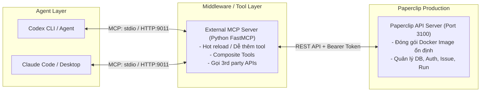
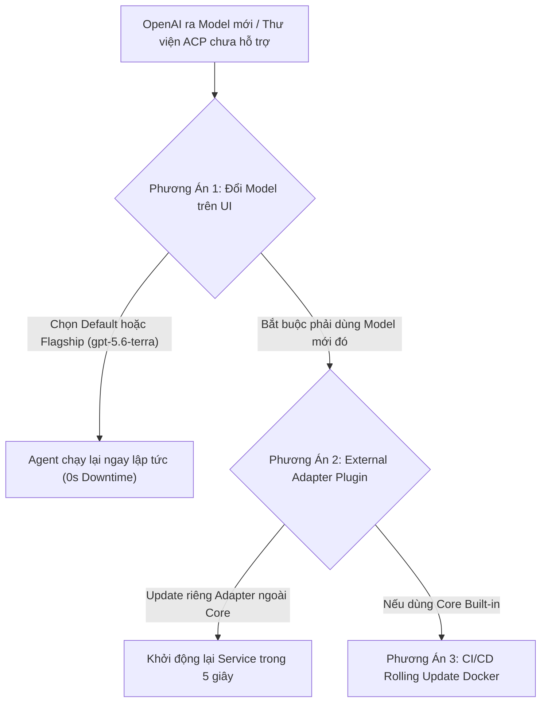
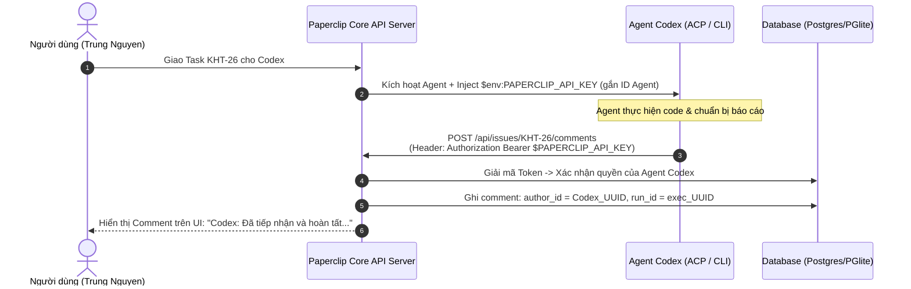

# Phân Tích Kiến Trúc: Internal MCP Server vs External MCP Server Cho Paperclip

Tài liệu này tổng hợp và phân tích kiến trúc giữa hai bộ MCP Server hiện có trong repository:
1. **Internal MCP Server (TypeScript):** `C:\paperclip\packages\mcp-server`
2. **External MCP Server (Python):** `C:\paperclip\paperclip-mcp`

Đồng thời tài liệu làm rõ lý do tại sao phương án **External MCP Server** là hướng tiếp cận tối ưu khi triển khai hệ thống Paperclip lên môi trường Production và kết nối với các Agent bên ngoài như **Codex**, **Claude Code**, hay **n8n**.

---

## 1. Bảng So Sánh Tổng Quan

| Tiêu chí | Internal MCP Server (`packages/mcp-server`) | External MCP Server (`paperclip-mcp`) |
| :--- | :--- | :--- |
| **Ngôn ngữ** | TypeScript / Node.js | Python (FastMCP + HTTPX) |
| **Vị trí & Quản lý** | Nằm trong monorepo Paperclip (`workspace:*`) | Thư mục/repo độc lập bên ngoài |
| **Tool Surface** | Đầy đủ, bám sát toàn bộ API REST (hơn 30+ tools chi tiết) | Gọn nhẹ, tập trung các use-case phổ biến (khoảng 15 tools) |
| **Vòng đời Build & Deploy** | **Gắn chặt với Paperclip Core:** Cần rebuild Docker image của toàn bộ hệ thống khi sửa/thêm tool | **Độc lập hoàn toàn:** Sửa đổi tool, thêm logic mới chỉ cần restart process Python hoặc restart container MCP riêng |
| **Mục đích thiết kế** | Cung cấp official standard MCP wrapper theo chuẩn Node SDK của Anthropic | Tạo lớp middleware linh hoạt cho Operator / AI Agent (Codex, Claude) tùy biến nhanh |
| **Cách chạy** | `stdio` qua lệnh Node/npx | Hỗ trợ cả `stdio` và `HTTP streamable` (port mặc định `9011`) |

---

## 2. Bài Toán Thực Tế: Tại Sao Cần External MCP Server?

### Vấn đề khi dùng Internal MCP Server (`packages/mcp-server`) trên Production
Khi hệ thống Paperclip Core đã được đóng gói thành Docker Image và deploy lên server Production:
* Mỗi khi bạn muốn **thêm 1 Tool mới** (ví dụ: một tool tổng hợp hoặc gọi thêm API phụ trợ), bạn bắt buộc phải:
  1. Thay đổi source code TypeScript trong repo Paperclip.
  2. Chạy lại quy trình build image (tốn thời gian, nguy cơ gây downtime).
  3. Deploy lại toàn bộ container Paperclip.
* Khó kết hợp gọi chéo với các dịch vụ bên ngoài (Slack, Jira, Database nội bộ, Cloud API) mà không làm "ô nhiễm" codebase của Paperclip Core.

### Lợi ích vượt trội của External MCP Server (`paperclip-mcp`)


1. **Decoupled Lifecycle (Tách rời vòng đời phát triển):**
   * Paperclip Core chỉ đóng vai trò cung cấp REST API chuẩn và dữ liệu nền tảng.
   * `paperclip-mcp` hoạt động như một **Microservice / Sidecar**. Bạn có thể tùy ý sửa code Python, thêm/bớt tool mà không ảnh hưởng gì tới Paperclip Production.
2. **Khả năng tạo Composite Tools (Gom cụm thao tác):**
   * Thay vì để Agent LLM phải gọi 3 lần MCP riêng biệt (*Get Issue -> Checkout Issue -> Post Comment*), bạn có thể viết 1 hàm Python duy nhất gom 3 bước này lại. Điều này giúp:
     * Tiết kiệm đáng kể Token context window cho Agent.
     * Tránh lỗi hallucination của Agent giữa các bước trung gian.
3. **Mở rộng kết nối đa nền tảng:**
   * Dễ dàng tích hợp thêm các thư viện Python mạnh mẽ (Pandas, BeautifulSoup, LangChain, SDK các dịch vụ bên thứ 3) trực tiếp vào MCP Server mà không làm cồng kềnh server Paperclip.

---

## 3. Hướng Dẫn Cấu Hình Tích Hợp

### A. Cấu hình cho Codex (`~/.codex/config.toml`)

Để Codex kết nối trực tiếp với `paperclip-mcp` qua giao thức `stdio`:

```toml
[mcp_servers.paperclip]
# Khuyến nghị: Dùng đường dẫn tuyệt đối đến file python.exe của môi trường Conda / venv đã cài fastmcp, httpx
command = "D:/anaconda/envs/ml_env/python.exe"
args = [
    "C:/paperclip/paperclip-mcp/src/paperclip_mcp/server.py",
    "--transport",
    "stdio"
]
env = { PAPERCLIP_BASE_URL = "http://localhost:3100/api", PAPERCLIP_API_KEY = "pcp_1305bc09851c001a4830228b8c36f99664814ff5244fe268", PAPERCLIP_COMPANY_ID = "cbe22c30-6a5b-40b8-b67a-85946c874e29" }
```

> **📌 Các lưu ý quan trọng khi cấu hình TOML:**
> 1. **Dấu gạch chéo xuôi (`/`):** Luôn dùng dấu `/` trong đường dẫn Windows (ví dụ: `D:/anaconda/...` hoặc `C:/paperclip/...`) thay vì `\` để tránh lỗi escape ký tự của cú pháp TOML (`missing escaped value`).
> 2. **Trỏ trực tiếp đến `python.exe` của Conda/venv:** Nếu dùng môi trường Conda (ví dụ `ml_env` hoặc `base`), hãy trỏ trực tiếp đến file `python.exe` của env đó. Khi đó Python sẽ tự nạp đầy đủ các package `fastmcp`, `httpx` trong `site-packages` mà không cần lệnh activate thủ công.
> 3. **Kiểm tra kết nối trong Codex:**
>    * Gõ `/mcp` để kiểm tra trạng thái kết nối (`connected (21 tools)`).
>    * Gõ `/mcp verbose` để xem danh sách chi tiết toàn bộ các Tool và tham số.
>    * Dòng `Auth: Unsupported` là hoàn toàn bình thường do MCP server dùng Static API Key qua header thay vì cơ chế OAuth2 động của giao thức MCP.


### B. Chạy dưới dạng HTTP Service (Dành cho Claude Code / mcp-proxy / Multi-client)

1. **Cấu hình `.env` trong `paperclip-mcp`:**
   ```dotenv
   PAPERCLIP_BASE_URL=http://localhost:3100/api
   PAPERCLIP_API_KEY=your_agent_api_key_here
   PAPERCLIP_COMPANY_ID=your_company_uuid_here
   ```
2. **Khởi động server HTTP (Port 9011):**
   ```bash
   cd C:\paperclip\paperclip-mcp
   python src/paperclip_mcp/server.py --port 9011
   ```
3. **Đăng ký với Claude Code:**
   ```bash
   claude mcp add paperclip --transport http http://localhost:9011/mcp
   ```

### C. Phân Tích So Sánh: stdio vs HTTP Service (Ưu / Nhược Điểm)

| Tiêu chí | Giao thức `stdio` | Giao thức `HTTP` (Streamable / SSE) |
| :--- | :--- | :--- |
| **Cơ chế hoạt động** | Client (Codex / Claude Desktop) tự sinh tiến trình con (`child_process`), giao tiếp qua `stdin` / `stdout` | Server chạy độc lập dưới dạng Web Service trên port (mặc định 9011), Client gửi request qua mạng |
| **Vòng đời (Lifecycle)** | Tự động sống/chết theo Client. Bật Codex là chạy, tắt Codex là giải phóng tiến trình | Chạy độc lập dưới nền (Daemon/Docker). Client bật/tắt không ảnh hưởng server |
| **Quản lý Port & Mạng** | **Không cần port.** Không bao giờ lo bị chiếm cổng (port collision) hay xung đột mạng | Phải quản lý port `9011`, đảm bảo không bị service khác chiếm dụng |
| **Chia sẻ Multi-client** | **Không.** Mỗi client spawn một process Python riêng (nếu mở nhiều app sẽ tốn thêm RAM) | **Rất tốt.** 1 Server duy nhất phục vụ đồng thời cho Codex, Claude Code, n8n, Cursor... |
| **Khả năng chạy Remote** | Chỉ chạy được cục bộ trên cùng 1 máy tính (Local-only) | Kết nối linh hoạt qua mạng LAN/Internet/Docker container khác |
| **Khả năng Debug & Log** | Khó debug hơn vì in `print()` vào stdout sẽ làm hỏng JSON-RPC | Dễ quan sát log trực tiếp trên terminal của server theo thời gian thực |

> **💡 Khuyến nghị áp dụng:**
> * **Chọn `stdio`:** Khi bạn dùng **Codex CLI** hoặc **Claude Desktop** làm việc cá nhân trên máy local. Cấu hình 1 lần trong file config là xong, không cần nhớ lệnh bật/tắt server.
> * **Chọn `HTTP`:** Khi bạn muốn kết nối với **n8n Workflow**, chia sẻ chung một MCP server cho nhiều agent, hoặc đóng gói server MCP vào container Docker riêng biệt.

---

## 4. Hướng Dẫn Mở Rộng & Viết Thêm Tool Mới trong `paperclip-mcp`

Nhờ sử dụng thư viện `FastMCP`, việc thêm một công cụ mới cực kỳ đơn giản.

Mở file `C:\paperclip\paperclip-mcp\src\paperclip_mcp\server.py` và sử dụng decorator `@mcp.tool()`:

```python
@mcp.tool()
async def quick_checkout_and_comment(
    issue_id: str, 
    agent_id: str, 
    comment_text: str,
    run_id: str | None = None
) -> dict:
    """
    Tiện ích gom: Tự động checkout một Issue và gửi kèm comment mở đầu công việc.
    
    :param issue_id: UUID của issue cần xử lý
    :param agent_id: UUID của agent thực hiện checkout
    :param comment_text: Nội dung thông báo bắt đầu xử lý
    :param run_id: Mã định danh của lượt chạy (nếu có)
    """
    headers = {"X-Run-Id": run_id} if run_id else {}
    
    # 1. Checkout issue
    checkout_res = await client.post(
        f"/issues/{issue_id}/checkout", 
        json={"agentId": agent_id},
        headers=headers
    )
    
    # 2. Thêm comment
    comment_res = await client.post(
        f"/issues/{issue_id}/comments",
        json={"body": comment_text},
        headers=headers
    )
    
    return {
        "status": "success",
        "checkout": checkout_res.json(),
        "comment": comment_res.json()
    }
```

---

## 5. Các Nguyên Tắc Cần Nhớ Khi Vận Hành

1. **Docstring rõ ràng:** LLM (Codex / Claude) dựa vào type hints và docstring của hàm Python để hiểu khi nào cần gọi tool. Hãy viết mô tả mục đích và tham số thật mạch lạc.
2. **Quản lý `run_id`:** Luôn hỗ trợ truyền `run_id` vào header các request gọi Paperclip REST API để giữ tính liên tục của luồng thực thi (execution trace/log) trên Paperclip UI.
3. **Bảo mật API Key:** File `.env` chứa API Key của Paperclip cần được giữ trong `.gitignore`, không đưa lên version control.

---

## 6. Hướng Dẫn Cập Nhật & Build Adapter Codex ACP (Paperclip Core)

Phần này hướng dẫn cách nâng cấp thư viện `@agentclientprotocol/codex-acp` và build adapter trong Paperclip khi có phiên bản mới hoặc hỗ trợ model mới (ví dụ `gpt-5.6-luna`, `gpt-5.6-terra`).

### A. Tại sao chọn chế độ ACP (Agent Client Protocol) trên Windows?
* **Tránh lỗi khoảng trắng đường dẫn Windows:** Chế độ `CLI` gọi qua file batch `codex.CMD`. Nếu username chứa khoảng trắng (ví dụ `C:\Users\LAPTOP HP\...`), CMD sẽ báo lỗi `is not recognized as an internal or external command`.
* **Hiệu năng & Trạng thái:** ACP giữ kết nối WebSocket liên tục, tối ưu context và spawn terminal ngầm bằng Node.js cực kỳ ổn định.
* **Không phụ thuộc CLI Global:** Không cần chạy `npm install -g @openai/codex` hay `@agentclientprotocol/codex-acp`. Paperclip tự quản lý gói nội bộ qua `pnpm`.

---

### B. Quy trình các bước thực hiện (Cheat Sheet lệnh)

#### Bước 1: Khai báo phiên bản trong file cấu hình
Mở file `packages/adapters/codex-local/package.json`:
1. Kiểm tra phần `"dependencies"`:
   ```json
   "dependencies": {
     "@agentclientprotocol/codex-acp": "^1.11.0",
     "@paperclipai/adapter-utils": "workspace:*",
     "picocolors": "^1.1.1"
   }
   ```
2. Đảm bảo script `"build"` tương thích với Windows (dùng `node -e` thay vì `cp` của Linux):
   ```json
   "scripts": {
     "build": "tsc && node -e \"fs.copyFileSync('src/server/codex-auth-merge-decision.cjs','dist/server/codex-auth-merge-decision.cjs');fs.copyFileSync('src/server/codex-auth-merge-extract.sh','dist/server/codex-auth-merge-extract.sh')\"",
     "clean": "rm -rf dist",
     "typecheck": "tsc --noEmit"
   }
   ```

#### Bước 2: Tải package mới và Build Adapter
Mở PowerShell tại thư mục gốc `C:\paperclip` và chạy:

```powershell
# 1. Tải dependencies mới
pnpm install

# 2. Build riêng gói adapter codex-local
pnpm --filter @paperclipai/adapter-codex-local build
```

#### Bước 3: Khởi động lại Paperclip
```powershell
pnpm dev
```

---

### C. Cấu hình trên Paperclip UI (`http://localhost:3100`)

1. Vào menu **Agents** -> Chọn Agent **Codex**.
2. **Adapter**: Chọn `Codex Local` (`codex_local`).
3. **Execution Engine**: Chọn `acp` (hoặc `ACP`).
4. **Model**:
   * Khuyến nghị chọn `Default` hoặc `gpt-5.6-terra` (bản chuẩn ổn định nhất).
   * Nếu dùng `gpt-5.6-luna`, hãy đảm bảo ACP đã được update bản mới như hướng dẫn ở trên.
5. Lưu lại cấu hình và chạy Task / Issue.

---

## 7. Chiến Lược Vận Hành Trên Production: Xử Lý Xung Đột & So Sánh ACP vs CLI

Phần này tổng hợp chiến lược triển khai hệ thống lên môi trường Production (Linux / Docker / Cloud VM / Kubernetes) và cách giải quyết các tình huống xung đột thư viện/model khi hệ thống đang phục vụ thực tế.

### A. Sự khác biệt giữa Local (Windows) và Production (Linux/Docker)
1. **Lỗi đường dẫn khoảng trắng (`LAPTOP HP`):** Trên Production (Linux), đường dẫn luôn theo chuẩn POSIX (ví dụ: `/app/workspaces/...`), không sử dụng ổ đĩa `C:\` và không chạy file batch `.CMD`.
2. **Lỗi script `cp`:** Lệnh `cp` là native command trong môi trường Linux, do đó quá trình build container trong CI/CD diễn ra trơn tru tuyệt đối.

---

### B. So sánh chiến lược: Nên chọn ACP hay CLI trên Production?

| Tiêu chí | **ACP (Agent Client Protocol) - Khuyên Dùng** | **CLI (`codex exec`)** |
| :--- | :--- | :--- |
| **Hiệu năng & Tốc độ** | **Rất cao & Nhẹ:** Kết nối trực tiếp qua WebSocket/HTTP API, stream token thời gian thực, hỗ trợ cơ chế warmup giữ context. | **Chậm & Nặng hơn:** Mỗi task phải khởi tạo 1 session process CLI mới từ đầu, tốn CPU/RAM. |
| **Kiểm soát vòng đời** | Quản lý 100% bằng Node.js: Dễ dàng ngắt lệnh khẩn cấp (Emergency Stop), theo dõi trạng thái tác vụ. | Dễ phát sinh tiến trình chạy ngầm (zombie process) nếu process CLI bị treo. |
| **Độ ổn định 24/7** | Hoạt động ngầm dưới dạng Service backend liên tục. | Phù hợp cho Developer gõ lệnh tương tác thủ công trên terminal hơn. |

> **👉 Khuyến nghị cho Production:** Luôn cấu hình **Engine: ACP** cho các Agent chạy ngầm tự động.

---

### C. 3 Phương Án Xử Lý Khi Xảy Ra Xung Đột Model / Thư Viện Trên Production



#### 1. Phương Án 1: Fallback Model trên UI (0 giây Downtime, không sửa code)
* Khi OpenAI ra mắt model phụ/mới (ví dụ `gpt-5.6-luna`), OpenAI vẫn luôn duy trì tương thích ngược (backward compatibility) cho các model tiêu chuẩn (`Default` hoặc `gpt-5.6-terra`).
* **Cách thực hiện:** Truy cập Paperclip UI -> Sửa cấu hình Agent về **`Model: Default`** hoặc **`gpt-5.6-terra`**. Agent tiếp tục làm việc bình thường ngay tức thì.

#### 2. Phương Án 2: Dùng External Adapter Plugin (Không Rebuild Core)
* Paperclip hỗ trợ tách rời adapter thành plugin độc lập qua cấu hình `~/.paperclip/adapter-plugins.json`.
* Khi có bản `@agentclientprotocol/codex-acp` mới:
  * Bạn chỉ cần nâng cấp gói plugin này độc lập bên ngoài.
  * Container Paperclip Core vẫn chạy nguyên vẹn, không cần rebuild image toàn bộ hệ thống.

#### 3. Phương Án 3: CI/CD Rolling Update Container
* Pin (khóa) phiên bản ổn định trong `package.json` (ví dụ `"@agentclientprotocol/codex-acp": "1.11.0"`).
* Khi nâng cấp:
  1. Thay đổi version trong code repo và đẩy (push) lên Git.
  2. Pipeline CI/CD tự động test và build Docker Image mới.
  3. Cơ chế **Rolling Update** (Kubernetes / Docker Swarm) sẽ khởi động container mới hoàn tất rồi mới tắt container cũ, đảm bảo hệ thống không bị gián đoạn hoạt động.

---

## 8. Cơ Chế Tải Cấu Hình & Tự Động Nhận Diện MCP Server Của ACP (`CODEX_HOME`)

Một thắc mắc phổ biến là: **Tại sao khi không chạy Codex CLI mà chỉ chạy chế độ ACP, hệ thống vẫn tự nhận diện được MCP Server Paperclip?**

Câu trả lời nằm ở cơ chế quản lý môi trường **`CODEX_HOME`** được Paperclip Codex Adapter triển khai trong mã nguồn [`packages/adapters/codex-local/src/server/codex-home.ts`](file:///c:/paperclip/packages/adapters/codex-local/src/server/codex-home.ts).

### A. Sơ đồ luồng tải cấu hình (Config Seeding & Discovery)

```mermaid
flowchart TD
    UserHome["Thư mục ~/.codex trên máy chủ<br/>(C:\Users\LAPTOP HP\.codex)"] --> Files["1. auth.json (API Key / OAuth Session)<br/>2. config.toml ([mcp_servers.paperclip])<br/>3. skills/ (Custom Skills)"]

    Files --> PaperclipSeeder["Paperclip Adapter Seeder<br/>(codex-home.ts / acp.ts)"]

    subgraph RuntimeEnv["Môi trường thực thi Managed CODEX_HOME"]
        PaperclipSeeder -->|Symlink an toàn| AuthFile["auth.json"]
        PaperclipSeeder -->|Nạp & Parse| ConfigFile["config.toml"]
    end

    AuthFile -->|Cấp Token/Key| ACPCore["ACP Engine (@agentclientprotocol/codex-acp)"]
    ConfigFile -->|Đọc mục [mcp_servers.paperclip]| MCPLauncher["ACP MCP Process Manager"]

    MCPLauncher -->|Spawn tiến trình con| PyServer["FastMCP Python Server (stdio)<br/>D:/anaconda/.../python.exe server.py"]

    PyServer -->|Đăng ký 32 Tools| ACPCore
    ACPCore <-->|WebSocket Stream + 32 Tools Context| OpenAIBackend["OpenAI Cloud (Codex Brain)"]
```

---

### B. Chi tiết 2 thành phần cốt lõi được nạp tự động:

#### 1. Nạp khóa xác thực từ `auth.json` (Authentication)
* Trong mã nguồn Paperclip (`codex-home.ts`), file `auth.json` được định nghĩa trong danh sách `SYMLINKED_SHARED_FILES`.
* Khi Agent bắt đầu chạy, Paperclip liên kết (symlink) file `~/.codex/auth.json` vào môi trường sandbox/execution.
* Thư viện ACP tự động đọc token xác thực đã lưu từ các lần đăng nhập trước (hoặc API Key) để khởi tạo phiên kết nối WebSocket an toàn với OpenAI Cloud mà không cần người dùng nhập lại thủ công.

#### 2. Nạp và đăng ký MCP Servers từ `config.toml` (Tool Registration)
* File `config.toml` nằm trong danh sách `COPIED_SHARED_FILES` được nạp vào session.
* ACP Engine tự động phân tích (parse) cú pháp TOML trong block `[mcp_servers.paperclip]`:
  ```toml
  [mcp_servers.paperclip]
  command = "D:/anaconda/envs/ml_env/python.exe"
  args = [
      "C:/paperclip/paperclip-mcp/src/paperclip_mcp/server.py",
      "--transport",
      "stdio"
  ]
  env = { PAPERCLIP_BASE_URL = "http://localhost:3100/api", ... }
  ```
* Sau khi đọc xong cấu hình, ACP Engine **tự động spawn tiến trình Python FastMCP** bằng đường ống giao tiếp `stdio`.
* Tiến trình Python phản hồi danh sách **32 Tools của Paperclip**.
* ACP Engine tổng hợp và khai báo toàn bộ 32 Tools này lên OpenAI Cloud trong tin nhắn `initialize` / `tools_schema`.

---

### C. Kết luận & Điểm mạnh kiến trúc:
* Cả **CLI** (`codex exec`) và **ACP** (`@agentclientprotocol/codex-acp`) đều sử dụng chung một "bộ hồ sơ năng lực & cấu hình" tại `~/.codex`.
* Nhờ cơ chế này, bạn chỉ cần cấu hình `~/.codex/config.toml` **duy nhất 1 lần**, toàn bộ công cụ MCP Server sẽ tự động sẵn sàng cho cả 2 chế độ mà không cần khai báo trùng lặp.

---

## 9. Kiến Trúc Xác Thực (Auth) & Định Danh Chủ Nhân Tác Vụ (Identity & Ownership)

Khi Agent thực hiện các thao tác trên Paperclip (gửi comment, checkout task, cập nhật document, tạo issue con), hệ thống giải quyết bài toán: **"Lấy Bearer Token ở đâu?"** và **"Ai là chủ nhân (Actor/Author) của các tác vụ đó?"** theo mô hình dưới đây:

### A. Nguồn gốc của Bearer Token (`PAPERCLIP_API_KEY`)

Paperclip áp dụng cơ chế **Cấp phát Token Động theo Phiên Chạy (Ephemeral Runtime Token)**:

1. **Khi chạy tự động trong Paperclip (ACP / CLI Run):**
   * Mỗi khi Paperclip Server kích hoạt Agent (nhận task từ Board hoặc Webhook), Server tự động sinh hoặc trích xuất **Agent API Key** gắn liền với chính Agent đó trong Database.
   * Server "bơm" (inject) token này vào biến môi trường của Workspace:
     ```powershell
     $env:PAPERCLIP_API_KEY
     $env:PAPERCLIP_RUN_ID
     $env:PAPERCLIP_TASK_ID
     ```
   * Token này có phạm vi giới hạn strictly theo Company và phiên chạy hiện tại. Mọi dữ liệu in ra log đều được Paperclip áp dụng bộ lọc che mật khẩu (`***REDACTED***`).

2. **Khi chạy thủ công từ terminal cá nhân (Codex CLI / FastMCP Local):**
   * Sử dụng Static API Key khai báo trong file `~/.codex/config.toml` (`PAPERCLIP_API_KEY = "pcp_..."`).

---

### B. Cơ chế định danh chủ nhân (Actor & Ownership Resolution)

Khi Paperclip REST API nhận được request từ Agent (dù gọi bằng **PowerShell `Invoke-RestMethod`** hay gọi qua **`paperclip-mcp`**):

1. **Giải mã Token:** API Gateway đọc Header `Authorization: Bearer <token>` và đối soát với bảng `agent_api_keys` trong DB.
2. **Xác định Tác Giả (Author / Actor):**
   * Hệ thống gán trực tiếp ID của tác vụ cho **Agent Codex** (UUID trong DB).
   * Trên giao diện Kanban/Issue Detail, comment hoặc task mới sẽ hiển thị rõ nhãn: **`Codex`** cùng avatar của Agent.
3. **Người ủy quyền (On Behalf Of):**
   * Nếu người giao việc là một thành viên con người (ví dụ: *Trung Nguyen*), toàn bộ luồng hoạt động sẽ được ghi nhận là: **`Codex (On behalf of Trung Nguyen)`**.
4. **Kiểm toán hoạt động (Audit Activity Log):**
   * Mỗi hành vi tạo/sửa đều ghi kèm `runId` và `agentId` tương ứng để phục vụ việc truy vết lịch sử thực thi minh bạch.

---

### C. Sơ đồ tuần tự tương tác (Sequence Diagram)




