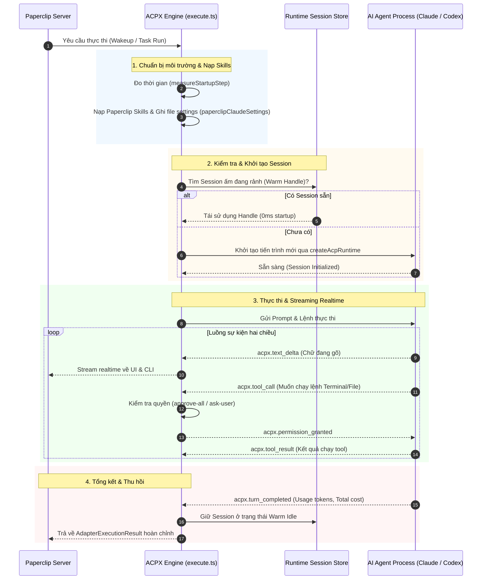
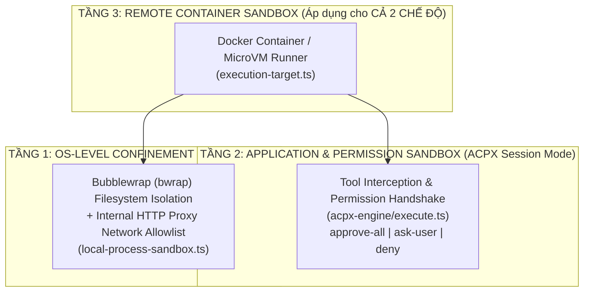

# TỔNG QUAN KIẾN TRÚC ACP & ACPX ENGINE TRONG PAPERCLIP

---

> **Tài liệu Kỹ thuật & Hướng dẫn Kiến trúc**  
> **Vị trí Module trong Repo:** `packages/adapter-utils/src/acpx-engine/`  
> **Mục đích:** Cung cấp bức tranh toàn diện về giao thức **ACP (Agent Client Protocol)**, cơ chế vận hành của **ACPX Engine**, và cách hệ thống chuẩn hóa, duy trì phiên làm việc liên tục (Stateful/Warm Sessions) cho các AI Agent (Claude, Codex, Gemini...).

---

## 1. KHÁI NIỆM CỐT LÕI: ACP & ACPX LÀ GÌ?

### 1.1. Khái niệm ACP (Agent Client Protocol)
* **Định nghĩa:** **ACP (Agent Client Protocol)** là giao thức tiêu chuẩn mở dùng để điều khiển, quản lý phiên làm việc (Session Lifecycle) và giao tiếp hai chiều (Two-way Event Stream / JSON-RPC) giữa **Host (Control Plane - Paperclip)** và **Agent Runtime (Claude, Codex, Gemini, Pi, OpenCode...)**.
* **So sánh với MCP (Model Context Protocol):**
  * **MCP (của Anthropic):** Chuẩn hóa việc AI kết nối với **Công cụ & Dữ liệu** (Tools, Resources, Prompts).
  * **ACP:** Chuẩn hóa việc **Điều khiển & Vận hành chính Agent đó** (Khởi tạo tiến trình, Giữ session ấm, Cấp quyền thực thi, Stream token, Quản lý trạng thái).

### 1.2. Khái niệm ACPX Engine trong Paperclip
* **ACPX Engine** (`acpx/runtime`) là bộ thư viện/engine lõi được tích hợp vào Paperclip (tại `@paperclipai/adapter-utils/acpx-engine`).
* Nó đóng vai trò là một **Lớp điều phối trung gian (Runtime Abstraction Layer)** giúp biến mọi CLI Agent độc lập của các hãng thành một chuẩn tương tác duy nhất mang tiền tố sự kiện `acpx.*`.

---

## 2. TẠI SAO PAPERCLIP CẦN ACPX ENGINE?

| Vấn đề khi chạy CLI thô (Raw Subprocess) | Giải pháp đột phá của ACPX Engine |
| :--- | :--- |
| **Khởi động chậm (Cold Start):** Mỗi lần Agent thức dậy (`heartbeat`) lại phải spawn tiến trình mới từ đầu, mất từ 3 - 10 giây. | **Phiên làm việc liên tục (Warm/Persistent Sessions):** Duy trì tiến trình ngầm ở trạng thái sẵn sàng. Khi có task mới, phản hồi ngay lập tức trong vài mili-giây. |
| **Phân mảnh định dạng log:** Mỗi hãng AI (Claude, Codex, Gemini) nhả ra định dạng JSON/Text hoàn toàn khác nhau. | **Chuẩn hóa Stream (`acpx.*`):** Quy tụ mọi loại log thành chuẩn thống nhất: `acpx.text_delta`, `acpx.tool_call`, `acpx.result`. |
| **Thiếu kiểm soát bảo mật:** Agent có thể tự do chạy các lệnh nguy hiểm (`rm -rf`, gọi API ngoài tốn kém). | **Cơ chế xin quyền (Permission Handshake):** Chặn các thao tác nguy hiểm để xin phép trước khi thực thi (`approve-all`, `ask-user`, `deny`). |
| **Mất bộ nhớ đệm (Cache):** Subprocess mới không nhớ ngữ cảnh hội thoại trước đó. | **Tái sử dụng Session Identity:** Duy trì ngữ cảnh và Prompt Caching trên LLM, tiết kiệm tối đa chi phí Token. |

---

## 3. BẢN ĐỒ MÃ NGUỒN ACPX ENGINE TRONG REPO

Toàn bộ mã nguồn nằm tại thư mục:  
👉 [`packages/adapter-utils/src/acpx-engine/`](file:///c:/paperclip/packages/adapter-utils/src/acpx-engine/)

```
packages/adapter-utils/src/acpx-engine/
├── index.ts               # Điểm xuất khẩu chính (createAcpxEngineExecutor, execute, formatters)
├── constants.ts           # Định nghĩa cấu hình mặc định, timeout, mapping Agent ID
├── execute.ts             # TRÁI TIM CỦA ENGINE: Quản lý vòng đời session, nạp skill, phân quyền (~3000 dòng)
├── session-codec.ts       # Mã hóa / giải mã định danh Session (Session Identity)
├── startup-timing.ts      # Đo lường chi tiết thời gian khởi động từng bước (latency metrics)
├── cli.ts                 # Định dạng & tô màu sự kiện cho màn hình dòng lệnh (Terminal)
└── ui.ts                  # Phân tích cú pháp sự kiện stream cho giao diện Web React
```

### Chi tiết các file quan trọng:

#### ① `execute.ts` (Trái tim của Engine)
* Nhập khẩu các hàm cốt lõi từ `acpx/runtime`: `createAcpRuntime`, `createAgentRegistry`, `createRuntimeStore`...
* Chuẩn bị môi trường & thư mục làm việc riêng cho từng Agent (`agentHome`, `stateDir`).
* Tự động tiêm các Kỹ năng (Skills Provisioning) của Paperclip:
  * `prepareClaudeSkillRuntime` cho Claude (`acpxAgent === "claude"`).
  * `prepareCodexSkillRuntime` cho Codex (`acpxAgent === "codex"`).
* Quản lý Timeout, cơ chế cô lập mạng (`networkScope`) và Sandbox hệ thống qua `bwrap`.

#### ② `constants.ts` (Ánh xạ Adapter)
```typescript
export const ACPX_ADAPTER_AGENT_IDS = {
  claude_local: "claude",
  codex_local: "codex",
  gemini_local: "gemini",
  custom_acp: "custom",
} as const;
```

#### ③ `cli.ts` & `ui.ts` (Bộ phân giải sự kiện chuẩn hóa)
* **`cli.ts` (`printAcpxStreamEvent`):** Lắng nghe các event `acpx.text_delta`, `acpx.tool_call` để in màu ra Terminal.
* **`ui.ts` (`parseAcpxStdoutLine`):** Chuyển đổi các event `acpx.*` thành mảng `TranscriptEntry[]` để vẽ các thẻ Accordion công cụ, khối code trên giao diện Web Dashboard.

---

## 4. SƠ ĐỒ VÒNG ĐỜI THỰC THI (SESSION LIFECYCLE)



## 5. KIẾN TRÚC CÔ LẬP MÔI TRƯỜNG & SANDBOX CỦA AI AGENT (EXECUTION ISOLATION)

Chức năng cô lập Sandbox và môi trường thực thi trong Paperclip được thiết kế theo **mô hình phòng thủ chiều sâu (Defense-in-Depth) gồm 3 tầng độc lập**, hỗ trợ cho cả 2 chế độ chạy:



---

### 5.1. Tầng 1: Cô lập mức Hệ điều hành (OS-Level Confinement) — Dành cho Raw CLI Mode

* **Tập tin nguồn phụ trách:**
  1. 👉 [`packages/adapter-utils/src/local-process-sandbox.ts`](file:///c:/paperclip/packages/adapter-utils/src/local-process-sandbox.ts) *(Xây dựng tham số bwrap và Proxy)*
  2. 👉 [`packages/adapter-utils/src/server-utils.ts:L2327-2345`](file:///c:/paperclip/packages/adapter-utils/src/server-utils.ts#L2327-L2345) *(Hàm `resolveSpawnExecutionTarget` bọc tiến trình)*

#### 🔍 Chi tiết 3 cơ chế cô lập cụ thể trong Code:

##### ① Cơ chế 1: Thay thế lệnh chạy bằng `bwrap` (Bubblewrap Namespace Isolation)
* **Vị trí code:** [`local-process-sandbox.ts:L380-385`](file:///c:/paperclip/packages/adapter-utils/src/local-process-sandbox.ts#L380-L385)
* **Cách hoạt động:** Thay vì spawn trực tiếp tiến trình `claude` hay `codex`, Paperclip chuyển đổi câu lệnh thành `bwrap` kèm các cờ cô lập Linux Kernel Namespaces:
  ```typescript
  const bwrapCommand = input.options.command?.trim() || "bwrap";
  // Cắt đứt Process ID, IPC, UTS namespace hoàn toàn với máy chủ
  const args = [
    "--die-with-parent", // Chết ngay lập tức nếu tiến trình cha (Paperclip) bị tắt
    "--new-session",
    "--unshare-pid",     // AI không thể nhìn thấy bất kỳ tiến trình nào khác trên host
    "--unshare-ipc",
    "--unshare-uts"
  ];
  ```

##### ② Cơ chế 2: Khóa Ổ đĩa hệ thống thành Read-Only (Filesystem Confinement)
* **Vị trí code:** [`local-process-sandbox.ts:L51-67`](file:///c:/paperclip/packages/adapter-utils/src/local-process-sandbox.ts#L51-L67) và [`L388-412`](file:///c:/paperclip/packages/adapter-utils/src/local-process-sandbox.ts#L388-L412)
* **Cách hoạt động:**
  1. **Khai báo danh sách thư mục hệ điều hành nhạy cảm:**
     ```typescript
     const SYSTEM_READ_PATHS = [
       "/bin", "/sbin", "/usr", "/lib", "/lib64",
       "/etc/ca-certificates", "/etc/ssl", "/etc/resolv.conf",
       "/etc/hosts", "/etc/passwd", "/etc/gitconfig"
     ] as const;
     ```
  2. **Mount hệ thống dưới quyền CHỈ ĐỌC (Read-Only Bind):**
     ```typescript
     // Tạo root ảo tạm thời trong RAM (tmpfs)
     args.push("--tmpfs", "/", "--proc", "/proc", "--dev", "/dev", "--tmpfs", "/tmp");

     // Gắn tất cả các thư mục hệ điều hành ở quyền CHỈ ĐỌC (ro = read-only)
     for (const systemPath of SYSTEM_READ_PATHS) {
       await mount(systemPath, "ro"); // -> bwrap sinh cờ: --ro-bind /usr /usr
     }
     ```
  3. **Chỉ mở quyền GHI (Read-Write) duy nhất vào đúng thư mục Task:**
     ```typescript
     // AI CHỈ ĐƯỢC PHÉP GHI VÀO ĐÚNG WORKSPACE CỦA TASK NÀY:
     await mount(workspaceDir, "rw"); // -> bwrap sinh cờ: --bind /workspace /workspace
     ```
  👉 *Kết quả:* Nếu AI cố tình chạy `rm -rf /` hay sửa file `/etc/passwd` ➡️ Bị Linux Kernel chặn đứng ngay với lỗi `EACCES / Permission Denied`.

##### ③ Cơ chế 3: Chặn mạng & Lọc qua HTTP Proxy nội bộ (Network Confinement)
* **Vị trí code:** [`local-process-sandbox.ts:L230-291`](file:///c:/paperclip/packages/adapter-utils/src/local-process-sandbox.ts#L230-L291) và [`L475-480`](file:///c:/paperclip/packages/adapter-utils/src/local-process-sandbox.ts#L475-L480)
* **Cách hoạt động:**
  1. **Cắt đứt hoàn toàn card mạng ngoài:**
     ```typescript
     if (networkScope) {
       args.push("--unshare-net"); // Ngắt toàn bộ kết nối Internet của Agent
     }
     ```
  2. **Dựng Proxy kiểm duyệt danh sách trắng (Allowlist Proxy):**
     Mọi request HTTP/HTTPS từ Agent bắt buộc phải đi qua Unix Domain Socket (`proxy.sock`):
     ```typescript
     server.on("connect", (request, clientSocket, head) => {
       const hostname = ...; // Domain AI đang muốn kết nối tới
       
       // KIỂM TRA DOMAIN CÓ TRONG networkAllowlist KHÔNG:
       if (!isNetworkTargetAllowed(hostname, port, rules)) {
         // 👉 NẾU KHÔNG THUỘC ALLOWLIST -> CHẶN ĐỨNG NGAY VỚI 403:
         clientSocket.end(connectProxyError(
           "network_target_denied",
           "Network target denied by Paperclip sandbox policy."
         ));
         return;
       }
       
       // NẾU HỢP LỆ (VD: api.anthropic.com) -> CHO PHÉP ĐI TIẾP:
       const upstream = net.connect(Number(port), hostname, ...);
     });
     ```

##### 📌 Lệnh bwrap thực tế được sinh ra khi khởi chạy:
```bash
bwrap \
  --die-with-parent \
  --unshare-pid \
  --unshare-net \
  --tmpfs / \
  --ro-bind /bin /bin \
  --ro-bind /usr /usr \
  --ro-bind /lib /lib \
  --bind /path/to/task/workspace /path/to/task/workspace \
  node bridge.cjs proxy.sock claude --print - --output-format stream-json
```


---

### 5.2. Tầng 2: Cô lập mức Quyền hạn Ứng dụng (Application & Permission Sandboxing) — Dành cho ACPX Mode
* **Tập tin nguồn:** 👉 [`packages/adapter-utils/src/acpx-engine/execute.ts`](file:///c:/paperclip/packages/adapter-utils/src/acpx-engine/execute.ts)
* **Cơ chế vận hành:**  
  Đối với các phiên làm việc liên tục (Persistent Daemon), ACPX kiểm soát qua cơ chế **Bắt chặn quyền hạn (Permission Handshake)**:
  1. **Chặn lệnh trước khi chạy (Tool Interception):** Mỗi khi Agent muốn gọi một công cụ nhạy cảm (Terminal Bash, File Edit), ACPX Engine đứng giữa bắt sự kiện `acpx.permission_request`.
  2. **Chính sách cấp quyền (`permissionMode`):**
     * `ask-user`: Tạm dừng và gửi thông báo lên Web UI để con người bấm nút "Approve" mới cho chạy tiếp.
     * `approve-all`: Tự động duyệt nhưng chỉ trong phạm vi các thư mục được phép.
     * `deny`: Cấm tuyệt đối mọi thao tác ngoài danh mục.
  3. **Tự sinh file cấu hình bảo mật:** Tự động tạo file `paperclipClaudeSettings` (giới hạn `additionalDirectories` và `allowedTools`) hoặc cấu hình biến môi trường `CODEX_CONFIG` cô lập.

---

### 5.3. Tầng 3: Cô lập mức Container Từ xa (Remote Container Sandbox) — Cả 2 Chế độ
* **Tập tin nguồn:** 👉 [`packages/adapter-utils/src/execution-target.ts`](file:///c:/paperclip/packages/adapter-utils/src/execution-target.ts)
* **Cơ chế vận hành:**  
  Khi cấu hình `executionTarget.kind === "remote"` với `transport: "sandbox"`:
  * Toàn bộ tiến trình Agent (dù chạy Raw CLI hay ACPX Session) được đưa vào chạy hoàn toàn bên trong một **Docker Container / MicroVM cô lập riêng biệt**.
  * Mã nguồn Task được đồng bộ sang Container (`stage([assets])`).
  * AI có thể thao tác thoải mái bên trong Container đó nhưng **hoàn toàn cách ly 100% với máy chủ Host của Paperclip**.

---

### 5.4. Bảng tổng kết các tầng Sandbox & Cô lập môi trường

| Tầng Sandbox | File nguồn phụ trách | Áp dụng cho chế độ | Cơ chế bảo vệ cốt lõi |
| :--- | :--- | :--- | :--- |
| **OS-Level Confinement** | `local-process-sandbox.ts` | **Raw CLI Mode** | Dùng `bwrap` (Bubblewrap) khóa ổ đĩa Read-Only & HTTP Proxy khóa mạng. |
| **Permission Sandboxing** | `acpx-engine/execute.ts` | **ACPX Session Mode** | Chặn tool call trung gian, hỏi ý kiến (`ask-user`), giới hạn file settings. |
| **Remote Container** | `execution-target.ts` | **Cả 2 chế độ** | Nhốt toàn bộ Agent vào Docker Container / MicroVM độc lập. |


---

## 6. CHI TIẾT 2 CHẾ ĐỘ CHẠY (RAW CLI MODE VS ACPX SESSION MODE) & MINH CHỨNG CODE

Trong Paperclip, các Local Adapter (như `claude-local`, `codex-local`...) được thiết kế để hỗ trợ song song **2 chế độ chạy**. Dưới đây là phân tích chi tiết và vị trí code minh chứng:

### 6.1. Ngã rẽ quyết định chế độ chạy (Engine Dispatcher)
Điểm bắt đầu của mọi lượt chạy nằm tại hàm `execute()` của adapter:  
👉 [`packages/adapters/claude-local/src/server/execute.ts:L394-411`](file:///c:/paperclip/packages/adapters/claude-local/src/server/execute.ts#L394-L411)

```typescript
export async function execute(ctx: AdapterExecutionContext): Promise<AdapterExecutionResult> {
  // 1. Kiểm tra cấu hình xem chọn chạy ACP hay CLI
  const engineSelection = await resolveClaudeExecutionEngineForRun(ctx);

  // 2. CHẾ ĐỘ ACPX: Nếu engine === "acp" -> Chạy qua ACPX Session Engine
  if (engineSelection.engine === "acp") {
    try {
      return await executeClaudeAcp(ctx);
    } catch (err) {
      if (engineSelection.explicit) throw err;
      // Nếu ACP lỗi ngoài ý muốn thì tự động fallback về CLI thô
      await ctx.onLog("stderr", formatClaudeAcpFallbackMessage(`Claude ACP startup failed: ${err}`));
    }
  }

  // 3. CHẾ ĐỘ CLI THÔ: Nếu engine === "cli" (hoặc fallback) -> Chạy tiếp luồng CLI bên dưới
  ...
}
```

---

### 6.2. Chế độ 1: Raw CLI Mode (Dòng lệnh thô trực tiếp)

* **Bản chất:** Hệ thống gọi trực tiếp file thực thi CLI của bên thứ 3 (như `claude` hoặc `codex`) cài đặt trên máy chủ/container dưới dạng tiến trình độc lập (`child_process.spawn`).
* **Minh chứng tạo lệnh:** [`packages/adapters/claude-local/src/server/execute.ts:L830-861`](file:///c:/paperclip/packages/adapters/claude-local/src/server/execute.ts#L830-L861)
  ```typescript
  const args = ["--print", "-", "--output-format", "stream-json", "--verbose"];
  if (resumeSessionId) args.push("--resume", resumeSessionId);
  if (model) args.push("--model", model);
  ```
* **Định dạng Log sinh ra:** Dữ liệu JSON stream mang cấu trúc riêng biệt của nhà cung cấp Anthropic:
  ```json
  {"type": "system", "subtype": "init", "model": "claude-3-7-sonnet"}
  {"type": "assistant", "message": {"content": [{"type": "text", "text": "..."}]}}
  {"type": "result", "usage": {"input_tokens": 1500, "total_cost_usd": 0.005}}
  ```
* **Minh chứng bắt log:** Trong [`format-event.ts:L60-110`](file:///c:/paperclip/packages/adapters/claude-local/src/cli/format-event.ts#L60-L110):
  ```typescript
  if (type === "system" && parsed.subtype === "init") { ... }
  if (type === "assistant") { ... }
  if (type === "result") { ... }
  ```

---

### 6.3. Chế độ 2: ACPX Session Mode (Phiên làm việc liên tục / Stateful)

* **Bản chất:** Thay vì spawn tiến trình mới, hệ thống chuyển giao quyền điều khiển cho **ACPX Engine** để tạo hoặc tái sử dụng một Session sống ngầm (Warm Handle), kết nối qua kênh JSON-RPC 2 chiều.
* **Minh chứng khởi tạo Executor:** [`packages/adapters/claude-local/src/server/acp.ts:L283-297`](file:///c:/paperclip/packages/adapters/claude-local/src/server/acp.ts#L283-L297)
  ```typescript
  export function createClaudeAcpExecutor(options: ClaudeAcpExecutorOptions = {}): ClaudeAcpExecutor {
    // Import và khởi tạo ACPX engine từ thư viện dùng chung adapter-utils
    const { createAcpxEngineExecutor } = await import("@paperclipai/adapter-utils/acpx-engine/execute");
    currentExecutor = createAcpxEngineExecutor(withClaudeAcpDefaults(options));
    return currentExecutor({ ...ctx, config: buildClaudeAcpConfig(ctx.config) });
  }
  ```
* **Minh chứng quản lý Session:** [`packages/adapter-utils/src/acpx-engine/execute.ts`](file:///c:/paperclip/packages/adapter-utils/src/acpx-engine/execute.ts) sử dụng `createAcpRuntime` và `RuntimeStore` để giữ tiến trình sống ngầm theo thời gian chờ `warmHandleIdleMs`.
* **Định dạng Log sinh ra:** Tất cả đều được chuẩn hóa thành các event thống nhất có tiền tố `acpx.*`:
  * `acpx.text_delta`: Chữ AI đang gõ theo thời gian thực.
  * `acpx.tool_call`: AI yêu cầu thực thi công cụ.
  * `acpx.permission_request`: Cơ chế xin phép trước khi chạy lệnh nguy hiểm.
  * `acpx.turn_completed`: Tổng kết một lượt tương tác.
* **Minh chứng bắt log:** Ngay đầu file [`format-event.ts:L55-58`](file:///c:/paperclip/packages/adapters/claude-local/src/cli/format-event.ts#L55-L58) và [`parse-stdout.ts:L45-48`](file:///c:/paperclip/packages/adapters/claude-local/src/ui/parse-stdout.ts#L45-L48):
  ```typescript
  if (type.startsWith("acpx.")) {
    printAcpxStreamEvent(line, debug); // Cho CLI
    // hoặc return parseAcpxStdoutLine(line, ts); // Cho Web UI
    return;
  }
  ```

---

### 6.4. Bảng so sánh tổng hợp 2 chế độ trong Codebase

| Tiêu chí | Chế độ 1: Raw CLI Mode | Chế độ 2: ACPX Session Mode |
| :--- | :--- | :--- |
| **Cấu hình kích hoạt** | `config.engine = "cli"` | `config.engine = "acp"` (mặc định nếu đủ điều kiện) |
| **Hàm khởi chạy** | `runAttempt()` trong `server/execute.ts` | `executeClaudeAcp()` trong `server/acp.ts` |
| **Cơ chế tiến trình** | Spawn tiến trình CLI độc lập mỗi lần run | Duy trì `AcpRuntimeHandle` ấm trong `RuntimeStore` |
| **Tốc độ khởi động** | Chậm (Cold start 3 - 10s) | Siêu nhanh (~0ms với warm session) |
| **Định dạng Stream** | Vendor-specific (`assistant`, `result`...) | Chuẩn hóa (`acpx.text_delta`, `acpx.tool_call`...) |
| **Phân quyền & Sandbox** | Tự quản lý qua cờ tham số CLI | Tích hợp sâu: `permissionMode`, `bwrap`, `networkScope` |
| **Tương thích UI & CLI** | Tự bóc tách qua `format-event.ts` & `parse-stdout.ts` | Tự động chuyển tiếp cho `printAcpxStreamEvent` & `parseAcpxStdoutLine` |

---

### 6.5. Chế độ Mặc định & 4 Điều kiện Tự động Fallback về CLI

#### 🔹 Mặc định hệ thống chọn chế độ nào?
Theo mặc định, Paperclip **ƯU TIÊN CHỌN CHẾ ĐỘ ACP (ACPX Session Mode)**.  
Minh chứng tại [`packages/adapters/claude-local/src/server/acp.ts:L65-70`](file:///c:/paperclip/packages/adapters/claude-local/src/server/acp.ts#L65-L70):
```typescript
function normalizeEngine(value: unknown): ClaudeEngineSelection {
  const raw = typeof value === "string" ? value.trim().toLowerCase() : "";
  if (raw === "acp") return { engine: "acp", explicit: true };
  if (raw === "cli") return { engine: "cli", explicit: true };
  // 👉 Nếu không chỉ định rõ: Mặc định là ACP
  return { engine: "acp", explicit: false };
}
```

#### 🔹 4 Điều kiện an toàn khiến hệ thống tự động Fallback sang CLI:
Dù ưu tiên ACP, hệ thống sẽ tự động chuyển về chạy **Raw CLI** nếu vi phạm 1 trong 4 điều kiện tại hàm `defaultClaudeAcpFallbackReason` ([`acp.ts:L400-420`](file:///c:/paperclip/packages/adapters/claude-local/src/server/acp.ts#L400-L420)):
1. **Phiên bản Node.js không đủ:** Node.js trên máy chủ `< v22.12.0` (chưa hỗ trợ đầy đủ ACP runtime).
2. **Chưa cài đặt lệnh ACP:** Máy tính chưa cài đặt sẵn binary của ACP server.
3. **Cấu hình Sandbox cô lập mạng / ổ đĩa:** Khi bật `filesystemScope` hoặc `networkScope` (yêu cầu Bubblewrap `bwrap` bọc trực tiếp từng tiến trình spawn).
4. **Môi trường Remote không hỗ trợ 2 chiều:** Khi chạy qua remote sandbox nhưng không có kênh kết nối 2 chiều (`processSessionBridge`).

#### 🔹 Tùy chọn ép buộc (Override):
Người dùng có thể chỉ định rõ trong cấu hình của Agent:
* `"engine": "acp"` ➡️ Ép buộc dùng ACP (sẽ throw error nếu không đủ điều kiện).
* `"engine": "cli"` ➡️ Ép buộc dùng Raw CLI truyền thống.

---

### 6.6. Tại sao Paperclip lại cần duy trì cả 2 chế độ?

1. **Cơ chế Dự phòng (Failover / Fallback):** Nếu phiên ngầm ACP bị crash hoặc đứt kết nối socket, hệ thống tự động fallback về Raw CLI để Task của người dùng không bao giờ bị dừng giữa chừng.
2. **Tính phổ quát (Zero-Setup):** Người dùng mới chỉ cần cài đặt công cụ dòng lệnh cơ bản của hãng (`claude` hoặc `codex`) là chạy được ngay mà không cần cấu hình runtime phức tạp.
3. **Phù hợp cho 2 kịch bản vận hành đối lập:**
   * **Batch Jobs / Cronjob (Chạy 1 lần rồi tắt):** Dùng **Raw CLI** để giải phóng 100% RAM và CPU sau khi chạy xong.
   * **Interactive Chat / Sửa code liên tục:** Dùng **ACPX Session** để phản hồi tức thì (0ms latency) và giữ Prompt Cache tiết kiệm tiền Token.

---

## 7. TỔNG KẾT

* **ACP (Agent Client Protocol)** là nền tảng giao thức giúp Paperclip mở rộng khả năng quản trị đa Agent quy mô lớn.
* **`acpx-engine`** biến Paperclip từ một hệ thống chạy script dòng lệnh rời rạc thành một **Hệ điều hành Agent (Agent OS)** có khả năng duy trì phiên làm việc liên tục, bảo mật cấp doanh nghiệp và streaming độ trễ siêu thấp.
* Nhờ kiến trúc phân lớp rõ ràng giữa **Raw CLI Lane** và **ACPX Session Lane**, Paperclip vừa đảm bảo tính tương thích ngược với các công cụ CLI truyền thống, vừa sẵn sàng cho kỷ nguyên Agent thời gian thực tốc độ cao.


